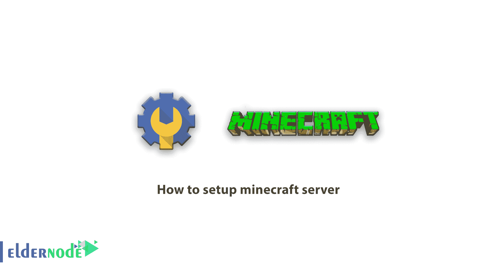
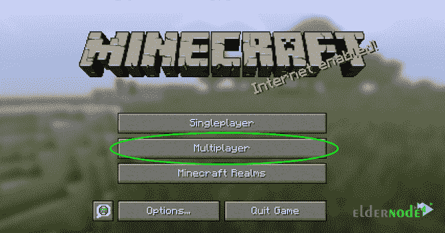
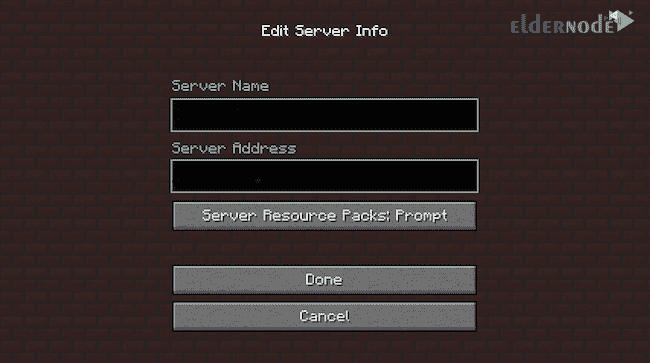
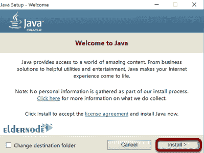
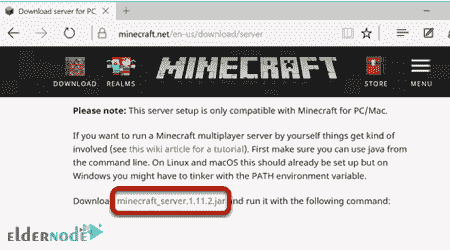
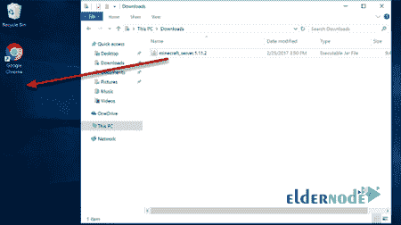
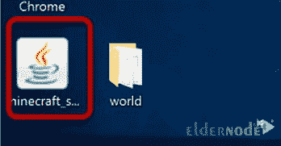
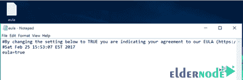
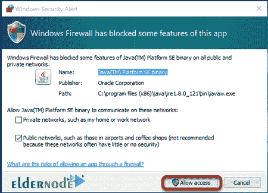

# 如何设置《我的世界》服务器[2021] - Eldernode 博客

> 原文：<https://blog.eldernode.com/how-to-setup-minecraft-server/>



[更新]《我的世界》是有史以来最流行的游戏之一。玩家探索无限的世界，建造从简单的房子到高耸的摩天大楼的建筑。《我的世界》是一个沙盒游戏，你可以在其中建立自己的 3D 世界。这款游戏的第一个版本制作于 2009 年，迄今为止，这款游戏已经在各种平台上制作和销售了超过 3000 万份。如果你想和你的朋友一起玩《我的世界》，你需要《我的世界》游戏服务器。该服务器允许玩家连接到中央系统作为游戏软件的主机。在这篇文章中，你将学习如何设置《我的世界》服务器。要购买虚拟专用服务器，请访问 [Eldernode](https://eldernode.com/) ，联系我们的支持团队，并购买您想要的 [VPS](https://eldernode.com/vps/) 托管服务器。

## **如何做一个《我的世界》服务器**

《我的世界》是一个非常简单的基于像素的 3D 游戏。这款游戏在短时间内在互联网用户和视频游戏爱好者中创造了大量人气。《我的世界》是一个团体游戏，允许用户在一个服务器上一起玩。在这款游戏的特色中，我们可以提到 3D 建筑的建造。整个游戏是冒险的，耗时的。在本文中，我们教你如何在 [Ubuntu](https://blog.eldernode.com/tag/ubuntu/) 和 [Windows](https://blog.eldernode.com/tag/windows/) 操作系统上安装《我的世界》游戏服务器。如果你在寻找性能更好的游戏服务器，最好使用高 RAM 和 CPU 能力的服务器，以便更好、更快地响应玩家的命令。

### **在 Ubuntu 上安装《我的世界》服务器的先决条件**

为了让本教程更好地工作，请考虑以下先决条件:

_ 拥有 Sudo 权限的非 root 用户。

_ 要进行设置，请遵循 Ubuntu 21.04 上的[初始服务器设置。](https://blog.eldernode.com/initial-server-setup-on-ubuntu-21-04/)

**_** [Linux VPS](https://eldernode.com/linux-vps/) 服务器

_ [Ubuntu](https://eldernode.com/ubuntu-vps/) 操作系统

**_** 1024 MB RAM(至少 1024 MB 但推荐量是 2048 MB。当然这个要看流量和玩家数量)

## **如何在 Ubuntu 上安装《我的世界》服务器**

在本指南的第一部分，你将回顾《我的世界》在 Ubuntu 上的安装过程。让我们按照要求的步骤来完成它。

你必须**更新系统**。使用以下命令来完成此操作:

```
apt-get update
```

```
apt-get upgrade -y
```

现在，你必须**安装 OpenJDK** 。

***注:*** OpenJDK 是一个在 Ubuntu 上实现 java 和 GNU 并创建这个环境的开源程序。使用以下命令安装 OpenJDK:

```
apt-get install openjdk-8-jre-headless screen
```

轮到创建新用户了。输入以下命令创建新用户:

```
adduser minecraft
```

然后，**将用户类型**从当前用户更改为您创建的新用户:

```
su - minecraft
```

是时候**安装《我的世界》**了。通过运行以下命令安装**最新版本**:

```
wget https://s3.amazonaws.com/Minecraft.Download/versions/1.11.2/minecraft_server.1.11.2.jar
```

***注:*** 你可以从[《我的世界》网站](https://minecraft.net/en-us/download/server)找到《我的世界》的最新版本。

使用以下命令，您可以运行运行《我的世界》的脚本:

```
nano /home/minecraft/run.sh
```

在该文件中输入以下命令，然后**保存**该文件:

```
#!/bin/sh  BINDIR=$(dirname "$(readlink -fn "$0")")  cd "$BINDIR"    java -Xms1024M -Xmx1536M -jar minecraft_server.1.11.2.jar -o true
```

注意， **Xms** 和 **Xmx** 值是分配给《我的世界》服务器的最小和最大 RAM 量。在本文中，最小 1024 MB，最大 1536 MB。根据服务器的使用量，该值可能会有所不同。

然后定义由以下命令创建的新脚本是可执行的:

```
chmod +x /home/minecraft/run.sh
```

现在**使用以下命令运行**《我的世界》:

```
./run.sh
```

打开 **eula.txt** 文件，将 **EULA** 值改为**真**:

```
nano /home/minecraft/eula.txt
```

要确保《我的世界》服务器使用单独的 [SSH](https://blog.eldernode.com/tutorial-connect-to-ssh-on-linux/) ，请运行以下命令:

```
sudo screen /home/minecraft/run.sh
```

打开《我的世界》客户端程序，点击**多人**:



最后，输入服务器地址，即服务器的 IP 地址，并连接到服务器:



你已经在你的 Ubuntu 服务器上启动了一个专用的个人《我的世界》服务器。现在你可以和你的朋友共享 IP 地址，所有的都在一个服务器上，享受游戏。

### 在 Windows 上安装《我的世界》服务器的先决条件

要在 Windows 中安装《我的世界》游戏服务器，请考虑以下先决条件:

**_** Windows 10

**_** 至少 4G 内存

**_** 连接到可靠的高带宽互联网，因为《我的世界》每个玩家每小时至少消耗 100 MB 的互联网。

## **如何在 Windows 上安装和配置《我的世界》服务器**

完成本指南的步骤，享受学习的乐趣。

打开 Windows 10 下载最新版本的**Java**；然后打开**。exe** 文件，点击**安装**。



安装完成后，**重启**您的系统。

去 minecraft.net 下载**《我的世界》香草罐**游戏服务器文件。当您下载**《我的世界》服务器 jar** 文件时，该文件会自动保存在**下载**文件夹中。



移动你的《我的世界》文件夹到你想要的位置。在下图中，我们将文件夹移动到了桌面，但是建议您使用一个**专用文件夹**。



双击**《我的世界》JAR** 文件。这将解压一系列文件，我们需要运行《我的世界》游戏服务器。



在使用服务器之前，你必须配置《我的世界》服务器的游戏配置文件。你需要打开的第一个文件是《我的世界》·EULA 的文件。

***注意* :** EULA 是你在运行服务器时同意的文件。

要接受最终用户许可，打开 EULA 文本文件并将 **eula=false** 改为 **eula=true** 。现在保存文件。

要设置服务器设置，请打开服务器属性文件，并在应用必要的更改后保存文件。

***注意* :** 在服务器设置中，默认设置端口 25565。



要运行 java 服务器文件，请双击打开《我的世界》服务器文件。

通过点击**允许访问**在防火墙中发布对《我的世界》游戏服务器的访问。



现在《我的世界》游戏服务器已经安装并运行，统计窗口已经打开。由于服务器已经启动并运行，您可以通过《我的世界》登录到服务器。

类似于在 Ubuntu 上安装《我的世界》，如上所述运行《我的世界》，选择**多人**。

点击**添加服务器**。输入服务器信息，点击**完成**。输入您购买的服务器的 IP 地址。

你的《我的世界》游戏服务器准备好了！点击 **PLAY** 按钮，开始游戏。

## 结论

在本文中，您了解了如何设置《我的世界》服务器。你回顾了《我的世界》在 Ubuntu 和 Windows 上安装的完整过程。一旦你创建了自己的《我的世界》，你就可以开始和你的朋友一起玩了。出于安全考虑，建议您邀请您认识的朋友和用户。如果您有兴趣了解更多信息，请找到我们的相关文章《在 CentOS 8 上设置《我的世界》服务器的教程[。](https://blog.eldernode.com/setup-minecraft-server-on-centos/)