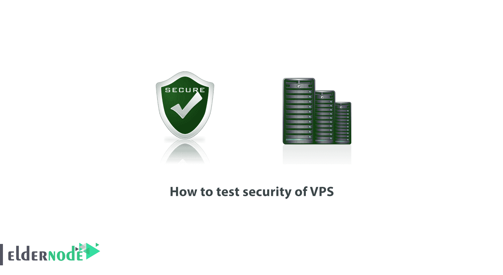
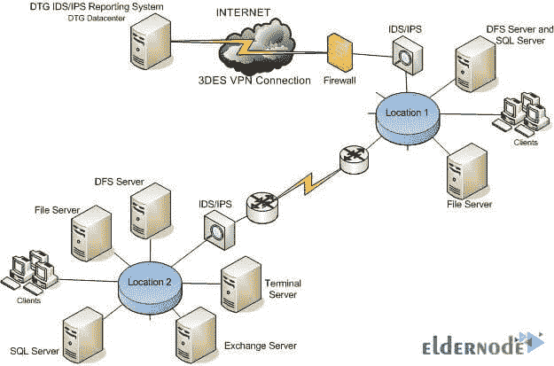
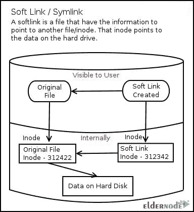

# 如何测试 VPS 服务器- Eldernode 博客的安全性

> 原文：<https://blog.eldernode.com/how-to-test-security-of-vps/>



【更新】服务器安全是信息技术领域最基本的问题之一，需要大量的专业知识来实现安全。服务器安全包括一系列主题:网络安全、操作系统安全、web 服务安全及其安全配置。在本文中，所有的服务器安全需求都将被检查和总结，它们是网站和信息的基础。我们也在尝试教你如何测试 VPS 服务器的安全性。你可以访问 [Eldernode](https://eldernode.com/) 的套装来购买 [VPS 服务器](https://eldernode.com/vps/)。

## 教程测试 VPS 服务器的安全性

目前讨论和使用较多的是 [Linux vps](https://eldernode.com/linux-vps/) 服务器安全和 Windows 服务器安全。这两种操作系统具有完全不同的结构和操作模式，仅在某些情况下有共同点。在 Linux 服务器中，通常会提供一个具有最小操作系统的服务器，这当然非常适合用户对 web 服务的需求。centos 操作系统在 Linux 托管服务器上最常用，流行且强大的 [Cpanel](https://blog.eldernode.com/tag/cpanel/) 和 [DirectAdmin](https://blog.eldernode.com/tag/direct-admin/) 控制面板也支持这个 Linux 发行版。

## **如何测试 VPS 服务器的安全性**

由于在共享主机服务中，大量的站点共享在一个服务器上，并使用共享的空间和资源，因此安全性应该得到更多的关注。在这篇文章的后续部分，加入我们来学习如何测试 VPS 的安全性。

### 开始使用服务器

鉴于我们使用的操作系统是 [Windows](https://blog.eldernode.com/tag/windows/) ，与 Linux 服务器的通信由 putty 软件和 Windows 服务器通过远程桌面连接来完成。根据本文关于安全的主题，在安装了服务器上使用的操作系统和服务后，您应该遵循一些原则，如限制服务、禁用不可用的服务。

### 服务器安全配置

由于在新时代，安全威胁和攻击方式呈现出新的形式，并且每天都在变化，因此组织和机构中的安全服务也必须根据这些变化进行更新。信息安全服务是一组安全服务，涵盖公司和组织的服务器的广泛信息和安全需求。

内部和外部代理发布间谍软件和恶意软件，或者这些代理泄露重要信息，都是这些威胁的例子。

### 渗透测试

渗透测试是一种系统的、有计划的方法，检查服务器、网络以及与之相连的资源和程序的漏洞和安全漏洞。这种服务属于第一类，模拟黑客对预定目标的攻击，并在识别安全漏洞后，提供适当的解决方案来保护它们。

### 渗透检测的类型

**1。** **透明测试**

**2。黑盒测试**

**3。灰盒测试**

在**黑盒** **测试**中，测试人员没有关于系统的先验信息而进行测试。然而，在**透明测试**中，测试人员拥有完整的规格说明和关于系统的全面信息，并基于此执行模拟攻击，而在**灰箱测试**中，测试人员只能访问部分信息，并不具备全面的信息。

根据系统的敏感性及其安全级别，应该进行测试。如果需要高安全性，应该执行透明测试，如果系统及其安全性不太重要，一个**灰盒**和一个**黑盒**测试就足够了。事实上，渗透测试应该有计划地进行，并事先与系统所有者协调，不能因为某些设备或网络系统在测试过程中可能出现问题而采取不协调的行动。

### 设置 SIM 卡

维护组织安全的关键之一是使用称为 SIM 或安全信息管理的产品。在这个软件的帮助下，我们可以获得关于一个系统事件的完整信息，以便对它们进行分析。

安全信息管理系统是一种软件，它收集不同系统的所有日志，并在检测到意外行为或所谓的不良行为时对系统日志做出反应。

### 设置 IDS / IPS

系统比防火墙更详细地检测和防止网络上的流量入侵。与防病毒系统类似，IDS 和 IPS 工具监控流量，并将每个数据包与已知攻击规范的数据库进行比较。

一旦检测到攻击模式，这些工具就会生效。IDS 和 IPS 有许多共同的特征。事实上，大多数 IPS 的核心都有一个 IDS。这些技术之间的主要区别是 IDS 工具检测网络流量，以提醒恶意用户注意攻击；但是 IPS 工具更进一步，自动阻止有害流量。



***注:*** 日志监控系统是能够收集和上报各种系统日志的软件。

### 防火墙安装

以最佳和最安全的方式在组织和公司中设置防火墙和 UTM 硬件和软件 UTM 是任何组织的安全需求之一。

软件防火墙安装在操作系统上，控制进出网络或操作系统的流量。这种防火墙主要用于家庭以及中小型组织和公司。针对未授权访问、特洛伊木马和恶意代码、计算机蠕虫等的软件防火墙可以保护系统。

硬件防火墙通常由制造商作为基础设施安装在硬件板上，并且通常在网络上作为路由器运行。路由器也可以作为硬件防火墙在网络上运行。默认情况下，硬件[防火墙](https://blog.eldernode.com/add-a-rule-in-windows-firewall/)可以防止不需要的数据和流量进入网络和信息，而无需进行任何初始调整。

### 管理安全漏洞

更新管理软件和安全漏洞，为小型和大型网络节省时间、金钱和带宽，为网络内的系统提供安全报告，并在尽可能短的时间内进行更新。

### 网络应用安全‌

使用不同技术测试、扫描和修复 web 应用程序安全漏洞的解决方案和服务。

### 安全和风险建议

恶意软件攻击后受损系统的风险管理和安全领域的咨询，以及信息安全管理系统(ISMS)的实施和部署，这是一个管理解决方案，用于创建、实施和部署、监测和审查以及维护和改善组织内的信息安全。

### 防止 Simlink 攻击

防止 Simlink 攻击是服务器管理和安全的最基本方面之一。通过防止 Simlink 攻击，服务器上每个用户的安全性将得到考虑，并且它的弱点不会对其他帐户产生负面影响。

### 什么是 Simlink？

Simlink 是一种允许您创建从一个文件或目录到另一个文件或目录的引用的功能。例如，**test.php**文件位于 ***首页/测试*** 路径。如果我们想让**test.php**文件在另一个路径中可见、可执行甚至可编辑，例如 ***home/sample*** ，我们可以使用 symlink。许多操作系统都支持这一特性，但是它们的名称和功能是不同的。



### 如何防止 Cpanel 中的 sim link

预防 Cpanel 中的 Simlink 可以分几个步骤和工作方法来做。符号链接是服务器上最危险的事情之一。Simlink 是 Linux 操作系统的核心工具之一。如果 Linux 服务器中的 symlink 的问题和限制没有得到解决，如果一个帐户受到危害，symlink 也可以渗透到其他帐户。cloudlinux 操作系统在很大程度上能够解决这个问题。这个操作系统使用一个名为 cagefs 的工具将每个帐户锁定在其域中的一个笼子中。

要防止 Cpanel 中出现符号链接，请执行以下操作:

1.*前往**首页**服务配置 阿帕奇配置 WHM 全局配置。*

在页面上执行以下操作:

2.将下拉菜单中的服务器令牌值设置为 **ProductOnly** 。

3.取消选中“/”选项目录中的 **FollowSymLinks** 和 **ExecCGI** 。确保 **SymLinksIfOwnerMatch** 复选框已启用。

4.**保存**项。

5.进入 ***首页*** ***服务配置*** ***PHP 配置编辑器*** 选择**高级模式**。

6.找到 **disable_functions** 项，并在其值中输入**符号链接**和 **ln** 以及可用值。

7.**保存**项。

8.进入 ***首页** **安全中心****Apache mod_userdir Tweak***激活启用 mod _ userdir 保护复选框，点击**保存**。

9.进入 ***首页** **安全中心****PHP open_basedir Tweak***勾选启用 PHP open _ basedir 保护复选框，点击保存。

10.进入 ***首页** **安全中心** **弹叉炸弹防护*** 点击**启用防护**。

11.在 php 的 apache web 服务器上使用 **suphp 处理程序**。

上述内容极大地限制了符号链接操作，但并没有完全禁用它。

还有其他因素会限制 symlink，其中一些因素会导致服务出现故障，这里不做介绍。

### 如何在 DirectAdmin 中阻止 sim link

有几种方法可以在直接管理中阻止 Simlink。

符号链接是服务器上最危险的事情之一。Simlink 是 Linux 操作系统的核心工具之一。如果 Linux 服务器中的 symlink 的问题和限制没有得到解决，如果一个帐户受到危害，symlink 也可以渗透到其他帐户。cloudlinux 操作系统在很大程度上能够解决这个问题。这个操作系统使用一个名为 cagefs 的工具将每个帐户锁定在其域中的一个笼子中。

要在 DirectAdmin 中阻止符号链接，请执行下列操作:

在 ssh 中输入以下命令。该命令包括 Simlink 的安全设置。

```
cd /usr/local/directadmin/custombuild
```

```
./build update
```

```
./build set harden-symlinks-patch yes
```

```
./build set secure_htaccess no
```

```
./build apache
```

```
./build rewrite_confs
```

然后输入以下命令在 ssh 中找到 **php.ini** 路径:

```
/usr/local/bin/php -i | grep ‘Loaded Configuration File’
```

使用 nano 命令编辑文件并找到 disable_functions。除了符号链接中的值，输入并**保存** ln。

## 结论

渗透测试是一个系统的、有计划的过程，通过模拟黑客攻击来检查服务器、网络以及与之相连的资源和程序的漏洞和安全漏洞。以这种方式，渗透测试可以使用诸如主机安全系统等内部资源或外部资源来控制和组织。因此，这种模拟攻击的测试用于发现问题，并测量服务器和与之相连的网络的安全性。本文完整地解释了如何测试 VPS 的安全性。如果你愿意，可以参考文章 [20 种保护 Linux 虚拟服务器防止黑客攻击的方法](https://blog.eldernode.com/20-ways-to-secure-a-linux-virtual-server-to-prevent-hacking/)。