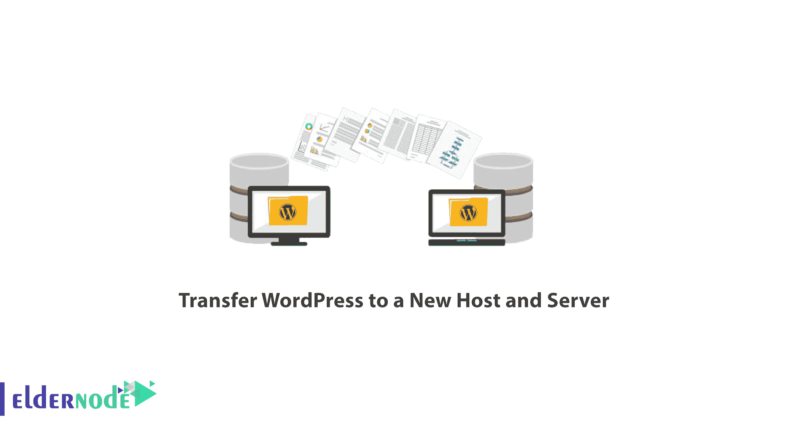
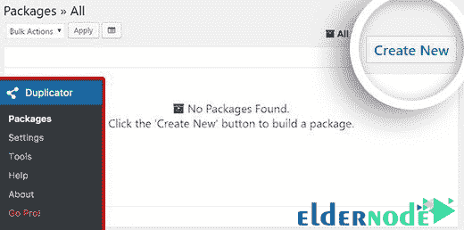
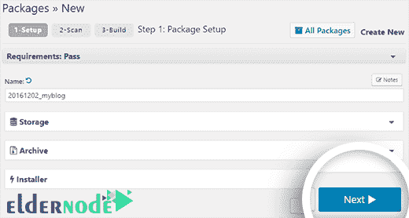
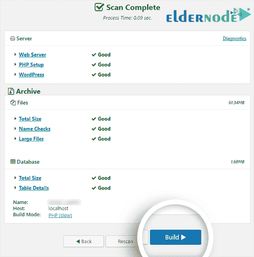
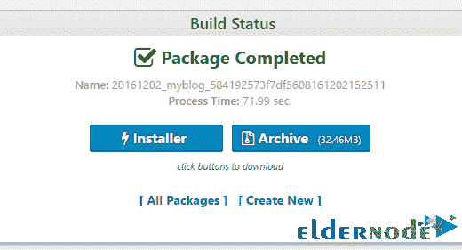
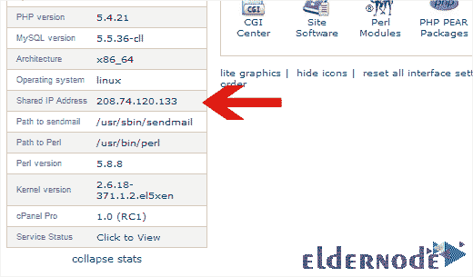
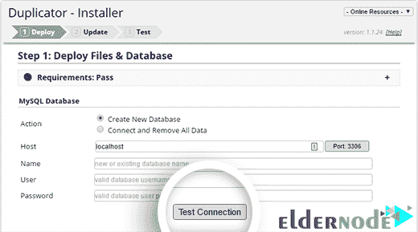
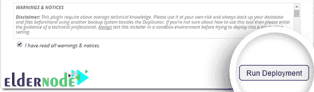
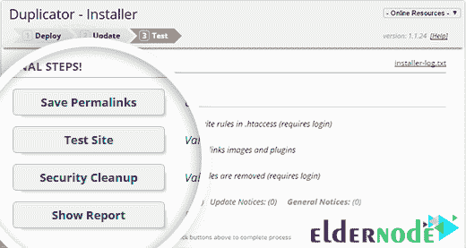

# 如何将 WordPress 转移到一个新的主机和服务器上

> 原文：<https://blog.eldernode.com/how-to-transfer-wordpress-to-a-new-host-and-server/>

如何将 WordPress 转移到新的主机和服务器上；将 WordPress 迁移到新服务器的最大风险是数据丢失或可能的停机时间。在本教程中， [Eldernode](https://eldernode.com/category/tutorial/) 将一步步向你展示如何在不停机的情况下将你的 WordPress 网站迁移到新的主机上。

### ***第一步:*选择你的新 WordPress 网站主机**

当你寻找一个新的 WordPress 主机时，你应该仔细地做出这个关键的选择。因为如果你做了错误的选择，你还是要把 WordPress 转移到新的主机上。

购买新主机后，您的主机帐户应该没有主目录中的任何文件和文件夹。

### ***第二步:*安装复印机方便 WordPress 转移**

首先要做的是在你要转的网站上安装并激活免费的 **[复制器插件](http://eldernode.com/category/wordpress/plugins/)** 。

Duplicator 是我们强烈推荐的免费插件。这个插件还可以把你的网站转移到另一个域，而不用担心降低 SEO 排名。

然而，在本教程中，我们将讨论如何在不停机的情况下将您的站点迁移到另一台主机。

在你安装并激活了**复印机** **插件**之后，进入 WordPress 管理仪表板的“**复印机> >包”**部分。然后点击页面右上角的“**新建**选项。

之后，点击**下一步**，继续步骤制作您的包裹。

确保您的所有扫描结果都正确完成，并且一切都处于**良好**状态，然后单击“**构建**按钮。此过程可能需要几分钟，因此不要关闭选项卡来完成此过程。

这个过程完成后，你必须同时点击“**安装程序**和“**存档**按钮来下载这两个文件。请记住，您需要这两个文件。

“**存档文件**是您站点的副本，并且“**安装程序**文件将自动为您执行安装过程。

### ***第三步:*将你的 WordPress 站点导入到新的主机**

现在您已经下载了归档文件和安装程序文件，下一步是将这两个文件上传到您的新主机。您可以使用 **FTP** 来完成这项工作。

使用你的 FTP 客户端或文件管理器将“**installer.php**”和“**archive.php**”上传到你网站的根目录。主机上的这个目录通常是: **/用户名/ public_html /** 或**/用户名/public_html/example.com** ，你知道 example.com 将是你的域名。

如果你不确定找到一个根目录，问问你的主机。此外，确保该目录完全为空，并且其中没有文件。如果你已经安装了默认文件或者 WordPress，一定要删除它们。

### ***步骤四:*修改主机文件防止停机**

在你将文件上传到你的新主机后，你需要从你的浏览器访问**installer.php**文件。这个文件可以通过对面的网址访问:【http://www.example.com/installer.php 

如果您获得了一个新的域，并且您的主机已经设置好了，它将在安装页面上轻松运行，您应该继续下一步。

但是，如果您想将您以前的域与现在设置为该主机的另一个主机连接，该地址会将您带到一个 **404 错误页面**。因为您的域仍然指向以前的主机。

主机文件将域名映射到特定的 IP 地址。

在这一步中，我们将向您展示如何在这些文件中写入新的一行，以便将域移动到新的 IP 主机。但是，只有当请求从您的计算机发出时。

通过进行这些更改，您可以通过您的域访问新主机。

其他用户将继续被重定向到您的旧主机。这保证 100%的正常运行时间。

首先要做的是获得您的新主机 IP 地址。

要找到它，进入你的" **cPanel 仪表板**，点击左边栏中的"**展开统计**"。您将看到有关服务器状态的信息。

你需要的信息指定为“**共享 IP 地址**”。

接下来，Windows 用户要去**程序>T5 所有程序>附件**。然后右击记事本，选择“**以管理员身份运行**”。

等待 **UAC** 请求运行它的许可。然后，点击**是**，记事本软件将以管理员权限运行。

在记事本页面，进入**文件> >打开**标签，进入**C:\ Windows \ System32 \ drivers \ etc**。选择**主机**文件并打开。

**Mac** 用户也应该打开他们的**终端**应用程序，并运行以下命令来更改主机文件:

`sudo nano /private/etc/hosts`

对于 Windows 和 Mac 用户，他们应该在 hosts 文件的底部输入他们复制的 IP 地址及其站点域，如下所示:

192 . 168 . 1 . 22 www.example.com

保存更改，现在您可以使用您站点的域名访问新主机上的文件。

***重要:***WordPress 站点转移操作完成并清空最后一行后，别忘了卸载这些改动。

#### 如何将 WordPress 转移到新的主机和服务器上

### ***第五步:*用复印机** 启动 WordPress 传送过程

现在我们准备运行“**安装程序**”。在你的浏览器中找到以下地址，用你的域名替换 example.com。

**http://www.example.com/installer.php**

如果您从未为您的新主机构建过数据库，那么是时候在 **cPanel** 中构建一个**数据库**了。

创建数据库后，必须在下面的字段中输入数据库信息，然后单击“**测试连接**按钮来测试连接。

成功连接到数据库后，向下滚动到页面底部，阅读警告和通知部分。然后选中复选框“**我已经阅读了所有警告&通知**，并点击“**运行部署**按钮。

在这里，安装程序开始导入数据库。这可能需要一些时间，所以让选项卡保持活动状态。

在安装脚本的**步骤 2** 中，将要求您确认新旧 URL 路径。

一旦您确定这些信息是正确的，点击“**运行更新**来更新 URL。

最后，您可以按顺序点击指定的按钮并测试一切是否正常，从而完成传输过程。

***重要提示*** **:** 您现在可以撤销在第四步中所做的更改。

### ***第六步:*更新你的域名**

您需要更改您的“ **DNS 域名服务器**”来更新您的域名。这将确保当您输入域名时，您的用户将被重定向到您的新托管帐户。

为此，请转到您以前的托管帐户或域注册站点，并转到您的域设置。

在那里，清除名称服务器字段并用新的主机名称服务器替换它们。您还可以通过 cPanel 仪表板找到新的主机名服务器。

如果你有困难，向你的新主机提供商询问提供这两个链接的域名服务器。这些地址通常如下:

**ns1.hostname.com**
ns2.hostname.com

成功更新名称服务器后，您需要等待 4 到 48 小时，让这些更改应用到所有用户的 DNS。

如何将 WordPress 转移到新的主机和服务器上；

[**下载复印机插件**](https://wordpress.org/plugins/duplicator/)

祝您好运