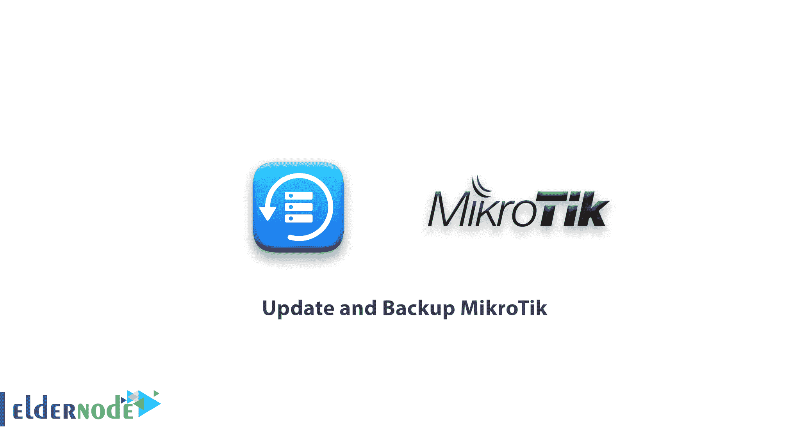
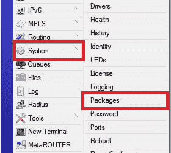
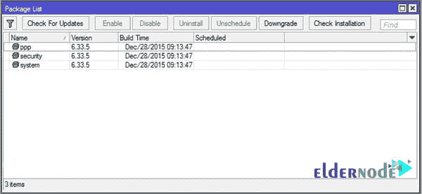
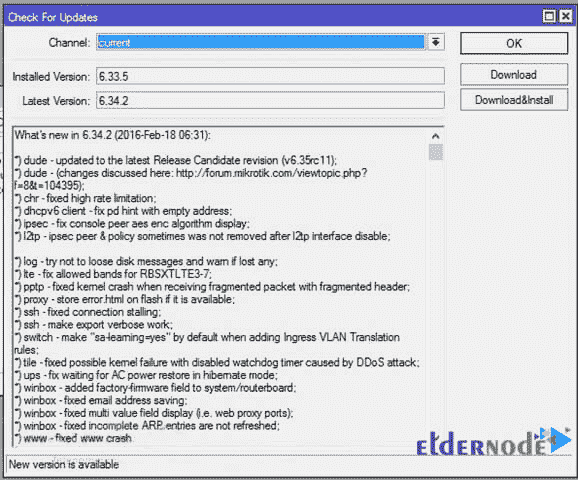
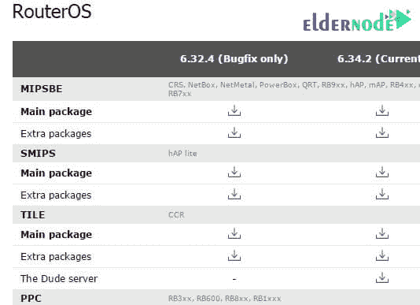
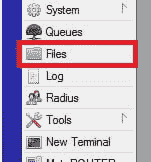
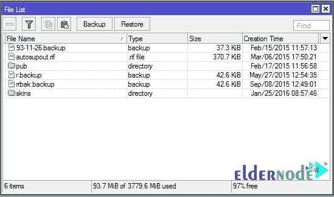
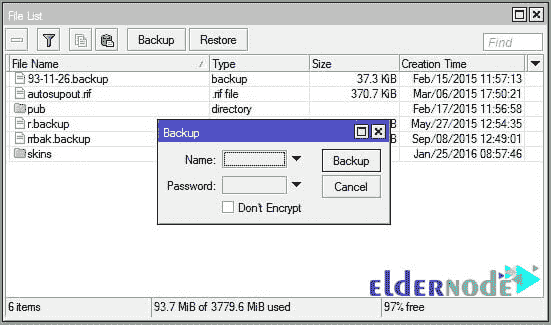
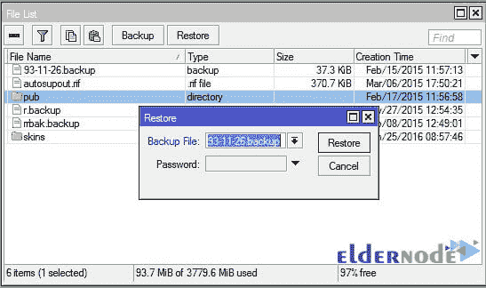

# 如何更新和备份 MikroTik - Advance ElderNode 博客

> 原文：<https://blog.eldernode.com/how-to-update-and-backup-mikrotik/>

如何更新和备份 MikroTik

路由器制造商总是希望修复他们的操作系统，以提高设备的稳定性和安全性。MikroTik 也不例外，它不时会提供产品更新，这些更新将提高 MikroTik 路由器的性能。

设置路由器是一项非常耗时的任务，建议您备份路由器设置，以便在紧急情况下使用。

### **如何更新 MikroTik:**

更新 [MikroTik](https://blog.eldernode.com/tag/mikrotik/) 有两种方法:

#### **1-在线:**

在线方法很简单。请注意，MikroTik 必须连接到互联网，并设置 DNS 以使用在线方法。

从左侧菜单 **winbox** 中选择**系统**，然后选择**包**。

您将看到如下图所示的图像:

点击**检查更新**，如果有新的更新，系统会通知我们。如下图点击**下载&安装**新版 **RouterOS** 将被下载并安装在路由器板上。

*请注意，下载完成后，路由器将重新启动进行安装。

#### **2-离线:**

如果路由器无法访问互联网，则使用此方法。这样，我们从 [**MikroTik 站点**](https://mikrotik.com/download) 获得新的更新包。MikroTik 工厂的每种产品都有两种包装，如下所示:

要更新 MikroTik，下载 **Extra Packages** 文件并解压。然后在左侧菜单的**对话框**中选择**文件**选项。将下载文件的内容传输到路由器(拖动&拖放或复制粘贴)。然后重启路由器自动更新。

**Extra Packages** 文件包含所有的 MikroTik 包，您只能将您需要的包传输到路由器来更新它们。

通过这种方式，您应该确保从网站上获得适合您路由器的软件包。

如果重启后没有安装新的软件包，最好手动重启一次。

### **获取 MikroTik 设置的备份:**

进入**文件**菜单从 MikroTik 设置中获取备份，点击**备份**。你会看到另一个窗口。在这里，您可以给备份文件起一个名字，甚至是一个密码。

点击**备份**创建一个文件，你可以把它传输到你的电脑，如果必要的话可以把它传输到路由器，然后**恢复**设置。

要恢复备份文件，只需点击文件窗口中的**恢复**。在**备份文件**部分，选择所需的备份文件。如果备份时输入了密码，输入密码后点击**恢复**。

注意不要将一台路由器备份到另一台路由器(使用另一种型号)。

如何更新和备份 MikroTik

可以买一个 [MikroTik VPS 服务器](https://eldernode.com/mikrotik-vps-server/)。

祝您好运