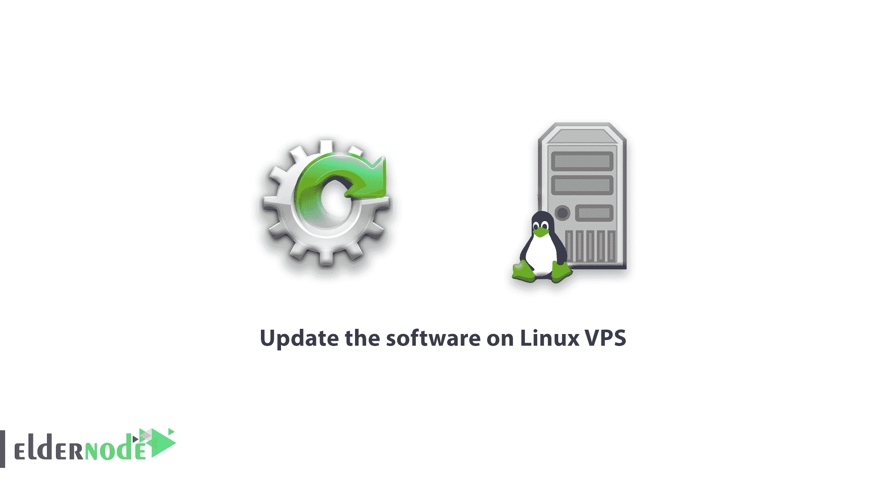

# 如何更新 Linux VPS - ElderNode 博客上的软件

> 原文：<https://blog.eldernode.com/how-to-update-the-software-on-linux-vps/>

如何在 **[Linux](https://blog.eldernode.com/tag/linux/) VPS** 上更新软件，软件更新是你收到虚拟服务器后应该做的第一件也是最重要的事情之一。由于服务器上的软件过期，会出现各种漏洞，并使您面临风险。

## **如何在 Linux VPS 上更新软件**

在这个[教程](https://eldernode.com/category/tutorial/)中，我们将向你展示如何在你的**虚拟私人服务器**上更新软件。所以请与**埃尔德诺德**在一起。

软件更新过程非常简单，只需几分钟。你需要通过 **SSH** 连接到服务器来更新服务器上的软件。连接到服务器后，您可以执行以下步骤。

#### 如何在 Linux VPS 上更新软件？

首先要做的是查看服务器上安装的软件包是否有更新。如果您使用的是 **Centos VPS** ，获得以下命令:

如果您使用的是 **Ubuntu VPS** ，您可以使用以下命令:

| # apt-get 更新和 apt-get -s 升级 |

以上命令显示了可以升级的软件包列表。您可以升级单个软件包，也可以升级服务器上安装的所有软件包。

### **如何用一个命令升级所有软件包:**

以下命令适用于 CentosVPS 用户:

系统将要求您确认更新。输入“ **Y** 然后点击“**输入**开始更新过程。

以下命令适用于 **Ubuntu VPS** 用户:

| # apt-get 更新&& apt-get 升级 |

系统将要求您确认更新。输入“ **Y** 语句，点击“**输入**开始该过程。

根据需要更新的软件包的数量和大小，此过程将需要几秒到几分钟的时间。更新过程完成后，系统软件将被更新。

请记住，如果您希望您的系统使用最新的软件，您应该定期重复这个过程。

如何在 [Linux](https://www.linux.org/forums/#linux-tutorials.122) VPS 上更新软件？

古德勒克