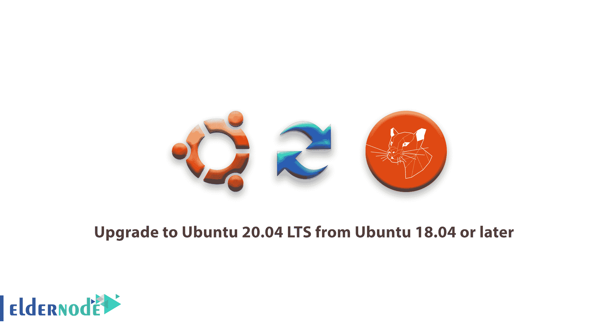

# 如何从 Ubuntu 18.04 或更高版本升级到 Ubuntu 20.04 LTS-elder node

> 原文：<https://blog.eldernode.com/how-to-upgrade-to-ubuntu-20-04-lts/>



在本教程中，我们想了解**如何从 [Ubuntu 18.04](https://eldernode.com/initial-setup-ubuntu-18/) 或更高版本升级到 Ubuntu 20.04 LTS** 。

所以如果你需要升级你的 Ubuntu 服务器到 Ubuntu 20.04，这个教程可能对你有用。

在开始步骤之前，我们必须说，请仔细阅读先决条件，并逐一运行所有步骤。

#### 先决条件

1-本指南假设您拥有配置了 root 或 sudo 用户的 [Ubuntu 18.04](https://releases.ubuntu.com/18.04/) 或更高版本。

2-在开始升级过程之前，请检查您安装的应用程序是否支持 Ubuntu 20.04 及其库

升级 Ubuntu 20.04 3-5gb 的空闲磁盘空间肯定是足够的，但是如果可以的话，请考虑给它 10Gb 的空闲空间。

4-备份您的所有数据和服务配置。如果升级过程结束，您应该确保不会丢失数据。实现这一点的最佳方法是备份您的整个文件系统、主目录、自定义配置文件以及数据库等服务存储的所有数据。

## 如何升级到 Ubuntu 20.04 LTS

#### 更新当前 Ubuntu 和已安装的软件包

在开始版本升级之前，您需要更新和升级所有当前的包、库等…

因此，要将所有包和库更新和升级到最新的可用版本，请运行以下命令

```
sudo apt update  sudo apt upgrade
```

您将看到一个软件包列表，并提示继续，回答 **Y** 为是，然后按 **输入** 。

这个过程取决于您安装的软件包可能需要一些时间。完成后，使用以下命令升级所有附加和依赖项。

```
sudo apt dist-upgrade -y
```

该命令包括根据需要更改依赖项、添加或删除新的包。

现在您已经更新了 Ubuntu 18.04，您可以运行以下命令将 Ubuntu 18.04 升级到 Ubuntu 20.04 LTS。

```
sudo do-release-upgrade
```

在检查当前 Ubuntu 版本和 Ubuntu 20.04 LTS 镜像链接后， [Ubuntu](https://eldernode.com/tag/ubuntu/) 会显示一个接受并同意升级的提示。你应该按下 **Y** 然后按下 **回车** 键开始升级。

**点:** 如果新的 Ubuntu 版本还没有正式发布，你可能会得到如下输出:

```
Output  Checking for a new Ubuntu release  No new release found
```

所以如果你在当前的 Ubuntu 上运行重要的服务，请**不要升级**。但是如果你无论如何都要升级的话，可以在命令末尾使用 **-d** 参数来获得 Ubuntu 20.04 的开发版。

```
sudo do-release-upgrade -d
```

升级到 Ubuntu 20.04 可能需要一些时间。一旦完成，请用下面的命令重启你的 Ubuntu。

```
reboot
```

启动 Ubuntu 后，你可以看到你的 Ubuntu 升级到了 LTS Ubuntu 20.04

您可能需要调查对服务和部署的应用程序的必要配置更改。

#### 结论

在本教程中，我们试图用一种简单的方式来学习如何将 Ubuntu 18.04 或更高版本升级到 Ubuntu 20.04。

希望**如何升级到 Ubuntu 20.04 LTS** 教程有用。

你可以在 [**Ubuntu 20.04 标签页**](https://eldernode.com/tag/ubuntu-20-04/) 找到更多关于 Ubuntu 20.04 的教程。

亲爱的用户，您可以在评论区提出关于本次培训的问题，在这一部分，您可以得到您的答案，或者解决 Eldernode.com 培训领域的其他问题，请参考 **[提问页面](https://eldernode.com/ask)** 部分，并尽快在其中提出您的问题。腾出时间给其他用户和专家来回答你的问题。

还有，你可以 **[从](https://eldernode.com/ubuntu-vps/) [**ElderNode VPS 页面**](https://eldernode.com/linux-vps/) 购买一个 Ubuntu 20.04 VPS**