# 如何将 Windows Server 2012 升级到 2016 - Eldernode 博客

> 原文：<https://blog.eldernode.com/how-to-upgrade-windows-server-2012-to-2016/>

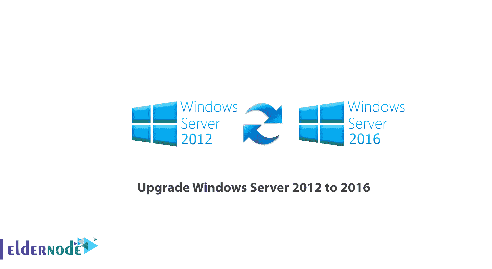

[更新日期:2021-01-27]是否要迁移到新版本的 Windows Server？与 Windows Server 2012 相比，Windows Server 2016 提供了新功能，因此您的答案可能是肯定的。这些新功能极大地改进了 Windows Server 的管理。这就是为什么我们决定向您**学习如何将 Windows Server 2012 升级到 2016** 。您可以从 [Eldernode](https://eldernode.com/) 选择您最完美的 [Windows VPS](https://eldernode.com/windows-vps/) 服务器包来安装您需要的 Windows 服务器。

## **教程升级 Windows Server 2012 到 2016**

与之前版本的 [Windows](https://blog.eldernode.com/tag/windows/) Server 升级到 2012 不同，Windows Server 2016 只支持 64 位架构。另外，Windows Server 2012 和 2016 只有 4 个版本。升级 Windows Server 是一个复杂的过程。因此，微软建议不要更新整个 Windows 服务器，而是升级 Windows 2016 服务器的角色和设置。

### **Windows 2012 升级到 2016 的要求**

为了能够将 Windows Server 2012 升级到 2016，您必须遵循以下要求:

1.Windows Server 2016 的所有版本都是 64 位(不可能从 32 位升级到 64 位。)

2.只有 Windows Server 2012 可以升级到 2016，其他版本不能升级。

3.不支持从一个版本升级到另一个版本。例如，您不能将 Windows Server 2012 的标准版本升级到 Windows Server 2016 的数据中心版本。

4.不可能从一种语言升级到另一种语言。比如不能把德语版的 Windows Server 升级到中文。

5.不支持从服务器核心升级到台式机版本(反之亦然)。

6.不支持从旧版本的 Windows Server 升级到试用版的 Windows Server。试用版必须手动安装。

7.禁用防病毒，因为它会扫描复制到磁盘的每个文件，并降低处理速度。

8.如果此服务器使用 NIC 绑定，请将其禁用并重新激活。

9.制作服务器的完整备份，因为您可能在升级过程中遇到问题，并且想要回到以前的版本。

10.检查服务器没有问题，如果你看到任何问题，尝试解决它们。否则，您可能会遇到导致整个安装过程失败的错误。

### 逐步升级:

现在您已经了解了升级的规则，让我们继续。

登录 Windows Server 2012 并安装 DVD 或 Flash。打开**文件浏览器**，点击 **DVD 光驱**，如下图所示:

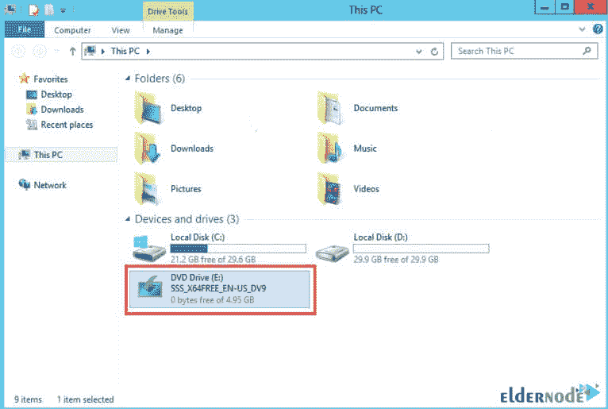

选择**下载&安装更新**开始 Windows 安装过程。

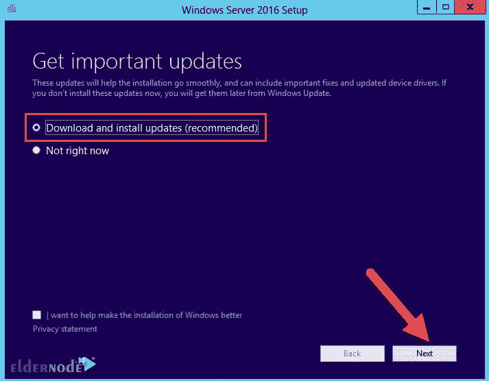

选择适合您需求的 Windows Server 2016 版本。您可能需要在未来扩大网络，并需要更多的角色和许可证。所以在这一点上要小心。

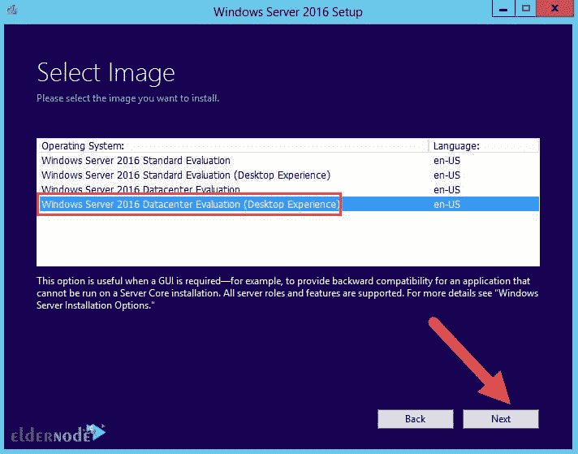

在**许可**阶段，点击**接受**。你将进入下一步。

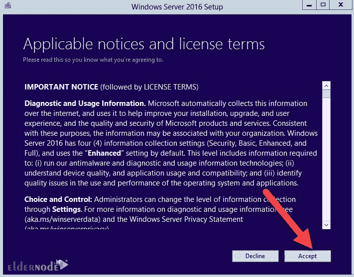

如果您选择了与先前版本相同的版本，您可以保留系统中的所有应用程序和文件。正如我们所说，如果你不想选择以前的版本，应用程序和文件将被删除。选择**保存个人文件和应用**保存文件和应用，否则，点击**无**删除所有文件。然后点击**下一步**。

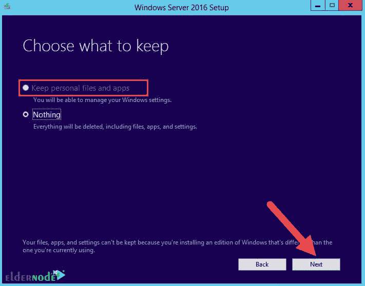

### **如何安装 Windows Server 2016**

Windows Server 会自动检查系统的兼容性。所以，点击**安装**开始安装。

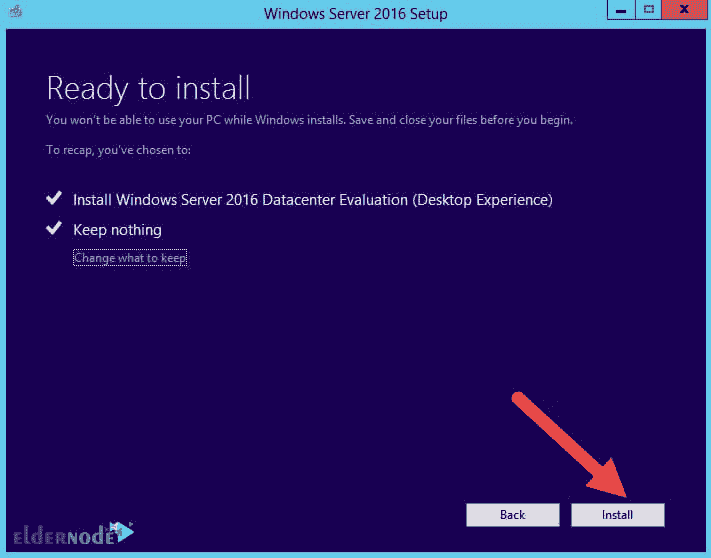

请稍等，因为在您的系统上安装 Windows Server 需要很长时间。在安装过程中，您的系统将被重置几次。

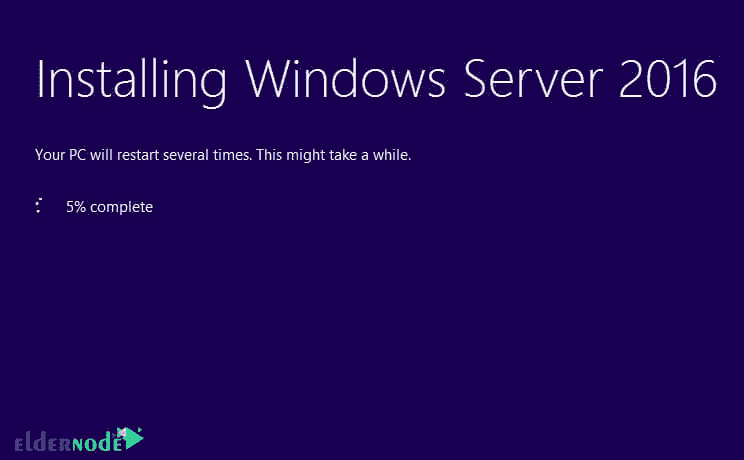

选择**国家和键盘语言**。请注意，您不能更改语言。点击**下一个**。

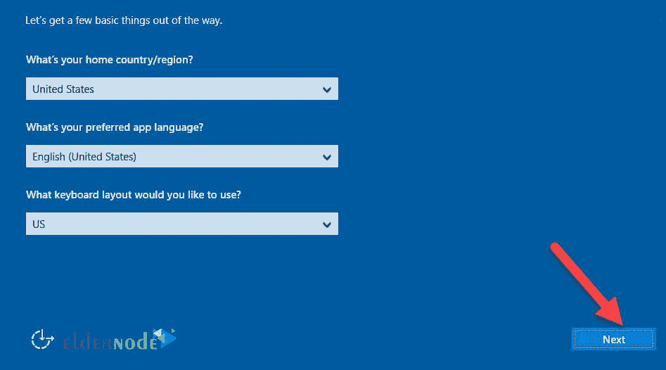

在**许可条款**页面点击**接受**。

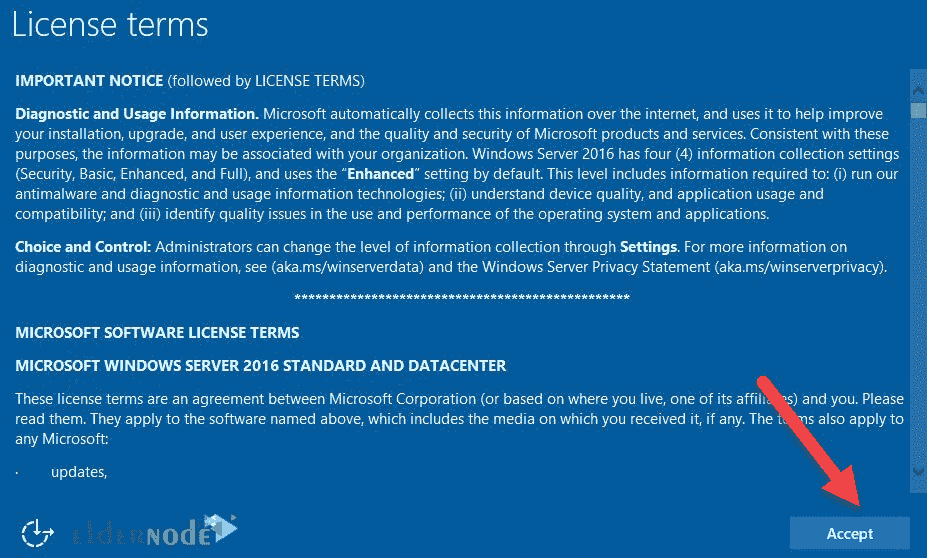

**用户名**是默认的**管理员**，输入密码(包含大小写字母、数字和符号的代码)，重新输入密码。然后点击**完成**。您可以使用该用户名和密码在本地登录服务器。

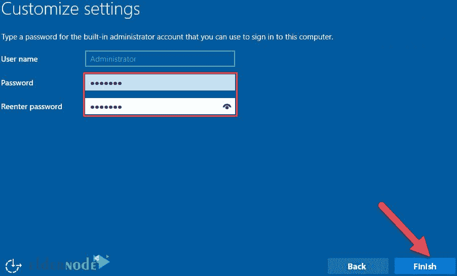

按 ***Ctrl + Alt + Del*** 进入登录页面，使用用户名和密码登录。

在这里，我们已经成功地从 Windows Server 2012 升级到 2016。进入 Windows Server 2016 页面，可以看到不同和改进。

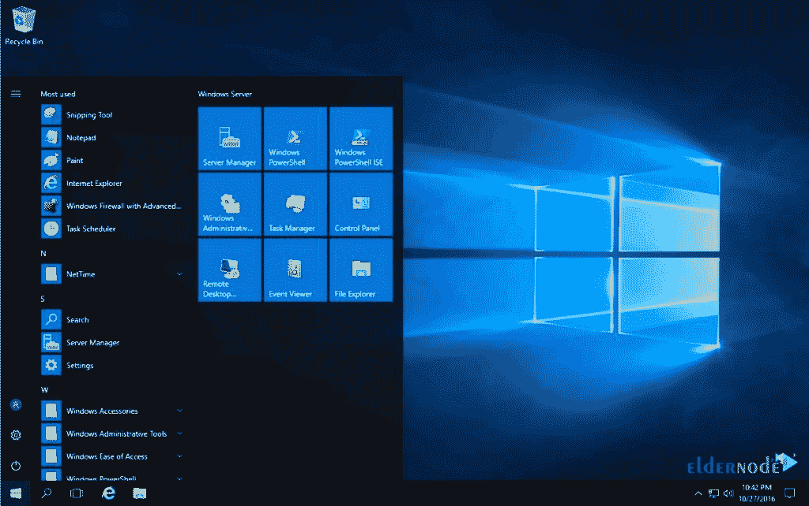

## 结论

在解释如何将 Windows Server 2012 升级到 2016 之前，我们首先需要提一下更新到 Windows Server 2016 的一些要求。然后，你就完全学会了如何从 Windows Server 2012 升级到 Windows Server 2016。