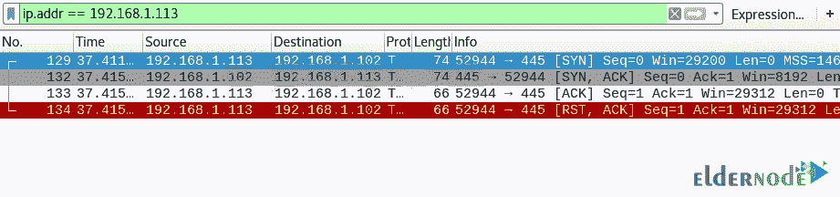

# 如何在 Nmap 中逐步使用 Wireshark-elder node 博客

> 原文：<https://blog.eldernode.com/how-to-use-wireshark-in-nmap/>


Wireshark 是分析网络流量和协议的强大工具。借助 Wireshark，您可以捕获网络流量并在捕获的流量中进行搜索。Wireshark 的强大功能和易用性使其成为网络和安全专业人士中最受欢迎的网络流量分析工具之一。在本文中，我们试图教你如何在 Nmap 中使用 Wireshark**。需要注意的是，如果你想购买一台 **[VPS 服务器](https://eldernode.com/vps/)** ，可以访问 [Eldernode](https://eldernode.com/) 中提供的软件包。**

## **教程在 Nmap 中逐步使用 Wireshark**

在本文的其余部分，我们将教您如何在攻击者使用 [NMAP](https://blog.eldernode.com/install-nmap-on-linux/) 端口扫描方法扫描目标时，使用 Wireshark 捕获网络数据包。在本教程中，您还将了解 Wireshark 如何记录开放和关闭端口的不同网络流量包。因此，我们请求您加入我们这篇关于如何在 Nmap 教程中使用 [Wireshark](https://blog.eldernode.com/introducing-wireshark-software/) 的文章。

### **Wireshark 应用**

Wireshark 可用于以下用途:

1-网络中的故障排除和调试

2-测试[安全](https://blog.eldernode.com/tag/security/)问题

3-协议的分析和开发

4-执行黑客操作

5-网络和安全培训

## **在 Nmap 中使用 Wireshark**

本节需要注意的重要一点是，在本节中，工作是使用 IP 地址(192.168.1.102)完成的。这对于 [Windows](https://blog.eldernode.com/tag/windows/) 和 [Linux](https://blog.eldernode.com/tag/linux/) 设备来说很常见。所以你可以通过你的 MAC 地址来区分它们。在下文中，我们将向您介绍如何在 Nmap 中使用 Wireshark 的不同部分。请加入我们。

### **TCP 扫描如何工作**

TCP 扫描扫描 TCP 端口，如端口 21、22、23、445。应该注意的是，该扫描确保通过源端口和目的端口之间的三方手动连接监听(开放)端口。完成此操作后，如果端口是打开的，源请求 SYN 数据包，发送 SYN 响应目的地、ACK 数据包，然后发送 ACK 数据包源。最后，信源再次发送 RST ACK 包。

您可以键入 NMAP 命令来扫描 TCP，如下所示。还要在另一端启动 Wireshark 来获取包:

```
nmap -sT -p 445 192.168.1.102
```

如下图所示，执行上述命令表明**端口 445** 打开。


此时，您可以查看通过 Wireshark 捕获的源和目的地之间的数据包传输序列。

1.源向目的地发送 SYN 数据包

2.目标向源发送 SYN，ACK

3.源向目的地发送了 ACK 数据包

4.源再次向目的地发送 RST 确认



此时，您可以检查关闭端口的网络流量。如果扫描端口关闭，则源和目的地之间不可能进行 3 次握手连接。源发送 Syn 包，如果端口关闭，接收方通过 RST 发送响应 ack。

您可以使用以下命令进行 TCP 扫描，并在另一方面启动 Wireshark 来捕获发送的数据包:

```
nmap -sT -p 3389 192.168.1.102
```

如下图所示，**端口 3389** 关闭。


现在，您可以查看通过 Wireshark 捕获的源和目的地之间的数据包传输序列。


### **隐形扫描如何工作**

SYN 扫描是最流行的扫描之一。这种类型的扫描可以轻松快速地完成，每秒钟扫描数千个端口。它也是相对典型和隐蔽的，因为它从不完成 TCP 连接。请注意，如果收到 SYN 数据包(没有 ACK 标志)作为响应，该端口也会打开。请注意，这种扫描被称为半开扫描，因为您没有打开完整的 TCP 连接。

像下面的命令一样，您可以扫描 TCP 的 NMAP 指令。您也可以在另一端启动 Wireshark 来记录发送的数据包:

```
nmap -sS -p 22 192.168.1.102
```

通过执行上述命令，您将看到**端口 22** 是打开的。


在下图中，您可以看到通过 Wireshark 在源和目的地之间进行的一系列数据包传输。

1.源向目的地发送 SYN 数据包

2.目标向源发送 SYN，ACK 数据包

3.源向目的地发送 RST 数据包


现在，您需要使用下面的 TCP 命令来扫描 NMAP 指令。请注意，您必须在另一端启动 Wireshark 来记录发送的数据包。

```
nmap -sS -p 3389 192.168.1.102
```

如下图所示，**端口 3389** 关闭。


您将仔细看到下面的图像:

1.源向目的地发送 SYN 数据包

2.目的地向目的地发送 RST ACK 数据包


### **手指扫描如何工作**

在本节中，我们将介绍 FIN 数据包。请注意，FIN 数据包用于在完成数据传输后终止源端口和目的端口之间的 TCP 连接。如何进行这种类型的扫描如下:

Nmap 使用 FIN 数据包代替 SYN 数据包启动 FIN 扫描。

如果端口是开放的，那么当 FIN 包通过源端口发送时，没有来自目的端口的响应。

***注意:*** Fin-Scan 只在 [Linux](https://blog.eldernode.com/tag/linux/) 机器上有效，在最新版本的 [windows](https://blog.eldernode.com/tag/windows/) 上无效。

与前面的步骤一样，您可以键入以下 NMAP 命令进行 TCP 扫描，并在另一方面启动 Wireshark 来捕获发送的数据包:

```
nmap -sF -p 22 192.168.1.102
```

你会看到**口 22** 是打开的。


如下图所示:

1.源向目标发送 FIN 数据包

2.目标没有向源发送回复


再次扫描 TCP 的以下说明，并启动 Wireshark 记录发送的数据包:

```
nmap -sF -p 3389 192.168.1.102
```

如你所见，**端口 3389** 关闭。


查看通过 Wireshark 接收的源和目的地之间的数据包传输顺序，您会发现:

1.源向目的地发送 SYN 数据包

2.目的地向目的地发送 RST 数据包


### **零扫描如何工作**

在本节中，我们将向您解释空扫描。空扫描是一系列包含序列号“零”(0000000)的 TCP 数据包。由于在这种类型的扫描中没有标志，目的地不知道如何响应请求。因此，它会销毁此数据包，并且不会发送任何指示端口已打开的响应。

***注意:*** 空扫描只在 Linux 设备上有效，在最新版本的 Windows 上无效。

与前面的步骤一样，您可以键入以下 NMAP 命令进行 TCP 扫描，并在另一方面启动 Wireshark 来捕获发送的数据包:

```
nmap -sN -p 22 192.168.1.102
```

通过执行上述命令，您将看到**端口 22** 是打开的。


如下图所示:

1.源向目的地发送了空数据包

2.目标没有向源发送回复


再次扫描 TCP 的以下说明，并启动 Wireshark 记录发送的数据包:

```
nmap -sN -p 3389 192.168.1.102
```

如你所见，**端口 3389** 关闭。


查看通过 Wireshark 接收的源和目的地之间的数据包传输顺序，您会发现:

1.源向目标发送了空(无)数据包

2.目的地发送 RST，确认来源


## 结论

Wireshark 是一种互联网分析工具的名称，以前称为 Ethereal。该软件分析通过互联网发送和接收的数据包，并将它们显示给用户。Wireshark 有许多功能，您可以使用它来检查在互联网上发送和接收的包。在本文中，我们试图通过一个例子教你如何一步一步地在 Nmap 中使用 Wireshark。