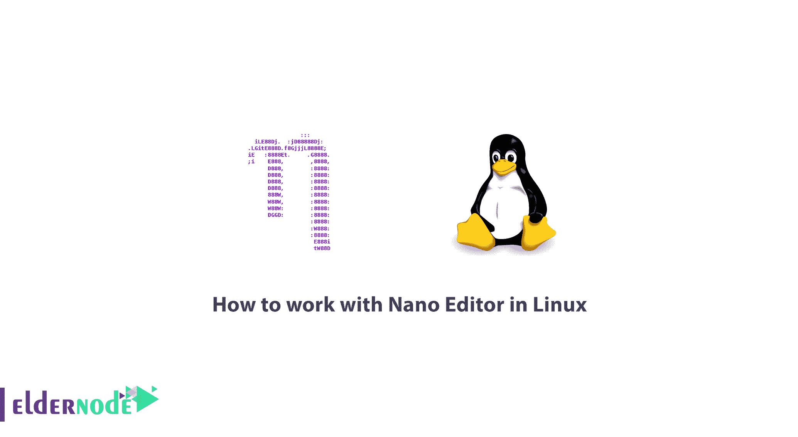

# 如何在 Linux - Eldernode 中使用 Nano 编辑器

> 原文：<https://blog.eldernode.com/how-to-work-with-nano-editor-in-linux/>



Linux 发行版有各种各样的编辑器，其中一些编辑器因其无处不在和易于使用而更受欢迎。这个领域提到的编辑器有 VI，VIM，Nano。在本教程中，我们将向您介绍如何在 Linux 中使用 Nano Editor。

Nano Editor 比其他编辑器更受欢迎和更容易的原因之一是编辑和使用它的类型。以至于在 Linux 终端中执行这个命令后，就好像给了你一个图形模式进行文本编辑，编辑起来更加轻松快捷。接下来，我们将教你如何在 Linux 下使用 Nano Editor。和我们在一起。

## 如何在 Linux 中使用 Nano 编辑器

要执行 nano 命令，只需在终端环境中键入 nano。如果遇到错误，很可能是您的 Linux 上没有安装 nano。使用以下命令安装 nano:

使用以下命令在 **CentOS** 和 **RHEL** Linux 上安装 Nano:

```
yum install -y nano
```

使用以下命令在 **Debian** 和 **Ubuntu** Linux 上安装 Nano:

```
apt-get install nano
```

安装 Nano 后，可以如下使用。

***注意:***sudo 部分旨在作为根用户运行该命令。如果您可能从一开始就没有以 root 用户身份登录，系统可能会要求您输入密码。所以不用担心。

**例如**，要编辑一个名为 **Elder.txt** 的文件，输入以下命令:

```
nano Elder.txt
```

一旦文件打开，您可以简单地应用所需的更改，最后**保存**文件。

### 文本编辑技巧和窍门

要选择文本，请滚动到文本的开头并按下 **ALT + A** 。然后使用箭头键移动文本。

按下 **ALT + 6** 复制选中的文本。这会将文本复制到剪贴板。

使用 **CTRL + K** 剪切文本。如果要粘贴文字，按 **CTRL + U** 。

### 如何搜索和替换文本

按下 **CTRL + W** 搜索文本。有人问你在找什么短语？输入要搜索的文本，然后按 Enter 键。使用 **ALT + W** 继续搜索相似的文本字符串。

如果你的目标是搜索和替换文本，按下 **CTRL + W** ，然后按下 **CTRL + R** 。这将搜索并替换文本。之后，编辑器会将您带到文本的第一个实例，并询问您是否所有找到的短语都被替换了？

### Linux 中的 Nano 命令

以下是一些 nano 命令:

***Ctrl + G:*** 转到 nano 命令的帮助部分

***Ctrl + A:*** 转到文档的第一行

***Ctrl + E:*** 转到文档的最后一行

***Ctrl + Y:*** 像 Windows 中的 page down，你会被重定向到一个页面。

***Ctrl + V:*** 像在 Windows 中向上翻页一样，你会被重定向到一个页面。

***Ctrl + C:*** 找到要打字的骏马

***Ctrl + W:*** 搜索文档

***Ctrl + D:*** 删除骏马所在的字符。

***Ctrl + K:*** 清除骏马所在的整行。

***Ctrl + O:*** 保存文档

***Ctrl + X:*** 退出文档并提示保存文档。

### 纳米编辑器设置

***1。平滑滚动***

nano 支持两种类型的滚动。一种是逐块滚动多行，另一种是逐行滚动。默认情况下，nano 多行滚动。要逐行或轻柔地滚动(即，只需按箭头键即可上下滚动)，请将以下行添加到设置中:

```
set smooth
```

或者在运行 nano 时使用以下开关:

```
-S or --smooth
```

***2-自动缩进***

这个选项对于程序员来说也是非常有用的。其逻辑是，它根据前一行的距离计算缩进。在设置文件中添加这一行:

```
set autoindent
```

或者在运行时使用以下开关:

```
-i or --autoindent
```

***3-备份***

请务必启用此功能。极其有用。

假设您操作了一个系统配置文件，现在系统出现了问题，而您不记得您更改了什么。使用此选项，每次操作文件时，nano 都会保留未修改版本的副本。

在设置文件中添加以下行:

```
set backup
```

或者在运行时使用以下开关:

```
-B or --backup
```

默认情况下，备份存储在原始文件旁边，但 nano 的一个优点是，您可以要求它将所有备份保存在特定路径中。

在配置文件中，添加以下行，并输入所需的地址:

```
set backupdir "/home/user/nano-backups"
```

***4-纳米历史***

如果您需要访问 nano 中的搜索/替换历史，只需将以下行添加到配置文件中。所有搜索的历史记录存储在 **~/中。纳米历史**文件。

```
set historylog
```

您还可以使用以下开关来保存历史记录:

```
-H or --historylog
```

***5-激活鼠标***

虽然在这些类型的编辑器中使用鼠标只会降低速度，但对于复制或剪切等操作来说，它可能很有用。

```
set mouse
```

以下是运行时选项:

```
-m or --mouse
```

有关可用选项的完整列表，请从 nano help 获取帮助:

```
nano --help or man nano
```

## 结论

在 Nano Text Editor 的帮助下，您可以使用 SSH 通过命令行轻松编辑 web 服务器上的文本文件。在本教程中，您将学习如何安装一个纳米文本编辑器。请注意，根据您使用的 Linux 操作系统，您必须在命令行环境中输入相关的命令。有一些基本的说明和应用程序的关键，可以帮助您编辑您的文件更快，更容易。下次不需要安装 Nano，只需使用文件编辑命令即可。下次不需要安装 Nano，只需使用文件编辑命令即可。