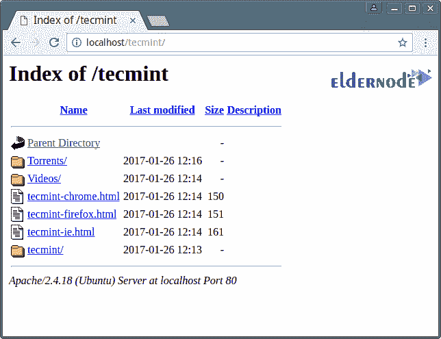

# htaccess 及其各种应用程序- Windows VPS 服务器

> 原文：<https://blog.eldernode.com/htaccess-and-its-applications/>


htaccess 及其各种应用。。htaccess 文件是一个 Apache web 服务器配置文件，它可以控制对站点的访问或如何工作。该文件可以更改 Apache 服务器的默认设置。安。用文本/HTML 编辑器可以轻松创建 htaccess 文件，然后通过 FTP 上传。

在这篇文章中，我们想先给大家介绍一下**。htaccess 文件**然后解释这个文件的不同用途。和我们在一起。

[**购买 VPS，在 Eldernode**](https://eldernode.com/vps/) 购买即时激活的廉价 VPS 托管服务器

## 什么是 htaccess？

。htaccess 是一个文本环境文件，用于配置一些 web 服务器上的各种文件夹，包括 [Apache](https://en.wikipedia.org/wiki/Apache_HTTP_Server) 。许多需要高级编码的任务只能通过在该文件中编写一行代码来完成。

有了这个文件，你可以将一个页面重定向到另一个页面，更改文件扩展名，加密文件夹，诸如此类的事情都很容易。

### 的位置。htaccess 文件以及如何访问它

这个文件通常存在于主机 public_html 目录中。在大多数**内容管理系统**中，比如 WordPress 和 Drupal ，这个文件是自动创建的。

如果你的主机控制面板是 cpanel ，这个控制面板默认不显示**隐藏文件**。因此，要让显示隐藏文件，请按如下步骤进行:

**1。在页面右上角的文件管理器文件夹中，点击设置按钮，弹出文件管理器设置窗口。**

**2。在弹出的** 窗口中，**勾选** 显示隐藏文件，点击保存。

有了这个改动，**保存**后，可以进入 public_html 文件夹，查看 htaccess 文件。其他隐藏的文件夹如 Trash ，即被删除文件所在的位置，也将在主文件夹中可见。


通过 [htaccesseditor 站点](http://www.htaccesseditor.com/en.shtml)，你可以根据你想要的应用轻松生成你需要插入 htaccess 的代码**将其添加**到你的 htaccess 文件。

### Htaccess 应用程序

这个文件通常是通过在脚本的主路径中自动创建流行的和**开源的 CMS** 如 WordPress 、 Joomla 和 Drupal 来创建的，它负责如下重要任务:

#### 改变主索引文件的标题和格式

你可以使用下面的代码来改变你站点原始文件的 名称和格式:

```
DirectoryIndex file.php file.htm
```

#### 防止主机内的文件和文件夹被盗

大多数情况下，诸如主机上的您自己的模板文件或压缩到您的主机中的文件之类的信息很容易被他人发现和窃取。

为了防止这种情况，将下面的代码放在的**底部**。htaccess 文件:

```
Options All -Indexes
```

#### 限制 htaccess 中特定 ip 的访问

在某些情况下，当来自一个或多个 ip 的许多请求被发送到您的站点并降低您的站点的加载速度或阻止 ip 垃圾邮件发送者时，您可以通过来限制所需的 ip。htaccess 文件。

```
deny from 1.2.3.4
```

```
allow from all
```

代替1.2.3.4你需要**添加**期望的 ip 或 ip 范围。

同样对于站点管理安全，你可以创建一个。htaccess 文件在站点管理路径中，例如在 WordPress 中，在 wp-admin 路径中，并且限制除了你的静态 ip 之外的所有 IP 的访问。这样，只有您的站点可以访问站点管理路径。

```
deny from all
```

```
allow from 1.2.3.4
```

代替1.2.3.4你需要**添加**期望的 ip 或 ip 范围。

#### 使用 htaccess 代码增强文件安全性(限制文件访问)

为了防止其他人访问站点的一些重要文件，如配置 文件，在 htaccess 中输入以下代码:

```
<files wp-config.php>    order allow,deny    deny from all     </files> 
```

你需要输入想要的文件名，而不是 wp-config.php。

#### 隐藏目录列表

网站的一个问题是查看文件和文件夹的能力。这个问题允许任何人看到上传到你网站的内容，例如可以复制你网站的模板。



要防止此问题，请在 htaccess 中输入以下代码:

```
Options –Indexes
```

#### 用 htaccess 代码在浏览器上缓存站点

**缓存**浏览器上的站点会减少你站点上的流量、 RAM 和 CPU 消耗，从而提高你站点的加载速度。

将下面的代码放在的**底部**。htaccess 文件:

```
# Enables browser caching    <IfModule mod_expires.c>  ExpiresActive On    ExpiresByType image/jpg "access 1 year"    ExpiresByType image/jpeg "access 1 year"    ExpiresByType image/gif "access 1 year"    ExpiresByType image/png "access 1 year"    ExpiresByType text/css "access 1 month"    ExpiresByType application/pdf "access 1 month"    ExpiresByType text/x-javascript "access 1 month"    ExpiresByType application/x-shockwave-flash "access 1 month"    ExpiresByType image/x-icon "access 1 year"    ExpiresDefault "access 2 days"    </IfModule> 
```

#### 限制可执行和可查看文件的类型

为了维护站点的安全和信息，您可以指定可以运行的文件扩展名:

```
Options +FollowSymlinks    RewriteEngine On    rewritecond %{REQUEST_FILENAME} !^(.+).css$    rewritecond %{REQUEST_FILENAME} !^(.+).js$    rewritecond %{REQUEST_FILENAME} !file.php$    RewriteRule ^(.+)$ /deny/ [nc]
```

#### 通过 htaccess 添加 mime-type】

删除服务器查询是否打开或者下载文件。轻松下载所需文件。

```
AddType application/octet-stream .pdf    AddType application/octet-stream .zip    AddType application/octet-stream .mov
```

#### 限制文件上传

您可以通过以下代码将最大可上传文件大小设置为 20 MB :

```
php_value upload_max_filesize 20M
```

#### 限制发帖量

通过下面的代码，可以指定每个**帖子**的最大大小为 2 MB :

```
php_value post_max_size 2M
```

#### 设置内存限制

您可以通过下面的代码指定内存量限制:

```
php_value memory_limit 128M
```

#### 在 htaccess 中定义重定向

htaccess 中最常见的用途之一是定义重定向和转发的能力。您可以通过在该文件或各种链接中插入代码，将网站重定向到另一个地址。你也可以用 **http** to https 或者用**www**to withoutwww指定要重定向的站点。


例如，你可以通过下面的代码将 http 重定向到 https :

```
RewriteEngine On    RewriteCond %{HTTPS} off    RewriteRule ^(.*)$ https://%{HTTP_HOST}%{REQUEST_URI} [L,R=301]
```

htaccess 及其各种应用

#### 更改默认页面

使用下面的代码，你可以指定站点的默认页面是什么。也就是说，当**站点加载**时，应该先加载哪个页面或者决定显示默认页面的优先级。

```
#Alternate default index pages    DirectoryIndex first.html index.htm index.html index.php
```

#### 创建默认错误页面

创建一个自定义错误页面意味着，例如，当你的网站遇到一个最常见的 HTTP 错误时。

例如，没有文件或页面，访问者通过输入一个在你的服务器和网站上不存在的地址得到一个 404 错误。

访问者可能不知道这个错误的含义，或者即使他知道，他可能会感到困惑，并停止访问您的网站。在这种情况下，如果我们已经创建了一个页面，访问者不会遇到 404 错误，而是进入一个页面，正确地告诉他“**有问题的文件不存在**或“**该文件可能由于某种原因已被删除或移动到另一个路径**”访问者对错误感觉更好。


#### 如何在中防止热链接操作。htaccess 文件(防止在其他网站上使用网站图片)

热链接保护防止您的信息被复制到其他网站。例如，如果你的托管服务目录中有一张图片，那张图片就不会显示在其他网站上。此外，如果可以使用您的网站下载带有**直接链接** 的文件，并且该链接被复制到另一个网站，该网站的用户将首先通过点击该链接被转到您的网站地址。这将**增加**你网站的流量和负载。在这种情况下，你的带宽将结束，而没有人访问你的网站。

使用 htaccess 将会阻止你在其他网站上使用你的内容，**尤其是**你的网站图片。

**注意** ，这个特性需要在你的服务器上启用 mod_rewrite 。因此，请务必联系您的系统管理员或虚拟主机公司。

htaccess 及其各种应用。

以下是防止使用应该在**中的格式为“ GIF ”、“ JPG ”和“ CSS ”的文件内容的说明。htaccess 文件**:

```
RewriteEngine on    RewriteCond %{HTTP_REFERER} !^$    RewriteCond %{HTTP_REFERER} !^http://(www\.)?yourdomain.com/.*$ [NC]    RewriteRule \.(gif|jpg|css)$ - [F]
```

Yourdomain.com被替换为网址。

#### Htaccess 保护。防止未经授权的访问

如你所见，你可以用一个做很多事情。htaccess 文件。

鉴于它对你的网络服务器的权力和控制，重要的是**保护**这个文件不被黑客的未授权访问。

为了保护这个文件，只需将下面的代码添加到您的中。htaccess 文件:

```
<files ".htaccess">    order allow,deny    deny from all    </files>
```

**亦作，见:**

[如何在 Windows Server 上安装 Apache](https://eldernode.com/install-apache-on-windows-server/)

**尊敬的用户**，我们希望您能喜欢这个[教程](https://eldernode.com/category/tutorial/)，您可以在评论区提出关于本次培训的问题，或者解决[老年人节点培训](https://eldernode.com/blog/)领域的其他问题，请参考[提问页面](https://eldernode.com/ask)部分，并尽快提出您的问题。腾出时间给其他用户和专家来回答你的问题。

htaccess 及其各种应用。

好运。