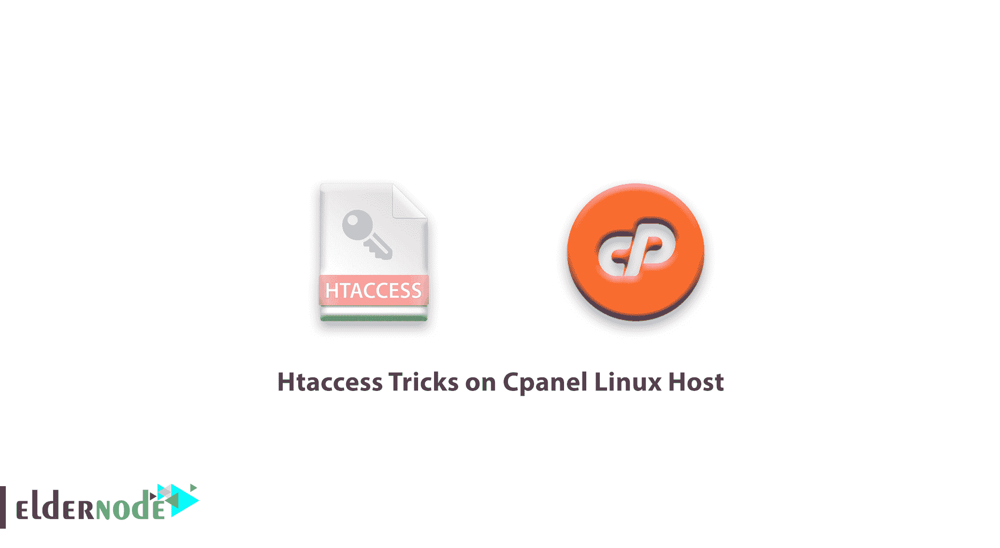

# Cpanel Linux Host - ElderNode 博客上的 Htaccess 技巧

> 原文：<https://blog.eldernode.com/htaccess-tricks-on-cpanel-linux-host/>

Cpanel Linux 主机上的 Htaccess 窍门；

一些 Linux 用户可能不知道" **htaccess"** 的功能。

您需要知道这些技巧中的一些是保护您的 web 服务器免受黑客攻击所必需的。其他人将能够执行简单有效的任务，如重定向网络服务器和网站优化。下面的 **htaccess** 将能够帮助你轻松的重定向和优化 web 服务器。

### cPanel Linux 主机上的 15 个 Htaccess 提示和技巧

#### ***1–设置时区:***

有时当你在 PHP 中使用 date 或 **mktime** 函数时，它会给你显示一条有趣的时区信息。这个问题很容易解决。在服务器上设置时区。**时区**支持列表可以在这里找到。

| SetEnv 澳大利亚 TZ/墨尔本 |

#### ***2–SEO 内容与 301 永久改变路径:***

今天，一些现代搜索引擎能够检测 301 永久重定向并更新现有记录。

| 重定向 301 http://www.test.com/home http://www.test.com/ |

#### ***3–排除下载对话框:***

通常，当您试图从 web 服务器下载某些内容时，会收到保存或打开文件的请求。要避免此请求，请在 htaccess 文件中输入以下代码。

| 添加应用程序/八位流类型。pdf AddType 应用程序/八位字节流。zip 添加类型应用程序/八进制流。mov |

#### ***4–删除 WWW***

SEO 准则之一是确保只有一个 URL 指向你的网站。因此，您需要将所有 WWW 流量重定向到非 WWW 路由。

使用以下代码来完成此操作:

| rewrite base/rewrite cond % { http _ host } ^www.joomir.com[NC]重写器^(.上的重写引擎*)$ http://joomir.com/$1[L，R=301] |

#### ***5–自定义错误页面:***

为每个错误代码创建一个自定义错误页面。

| ErrorDocument 401 /error/401.php ErrorDocument 403 /error/403.php ErrorDocument 404 /error/404.p错误文档 500 /error/500.php |

#### ***6–压缩文件:***

优化加载网站的时间可以通过压缩文件到更小的尺寸来实现。

| # compress text, html, javascript, css, xml: AddOutputFilterByType DEFLATE text/plain**a)** AddOutputFilterByType DEFLATE text/html AddOutputFilterByType DEFLATE text/xml**b)**AddOutputFilterByType DEFLATE 文本/CSS AddOutputFilterByType DEFLATE 应用程序/xml**c)**AddOutputFilterByType DEFLATE 应用程序/XHTML+XML AddOutputFilterByType DEFLATEapplication/RSS+XML AddOutputFilterByType DEFLATE application/JavaScript AddOutputFilterByType压缩应用程序/x-javascript |

#### ***7–缓存文件:***

文件保存是加载时优化网站的流行方式。

| <filesmatch>标题集缓存控制" max-age=2592000 "</filesmatch> |

#### ***8–禁止存储某些类型的文件:***

您可以禁用某些类型文件的存储。

| # explicitly disable caching for scripts and other dynamic files <FilesMatch “.(pl&#124;php&#124;cgi&#124;spl&#124;scgi&#124;fcgi)$ " >标头未设置缓存控制 |

Htaccess 在 [Cpanel](https://www.cpanel.net/) Linux 主机上耍花招；

## 安全

后续的 **htaccess** 代码将能够提高你的网络服务器的安全级别。**热链接**保护在防止存储在网络服务器上的图像被使用方面非常有用。

#### ***1–带 htaccess*** 的热链接保护

通过使用下面的代码，你可以防止你的网站的带宽被窃取，通过使用你的网络服务器上的图像。

| RewriteBase / RewriteCond %{HTTP_REFERER} !^$ RewriteCond %{HTTP_REFERER} !^http://(www.)joomir.com/.*$[NC]重写器。(gif &#124; jpg &#124; swf &#124; flv &#124; png)$/feed/[R = 302，L] |

#### ***2——防止黑客入侵你的网站***

要提高网站的安全级别，请使用以下代码。这些代码将通过检测恶意 URL 来防止一些黑客技术。

| RewriteEngine On # proc/self/environ? no way! RewriteCond %{QUERY_STRING} proc/self/environ [OR] #阻止任何试图通过 URL RewriteCond %{QUERY_STRING}设置 mosConfig 值的脚本mosConfig_[a-zA-Z_]{1，21}(=&#124;\%3D) [OR] #阻止任何试图对要发送的垃圾进行 base64 编码的脚本通过 URL 重写第%{QUERY_STRING} base64_encode。*(.*)[或] |

#### ***3–阻止访问您的 htaccess 文件***

以下代码将阻止用户访问 **htaccess** 文件。您也可以阻止多个文件。

| # secure htaccess file order allow,deny deny from all # prevent viewing of a specific file order允许，拒绝拒绝所有#多个文件类型(htaccess &#124; htpasswd &#124; ini &#124; phps &#124; Fla &#124; PSD &#124; log &#124; sh)$ " > Order Allow，Deny Deny from all |

#### ***4–重命名 htaccess 文件***

您可以将 **htaccess** 文件重命名为其他名称，以防止其他人访问它。

#### ***5–更改默认索引页面***

您可以将默认的 index.html 页面、index.php 页面或 index.htm 页面更改为其他页面。

| business.html 董事索引 |

***6–通过域名提示阻止不需要的访客***

#### scumbag.com[北卡罗莱纳州]重写第二% { HTTP _ REFERER } wormhole.com[北卡罗莱纳州]重写规则。*–[F]

| # block visitors referred from indicated domains RewriteEngine on RewriteCond %{HTTP_REFERER}***7–通过禁用执行脚本来保护目录*** |

#### #通过禁用脚本执行 AddHandler cgi-script 来保护目录。php。地方 py。jsp。asp。htm。shtml。先令 cgi 选项-Ex

| Cpanel Linux 主机上的 Htaccess 窍门； |

祝您好运

Goodluck.