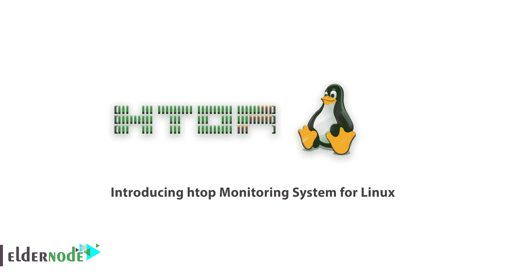
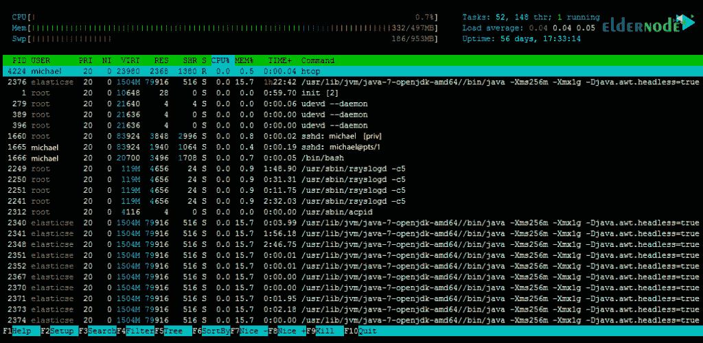

# Linux 的 htop 监控系统介绍- Eldernode 博客

> 原文：<https://blog.eldernode.com/htop-monitoring-system-for-linux/>

Linux 是今天在服务器操作系统中占据特殊位置的操作系统。服务器和操作系统管理对于可执行服务非常重要。因此，Linux 管理员通常使用 Linux 软件或命令来监控服务器状态。对互联网服务器的攻击也使得管理员更加注意监控他们的服务器。在这篇文章中，我们试图向您介绍用于 Linux 的 htop 监控系统。你可以访问 [Eldernode](https://eldernode.com/) 提供的包来购买 [Linux VPS](https://eldernode.com/linux-vps/) 服务器。

## Htop Linux 监控系统

在使用任何操作系统时都会出现这样的需求，即用户可以很容易地看到 CPU 和 RAM 等系统资源的使用量。它还可以查看正在运行的进程。

通常所有现有的操作系统都为用户提供这个工具。例如，在[窗口](https://blog.eldernode.com/tag/windows/)中，你可以使用像任务管理器这样的工具来完成。这允许您管理正在运行的进程和正在运行的应用程序。这在不同的 Linux 发行版中也是可能的。例如，您可以使用系统监视器工具管理 [ubuntu](https://blog.eldernode.com/tag/ubuntu/) 发行版中的硬件进程和资源。

系统监视器工具不是管理进程的唯一工具。一些有很多使用 Linux 经验的人更喜欢使用文本工具。这些用户倾向于使用终端工具。Linux 也有针对这些用户的解决方案。这些用户可以使用 htop‌工具。请注意，默认情况下，这个工具可能没有安装在您的 Linux 上。所以你必须安装它。

Htop 是 Linux 操作系统上最好和最流行的资源管理软件之一。如果你对 Linux 有一点熟悉的话，你应该熟悉用于查看正在进行的进程的 top 和 ps 系统。但是 htop 对你来说可能不是一个熟悉的名字。在本文中，我们将向您全面介绍这款软件。

### htop 有什么特点？

htop 工具在主页上有两个部分。页面顶部显示了系统的 CPU、RAM 和交换空间的使用情况。第二部分显示了当前正在运行的进程列表。它还显示每个处理器使用的资源量。例如，它显示每个处理器使用了多少 RAM 和 CPU。

htop 工具的一个特性是你也可以使用鼠标。例如，如果您单击页面底部的任何选项，该命令将像按钮一样运行。您还可以通过单击现有标题(如 cpu 和内存)来根据 CPU 和 RAM 的使用情况对进程进行排序。这个工具的要点是这个列表中的主处理用白色显示，其余的子处理用绿色显示。

–在 htop 中，您可以垂直移动来查看完整的步骤列表，水平移动来查看完整的命令行。

**–**这个程序启动很快，因为它不能等待接收数据。

在 htop 中，你可以在不插入 PID 的情况下终止多个进程。

**–**在 htop 中，您无需输入处理号或优先级值即可重新处理。

**–**您可以按“e”键打印一组流程的环境变量。

**–**可以用鼠标选择列表项。

### htop 监控是做什么的？

htop 监控系统是一个命令行工具，允许您实时控制关键的系统资源或服务器进程。为了能够熟悉 htop 性能，在下文中，我们将检查显示其性能的 htop 项目。这些部分包括 CPU、内存、平均负载和进程信息。

#### CPU

正如您在屏幕左上方看到的，使用百分比显示在 cpu 行的前面。如果一个处理器有一个核心，它用一条线显示。但是如果一个处理器有多个内核，那么这些行就根据内核的数量来显示。百分比越低，CPU 负载越低。

还需要注意的是，在上述进程中，红色表示核心进程，绿色表示正常使用趋势，蓝色表示低优先级趋势。

#### 内存

下一节显示了服务器上运行的进程的内存消耗。换句话说，它显示总内存中已使用的内存量。应该注意的是，该部分前面的颜色是绿色，表示使用的内存页面。表示蓝色、缓冲页面和黄色缓存页面。

#### 平均负载

平均负载是指 CPU 完成的平均计算工作量。该参数位于**记忆**部分的前面。应该注意，平均负载由三个值组成。第一个数字是一分钟平均值(上图中的 0.04)，第二个数字是五分钟平均值(0.04)，第三个数字是十五分钟平均值(0.05)。

#### 过程信息

你在上图中间看到的其他参数与信息处理有关。这些参数包括 PID、用户、VIRT、%CPU、%MEM 和命令，下面将简要介绍这些参数。

**–PID:**代表唯一的过程标识符。

**–用户:**是流程的所有者。

**–VIRT:**代表进程中使用的虚拟内存。

**–% CPU:**此部分显示进程使用的 CPU 时间的百分比。

**–% MEM:**显示进程使用的物理 RAM 的百分比。

**–COMMAND:**COMAND 部分包含启动进程的命令的名称。

### htop 监控系统的好处

**1-** 正在进行的流程之间的搜索

**2-** 过滤过程

**3-** 终止特殊进程的能力

**4-** 逐时[监控](https://blog.eldernode.com/linux-server-monitoring-commands/)[服务器](https://blog.eldernode.com/check-server-load-on-windows-server/)处理

**5-** 显示 CPU 和 RAM 状态

## 结论

Htop 基本上是顶级 Linux 命令的交互式或半图形化环境，您可以通过安装它来享受。这个命令在执行后显示所有的 Linux 进程，你可以随意杀死它们。在本文中，我们试图让您全面了解 Linux 的 htop [监控](https://blog.eldernode.com/netdata-monitoring-system-for-linux/)系统。