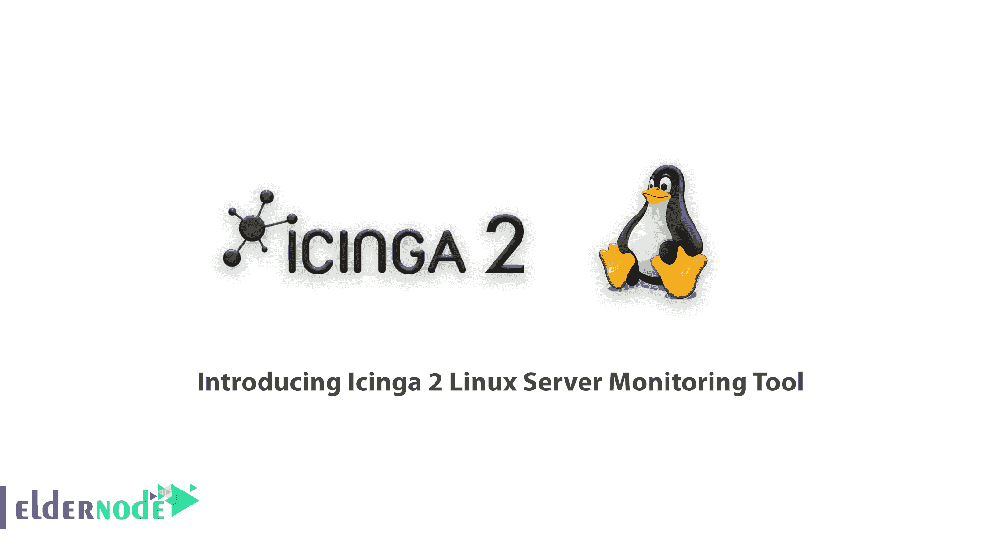
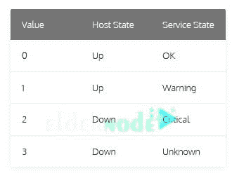
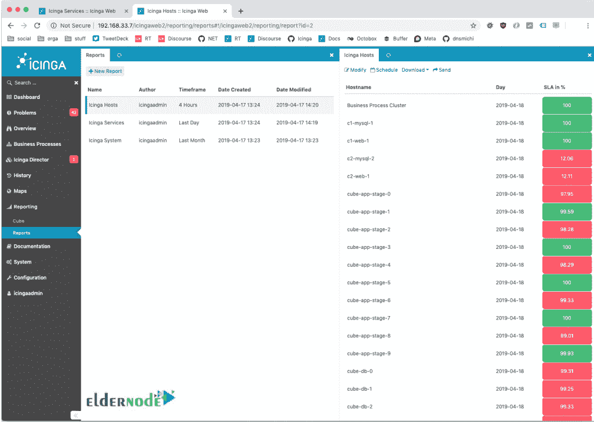

# 介绍 Icinga 2 Linux 服务器监控工具- Eldernode 博客

> 原文：<https://blog.eldernode.com/icinga-2-linux-server-monitoring-tool/>

一个管理者花费他的时间、信用、金钱，有时甚至是他一生中最好的想法，所以，他只有一个选择；为了成功！观察问题的存在总是有助于我们能够预防或解决它。毫无疑问，你需要经常监控你的系统。作为一个监控系统，Icinga 会监控您的系统，通知您网络资源是否可用。没有 IT 管理员喜欢“停机”这个词，但他们更愿意成为第一个发现它的人。如果你把这篇文章读到最后，那将会更加有趣，所以加入我们的**介绍 Icinga 2 Linux 服务器监控工具**。要准备一个完美的 [Linux VPS](https://eldernode.com/linux-vps/) 套装，请访问 [Eldernode](https://eldernode.com/) 并购买一个有 VIP 支持的经济型 VPS。

## Icinga 2 Linux 服务器监控工具

[Icinga](https://icinga.com/) 是 2009 年从 Nagios 中独立出来的开源计算机系统，成为一款原创的网络监控应用。一些变化是添加新的特性和数据库连接器。IDODB 是**I**cinga**D**ATA**O**ut**D**database，它是附加组件或 Icinga web 接口访问的历史监控数据的存储点。Icinga 支持 MySQL、Oracle 和 [PostgreSQL](https://blog.eldernode.com/tutorial-postgresql-installation-ubuntu-20/) 。Icinga 2 也是用 C++编写的，可以在 Linux 和 Windows 上构建，并遵守 GNU 许可证的条款。 **Icinga 2** 已准备好监控您的整个基础设施，并生成系统数据分析的结果，以帮助您获得可用且稳定的证据。通过收集有关系统功能的详细数据，您将能够检查它的启动和运行情况，并根据您的需求及时采取行动。

### Icinga 2 如何监控

在这一部分中，我们将回顾 Icinga2 选择了什么样的监控方式来与用户一起运行。Icinga 2 能够为属性使用不同的值类型来表示正确的必要信息，这将导致有效的配置。例如，要检查您的[主机和服务](https://eldernode.com/vps-hosting/)的可用性，您需要 Icinga 2 的监控。任何时候你都可以添加一个主机和服务来被 Icinga 2 监控。看看一些可以检查的**主机**和**服务**:

**1-** 网络服务的监控(HTTP、SMTP、SNMP、SSH 等。)

**2-** 监控主机资源(CPU 负载、磁盘使用量、系统负载或当前登录的用户数量等。)

**3-** 监控服务器组件(交换机、路由器、温湿度传感器等。)

**4-** 监控停机和无法访问的主机

**5-** 通过设计一个简单的插件来帮助开发服务检查

**6-** 并行服务检查

**7-** 能够定义在服务或主机事件期间运行的事件处理程序，以主动解决问题

**8-** 打印机

### 主机和服务状态

主机和服务是监视对象。Icinga 2 使用单词“Up”或“Down”向您发送您的**主机**的状态。显然，当您被通知“启动”时，您将理解主机是可用的。

此外，为了检测您的**服务**的状态，它会使用“正常”、“警告”、“紧急”或“未知”等词语。

为了更好地理解上面的解释，请看检查结果状态图作为例子。插件返回一个退出代码，但是它们被转换成一个可读的状态号。此图显示了服务的状态，根据协议，主机会将 0 或 1 视为已启动。

不要担心收到几个**通知**，Icinga 2 不会在检测到问题时提醒您，而是开始重新检查可疑对象，以通知您真正的威胁，而不是临时问题。**软**状态是 Icinga 2 检测到一个物体，重新检查，发现不需要通知的一段时间。但是，如果重新检查的结果为非 OK 状态，它会将主机/服务切换到**硬**状态，并向您发送通知以开始所需的操作。

### 报告流程

在网络监控系统中，报告因素非常重要。Icinga 设计了一个框架模块。与公众的想法相反，没有收集任何数据，它只是处理数据并以 PDF、JSON 或 CSV 格式发送它们，或者直接在 Icinga web 界面中查看它们。如果您愿意，您可以定期通过电子邮件接收报告。

### Icinga 2 的特点

当你决定使用 ice 2 时，你会安全地离开**监控管理**和**运行检查**，因为 Icinga2 很好地完成了向你发送必要的**通知**的任务。此外，您还可以在下面看到其他一些好处:

**1-** 灵活的模块化架构

**2-** 动态网页界面

**3-** 企业级可扩展性和认证

**4-** 100%开源和社区驱动

**5-** 旨在使监控更容易

### Icinga 2 Linux 服务器监控的缺点

在所有的灵活性中，不可否认的是配置是神秘的，不是为非 Unix 用户或初学者设计的，他们将面临挑战性的情况，他们希望能更简单。另一方面，Icinga 的粉丝认为，如果你读了它，你就不会再感觉到第一天安装的复杂性了。

### ICINGA VS NAGIOS

正如你之前读到的数据库，Nagios 支持 MySQL，Icinga 除了 MySQL 还支持 PostgreSQL 和 Oracle 数据库。从插件、配置和插件的角度来看，这两者没有什么不同，是兼容的。但是在比较**架构**和**核心**和**报告**能力或者两个 web **接口**和 **API 上下文**时，Icinga 更出彩。

## 结论

在本文中，您了解了 Icinga 2 Linux 服务器监控工具简介。如果你需要一个完美简单但功能强大的网络监控工具，它一定会是你的最爱。Icinga 这个词的意思是“它浏览”和“它检查”，真的值得浏览和检查！