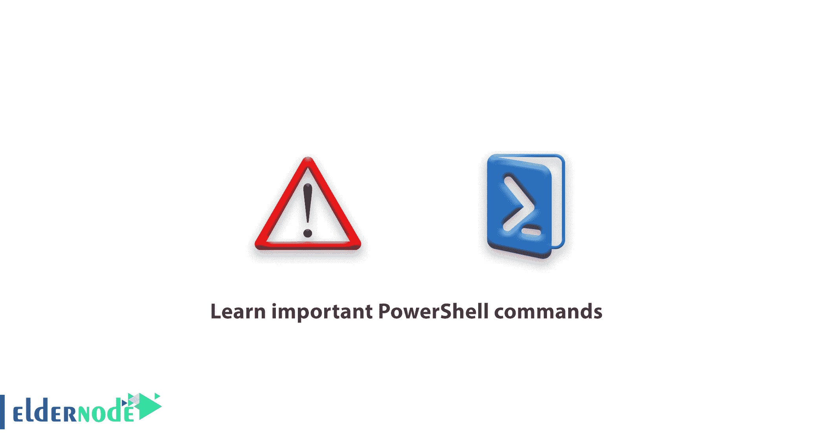

# 了解重要的 PowerShell 命令- Windows VPS 服务器

> 原文：<https://blog.eldernode.com/important-powershell-commands/>



了解重要的 PowerShell 命令。 Windows PowerShell 是[微软](https://www.microsoft.com/)操作系统中的一个高级命令行环境，在之前的文章中已经有充分的介绍。现在，从 PowerShell 培训的[系列开始，在本文中，我们将教授重要的 PowerShell 命令。](https://eldernode.com/tag/powershell-commands/)

使用 PowerShell 非常简单。任何使用过 Windows 或 Linux 的人都可以很容易地使用它并利用它。

在本文中，我们试图让您熟悉使用 PowerShell 的简单和基本技巧以及一些重要的 PowerShell 命令。和我们在一起。

## 重要的 PowerShell 命令

PowerShell 推出后吸引了许多 IT 高管的关注。Windows PowerShell 消除了专业人员在 Windows 中缺少完整命令行环境的需求。

PowerShell 中的命令有别名命令和命令小命令两个版本，其中大部分盟友命令与 Linux 命令非常相似。

例如， **ps** 命令，在 Linux 中用于获取活动进程列表，在 PowerShell 中也使用。

在您开始使用 PowerShell 之前，有几个要点我们需要提及。

### 使用 PowerShell 命令的提示

**–**所有完整的 PowerShell 命令都有一个假名。

**–**用 PowerShell 工作时，大小写字母没什么区别。

**–**选择鼠标并按回车键可以复制多行，粘贴时只需在**的**鼠标上点击右键。

**–**使用 PowerShell 时，只需键入命令的一部分，按 Tab 键即可自动继续编写。

**–**PowerShell 可以在 Windows 的各个部分运行和管理。

**–**其他默认不在 Windows 上的微软软件和工具都有外部模块可以添加到 PowerShell 中。

**–**PowerShell 有一个功能叫做 PowerShell Direct，可以远程控制和管理另一个 Windows 系统。

**–**PowerShell 具有执行脚本命令的能力。

在下面的教程中，您将了解更多关于重要的 PowerShell 命令。

### 学习 PowerShell 基本命令

#### 在 PowerShell 中获取帮助命令

像任何 PowerShell 命令行环境一样，它有一个命令 [get-help](https://eldernode.com/get-help-command-in-powershell/) 。学习这些类型的命令肯定会对您继续使用 PowerShell 有很大帮助。

例如，如果你想从 **停止-处理** 命令中获取信息，你需要的命令必须输入如下。

```
Get-help stop-process
```

你也可以在 PowerShell 中使用 Man 命令到**获取帮助**。这个命令类似于 Linux 中的 Man 命令，它会给你一个命令的完整信息。

该命令按如下方式输入:

```
Man stop-process
```

Get-help 命令和 Man 命令的区别在于，当 Man 命令的输出显示时，页面自动停止。

这意味着，如果输出内容超过页面大小，它将自动阻止内容的继续，以便用户可以轻松阅读文本，并通过输入或空格键查看其余内容。

如果您在**阅读帮助命令时遇到困难**，您可以使用 -example 参数来获取命令的示例。

下面的框中是使用的示例-示例:

```
PS C:\Windows\system32> Get-Help Copy-Item -Examples    NAME  Copy-Item    SYNOPSIS  Copies an item from one location to another.    Example 1: Copy a file to the specified directory    PS C:\>Copy-Item "C:\Wabash\Logfiles\mar1604.log.txt" -Destination "C:\Presentation"    This command copies the mar1604.log.txt file to the C:\Presentation directory. The command does not delete the  original file.
```

如果 Get-Help 命令没有显示关于命令的完整信息，通过输入以下命令更新PowerShell 帮助文件:

```
Update-help
```

**注意:** 如果更新帮助遇到错误，打开你的 PowerShell 作为以管理员身份运行。

#### 文件和目录列表

本教程中的下一个命令是 Get-Childitem 命令。该命令用于获取文件和文件夹列表。

使用这个命令非常简单，您只需要在 PowerShell 中输入它而不需要参数。

```
PS C:\> Get-childitem  Directory: C:\    Mode LastWriteTime Length Name  ---- ------------- ------ ----  d----- 8/8/2017 8:36 PM Intel  d----- 3/19/2017 12:33 AM PerfLogs  d-r--- 8/27/2017 9:10 PM Program Files  d-r--- 8/9/2017 12:47 AM Program Files (x86)  d-r--- 8/8/2017 7:44 PM Users  d----- 8/9/2017 1:13 AM Windows
```

您将输入另一个名为 ls 的命令，以获得与 Get-Childitem 命令相同的输出。

ls 或 Get-Childitem 命令有一个常用的参数叫做-属性。使用这个参数你可以看到**隐藏文件**的完整列表。

```
Ls -attibutes hidden
```

或

```
Get-childitem -attributes h
```

或

```
ls -Attrib h
```

#### 在 PowerShell 中的文件夹间导航

PowerShell 中更改地址的命令是 Set-Location 。你也可以使用 Cd 命令在目录之间移动。

##### 设置位置命令结构

```
Set-location D:\multimedia
```

或

```
Cd c:\windows
```

PowerShell 的优势和设置位置命令之一是你可以进入 Windows 注册表目录，用它你可以编辑注册表键。

要进入 **Windows 注册表**，必须使用 -path 参数和注册表目录的缩写。

```
Set-location -path “HKCU”
```

输入上述命令后，你将进入 HKEY 当前用户目录。

清除 PowerShell 页面

#### 在 PowerShell 中，您可以使用 cls 或 clear 命令来清除页面。

Cls 和 PowerShell 中的清晰命令结构

##### 或

```
Cls
```

查看 PowerShell 中文本文件的内容

```
Clear
```

使用 Get-Content 命令或其别名 Cat 在 PowerShell 中显示文本文件的内容。

#### 使用这个命令的方法非常简单。只需输入带有完整文本文件名的命令。

Use the Get-Content command or its alias Cat to display the contents of text files in PowerShell.

Cat 和 Get-Content 命令结构

##### 或

##### 在 PowerShell 中复制文件

```
Cat eldernode.txt
```

要在 PowerShell 中获得副本，只需使用 Cp 、 Copy 或 Copy-Item 命令中的一个。这 3 个命令工作方式相同，没有区别。

```
Get-content eldernode.txt
```

PowerShell 中的 Copy-Item 命令结构

#### 或

**注意:** 在所有命令中，比如有两个源地址和目的地址的副本，你只需要用一个空格来表示它们。

##### 重命名 PowerShell 中的文件

```
Cp D:\multimedia\learn.mkv -destionation E:\video\
```

使用 Ren 或 Rename-Item 可以在 PowerShell 中重命名文件或文件夹。要重命名文件或文件夹，只需键入命令，然后输入原始文件的名称，然后输入一个带空格的新名称。

```
Copy-item D:\multimedia\learn.mkv -destination E:\video\
```

或

删除 PowerShell 中的文件

#### 在 PowerShell 中删除文件或文件夹也不例外，两者都可以使用 Remove-item 或 Del 命令来完成。

Renaming a file or folder in PowerShell is possible with either Ren or Rename-Item. To rename a file or folder, just type the command and then enter the name of the original file and then a new name with a space.

```
Rename-item “learn.mkv” train.mkv
```

PowerShell 中的 Remove-Item 命令结构

```
Ren “learn.mkv” train.mkv
```

或

#### 在 PowerShell 中移动文件

可以使用移动项目或 Mv 命令在 PowerShell 中移动文件。该命令与复制项目命令的结构相同。

##### 在 PowerShell 中移动命令结构

```
Remove-item D:\multimedia\learn.mkv
```

或

```
Del D:\multimedia
```

PowerShell 中的活动进程列表

#### 在 PowerShell 中获取进程列表或相同的活动进程非常简单，可以使用 Ps 命令或 Get-Process 来完成。

The Move-Item or Mv command can be used to move the file in PowerShell. This command is the same as the structure of the Copy-Item command.

PowerShell 中的 Get-Process 命令结构

##### 或

```
Move-item D:\eldernode.txt -destination E:\
```

Get-Process 命令最重要和有趣的特性之一是接收特定程序的进程。例如，通过输入以下命令，您将看到资源管理器进程。

```
Mv D:\eldernode.txt E:\
```

#### 关闭 PowerShell 启用的进程

两个命令 kill 和 Stop-Process 能够关闭活动进程。要使用这些命令，只需输入命令并输入所需进程的名称或 ID。

##### Kill 和 Stop-process 命令结构

```
Ps
```

或

```
Get-process
```

**注意:** 如果在使用这些命令时遇到问题或错误，使用 -force 参数。

```
Get-Process explorer
```

**尊敬的用户**，我们希望您能喜欢这个[教程](https://eldernode.com/category/tutorial/)，您可以在评论区提出关于本次培训的问题，或者解决[老年人节点培训](https://eldernode.com/blog/)领域的其他问题，请参考[提问页面](https://eldernode.com/ask)部分，并尽快提出您的问题。腾出时间给其他用户和专家来回答你的问题。

#### 好运。

The two commands kill and Stop-Process have the ability to close active processes. To use these commands, just enter the command and enter the name or ID of the desired process.

##### Kill and Stop-process command structure

```
Stop-process 298
```

or

```
Kill -name notepad
```

**Note:** If you encounter a problem or error while using these commands, use the -force parameter.

```
Stop-Process -Name notepad -Force
```

**Dear user**, we hope you would enjoy this [tutorial](https://eldernode.com/category/tutorial/), you can ask questions about this training in the comments section, or to solve other problems in the field of [Eldernode training](https://eldernode.com/blog/), refer to the [Ask page](https://eldernode.com/ask) section and raise your problem in it as soon as possible. Make time for other users and experts to answer your questions.

Goodluck.