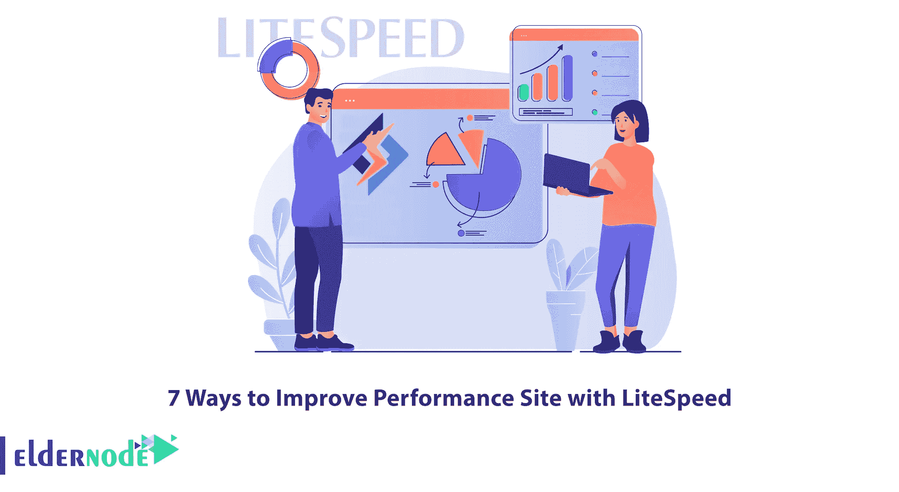
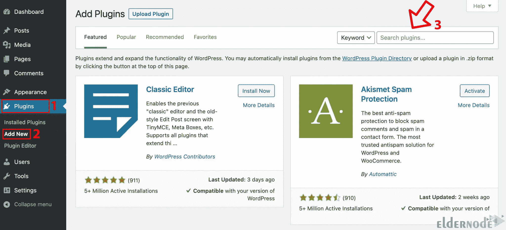
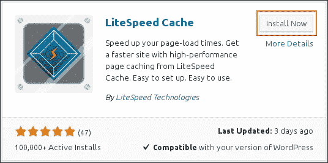
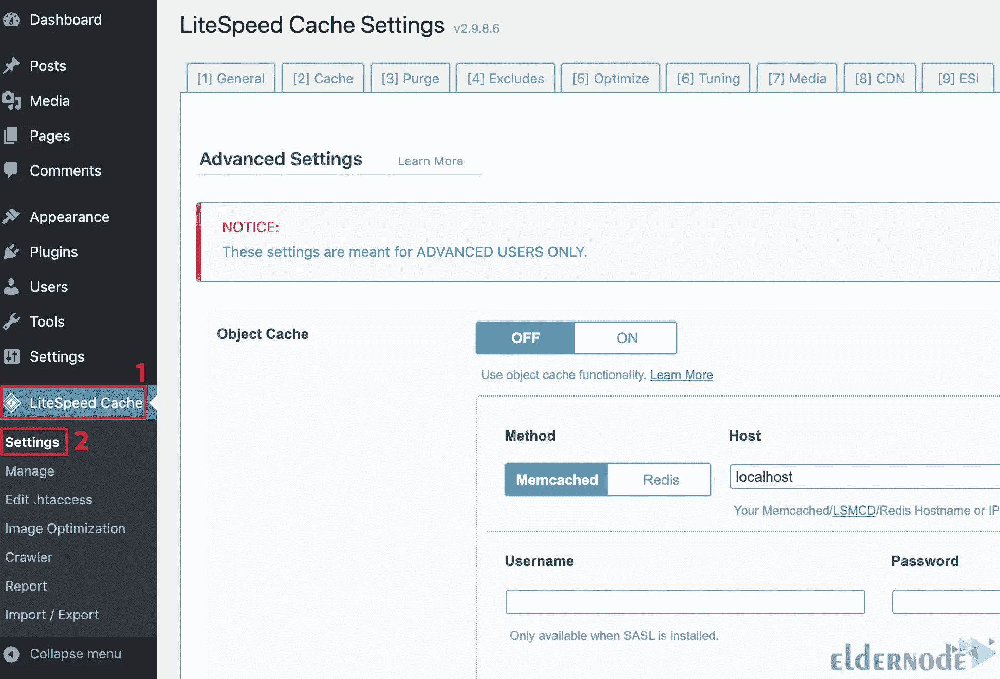
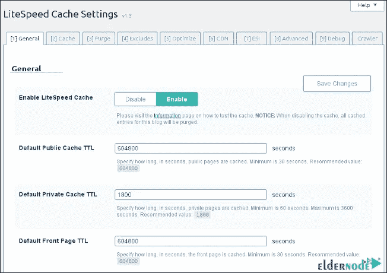
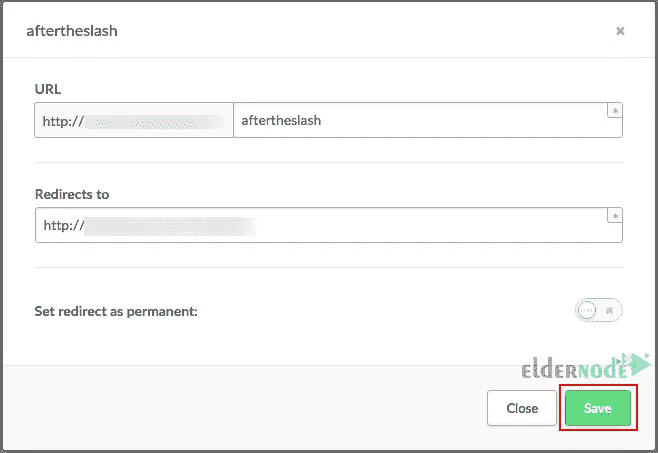

# 用 LiteSpeed 提高网站性能的 7 种方法

> 原文：<https://blog.eldernode.com/improve-performance-site-with-litespeed/>



服务器管理员可以从 web 服务器获得帮助来建立他们的站点。LiteSpeed 网络服务器已经在网络上广泛用于各种目的。如果你正在为你的网站寻找一个最佳的服务器解决方案，LiteSpeed 网络服务器是为你准备的。这篇文章将解释 7 种提高 LiteSpeed 网站性能的方法。 [Eldernode](https://eldernode.com/) 网站提供经济实惠的 [Linux VPS](https://eldernode.com/linux-vps/) 套装，可以是最好的选择。

## **如何用 LiteSpeed 提升站点性能**

LiteSpeed 是一款轻量级的专有网络服务器软件，提供高可扩展性、安全性和负载平衡。您可以使用它来替换现有的 Apache 服务器，而无需更改任何程序和操作系统细节。该 web 服务器允许每 IP 连接和带宽限制，并提供内置的防 DDoS 功能。LiteSpeed 最大的特点是可以集成，没有任何潜在的崩溃。

### **1-启用 LiteSpeed 缓存**

首先登录 WordPress 管理面板，进入**插件>添加新的**路径。在搜索框中搜索 LiteSpeed 缓存:



找到插件后，点击**立即安装**:



安装完成后，点击**激活**以启用插件。

### **2-配置 LiteSpeed 缓存设置**

在这一步中，您应该配置 LiteSpeed 缓存设置。一旦你激活了 LiteSpeed 缓存，进入 **LiteSpeed 缓存>设置**:



您将看到 LiteSpeed 缓存设置页面:



您可以在此查看您的网站设置:

**–>常规:**它包含 TTL 设置，控制各种内容类型在缓存中保存的时间。

**–>缓存:**缓存选项卡的设置可以控制特殊类型内容的缓存。

**–>清除:**清除选项卡的设置清除存储在缓存中的内容。

**–>排除:**排除选项卡的设置定义了不缓存的内容类型。

**–>优化:**优化选项卡的设置优化你的站点。

**–>CDN:**该选项卡包含内容分发网络设置。

**–>ESI:**该选项卡包含边缘侧包含设置，使您能够缓存部分页面。

**–>高级:**该选项卡包含一些杂项高级设置。

**–>调试:**调试选项卡的设置可以帮助排除故障。

对设置进行更改后，点击**保存更改**。

### **3-设置重定向**

重定向是从一个 URL 到一个新 URL 的引用；每当用户在浏览器中输入源地址时，他们会被自动重定向到目标页面。它有很多用途，可以让你提高你的网站性能。事实上，您可以通过该功能将您想要的域转移到一个域中。通过重定向，您可以让搜索引擎将用户重定向到您选择 URL 的新页面。如果保持相同的域名，LightSpeed 可以从你的旧平台重定向到 LightSpeed 的平台。

要设置重定向，请转到**设置> >网站设置> >重定向> >添加重定向**路径并配置重定向。您应该在 **URL** 字段中输入登录页面的 URL，并在**重定向到**字段中输入页面应该指向的 URL:



### **4-禁用 Gzip 压缩**

你可以用两种方法从服务器级别禁用 Gzip 压缩，这两种方法是重写规则和 SetEnv/SetEnvIf。

使用中的重写规则禁用 Gzip 压缩。htaccess，在。htaccess:

```
RewriteRule . - [E=no-gzip:1]
```

同样，在. htaccess 中使用 SetEnv/SetEnvIf 可以禁用 Gzip 压缩。htaccess:

```
SetEnv no-gzip 1
```

### **5-为静态文件设置 LiteSpeed 缓存**

在本节中，您应该为静态文件设置 LiteSpeed 缓存。静态文件可以增强你的应用程序，并且不会随着程序的运行而改变。每个 web 应用程序都需要从文件系统提供文件。LiteSpeed 服务静态文件更快，可以帮助您提高网站的性能。如果和浏览器缓存结合，效果会非常好。

### **6-为动态页面配置 LiteSpeed 缓存**

对于保持相同布局的用户，动态页面有不同的内容。您可以使用 PHP、Ajax 和 ASP.NET 等编程语言和技术来创建这些页面。这些页面旨在显示经常变化的信息，如股票价格，并且需要更多的时间来加载。提高网站性能的方法之一是为动态页面配置 LiteSpeed 缓存。您可以通过进入**页面> >添加新的> >动态页面**路径并输入页面名称来配置动态页面的 LiteSpeed 缓存。然后你应该从下拉菜单中选择想要连接的收藏，并按下**添加页面**。

### **7-设置缓存规则并测试你的站点速度**

用户可以根据附加标准设置缓存行为，并继续将请求的 URL 与缓存规则相匹配。缓存规则允许用户在一个或多个可用字段上定义此行为。最后一步是设置缓存规则，并测试您的网站速度。你的网站必须在 5 秒内加载，否则，它不会在谷歌排名，网站不会改善。因此，准确测量你的网站速度是必不可少的。

## 结论

LiteSpeed 网络服务器是领先的网络服务器，具有非常高的性能和强大的可扩展性，使用非常先进的技术。在本文中，我们解释了用 LiteSpeed 提高网站性能的 7 种方法。我希望这篇教程对你有用，并帮助你提高 LiteSpeed 网站的性能。如果您有任何问题或建议，可以在评论区联系我们。