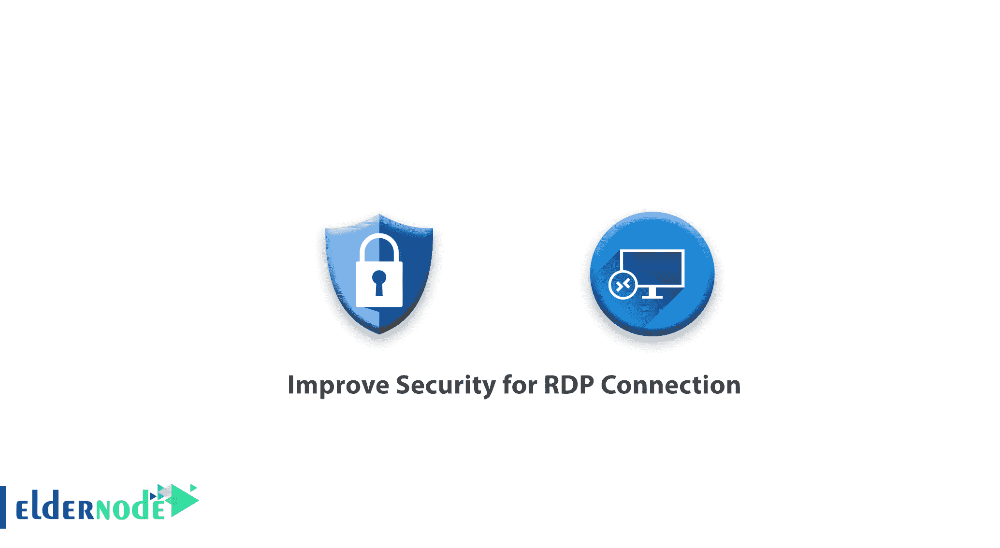
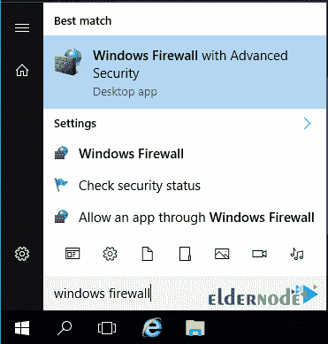
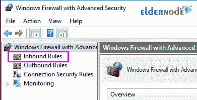
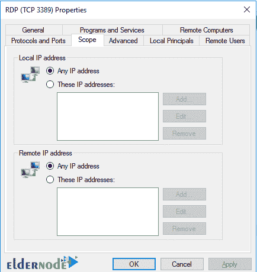

# 如何提高 RDP 连接的安全性-

> 原文：<https://blog.eldernode.com/improve-security-for-rdp/>

如何提高 RDP 连接的安全性？导致黑客和黑客侵入你的服务器的 [Windows 服务器](https://eldernode.com/tag/windows-server/)的一个主要问题是[远程桌面](https://eldernode.com/tag/remote-desktop/)处于活动状态。

当在您的 Windows 服务器上启用远程桌面并在主端口和默认端口上进行默认设置时，您可以让黑客更容易地对您的 Windows 服务器进行暴力攻击，并更快地侵入您的服务器。

**远程桌面协议** ( RDP )是管理 Windows 服务器最简单、最常用的方法。

基于 Windows 、 Macintosh 和 Linux 的桌面都有免费应用。

因为它的应用如此广泛，RDP 也是服务器上大量暴力攻击的目标。恶意用户将使用被入侵的计算机，试图通过 RDP 连接到您的服务器。即使攻击猜测您的管理员密码不成功，仅仅是尝试连接的洪流就可能导致您的服务器不稳定和其他性能问题。

**幸运的是**，您可以使用一些方法来最大限度地减少遭受此类攻击的风险。

在这篇文章中，我们将教你如何提高远程桌面连接的安全性。

[**选择您的完美 Windows 虚拟专用服务器包**](https://eldernode.com/windows-vps/)

如何提高 RDP 连接的安全性？

### 第一种方式:使用 VPN

使用虚拟专用网络(VPN)是保护你的服务器免受 RDP 恶意攻击的最好方法之一。

使用 VPN 连接意味着在尝试访问您的服务器之前，必须首先连接到安全的专用网络。这个专用网络在你的服务器之外被加密和托管，所以安全连接本身不需要你的服务器的任何资源。

一旦连接到专用网络，您的工作站将被**分配给**一个专用 IP 地址，该地址将用于打开与服务器的 RDP 连接。

使用 VPN 时，服务器被配置为只允许来自 VPN 地址的连接，拒绝来自外部 IP 地址的任何尝试。

VPN 不仅保护服务器免受恶意连接，它还**保护**在你的本地工作站和服务器之间通过 VPN 连接传输的数据。

### 第二种方式:使用硬件防火墙

硬件防火墙安装在网络平台和路由器路径中或其上。硬件防火墙在基本层中表现非常好，如果它们具有必要的性能，会使健康的流量到达软件系统和防火墙。

应该注意，硬件防火墙不能完全检查网络上数据包的详细信息。

因此，在**网络级别**存在和使用硬件和软件组合以确保网络安全似乎是必要的。

像使用 VPN 一样，给你的服务器基础设施增加一个硬件防火墙进一步保护你的服务器免受**恶意攻击**。

您可以向您的帐户添加一个 Web 防火墙，以便只允许来自受信任位置的 RDP 连接。如果你有能力在硬件防火墙上限制 IP，只为你指定的可信 IP 打开远程桌面。同时将默认端口从 3389 更改为另一个端口。

### 第三种方式:界定 RDP 防火墙规则的范围

你可以使用你的 Windows 防火墙来限制对你的 RDP 端口的访问(默认情况下，端口 3389 )。

将对端口的访问限制到单个 IP 地址或一组 IP 地址的过程称为“作用域”端口。

当您**作用域**的 RDP 端口时，您的服务器将不再接受来自任何不在作用域内的 IP 地址的连接尝试。范围**释放**服务器资源因为服务器不需要处理恶意连接尝试，被拒绝的未授权用户在到达 RDP 系统之前就被防火墙拒绝。

以下是确定 RDP 端口范围的必要步骤:

#### 限制 RDP 港口所需的步骤

**1。** 登录到服务器。

点击 Windows 图标，在**搜索**栏中输入 Windows 防火墙。

**2。T3 点击 Windows 防火墙与高级安全。**

**3。T3 点击入库规则。**

**4。** 向下滚动找到一个标注为 RDP (或使用端口 3389 )的**规则。**

**5。双击规则上的**。

**6。的**点击的选项卡。

**7。** 确保将您当前的 IP 地址包含在允许的远程 IP列表中。

**8。** 点击**单选按钮**查看这些 IP 地址。(在远程 IP 地址下。)

**9。** 点击确定到保存所做的修改。

### 第四种方式:改变 RDP 港

虽然确定 RDP 端口的范围是保护您的服务器免受使用远程桌面协议的恶意企图的一个很好的方法，但有时确定端口的范围是不可能的。

例如，如果您或您的开发人员必须使用动态 IP 地址连接，根据 IP 地址限制访问可能不太实际。

您仍然可以采取措施来提高 RDP 连接的性能和安全性。

对 RDP 的大多数蛮力攻击都使用 3389 的默认端口。

**亦作，见:**

[防止暴力攻击 Windows Server 2012 的 FTP 配置](https://eldernode.com/ftp-configuration-to-prevent-brute-force-attacks-on-windows-server-2012/)

##### 如何提高 RDP 连接的安全性

如果通过 RDP 登录的尝试多次失败，您可以更改 RDP 用于连接的端口。

**1。** 在**更改**RDP 端口之前，确保你要使用的新端口在防火墙中打开以防止被锁定在你的服务器之外。

[了解如何在 Windows 防火墙上打开端口](https://eldernode.com/open-a-port-on-a-windows-firewall/)

**2。在搜索栏输入regedit.exe打开 **注册表编辑器** 登录**到你的服务器。

**3。** 一旦进入注册表就导航到如下:

HKEY _ LOCAL _ MACHINE \ SYSTEM \ current Control set \ Control \ Terminal Server \ win stations \ RDP-Tcp

**4。** 一旦出现，向下滚动列表直到找到“端口号”。

**5。** **双击此处的**会调出编辑器框。

**6。** 把十六进制改成十二月所以是数字。

**7。在这里设置**的端口号，点击 OK 。

**注意:** 你可以使用任何你想要的端口号，但是你应该选择一个没有被其他服务使用的端口。

在麻省理工学院的网站上可以找到常用端口号的列表。

**8。关闭**注册表编辑器重启服务器。

**9。** 务必用新的 RDP 端口号将重新连接到服务器。

**尊敬的用户**，我们希望您能喜欢这个[教程](https://eldernode.com/category/tutorial/)，您可以在评论区提出关于本次培训的问题，或者解决[老年人节点培训](https://eldernode.com/blog/)领域的其他问题，请参考[提问页面](https://eldernode.com/ask)部分，并尽快提出您的问题。腾出时间给其他用户和专家来回答你的问题。

好运。