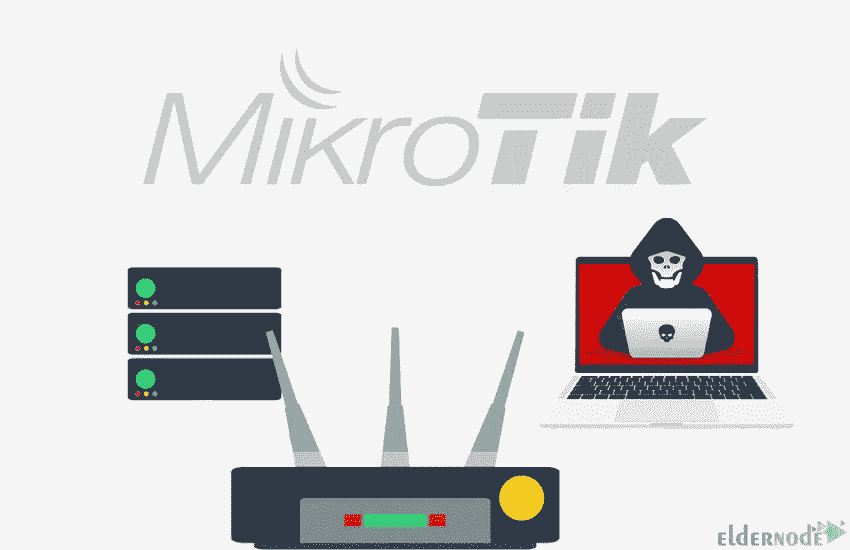

# 提高 MikroTik 路由器性能的 5 种方法

> 原文：<https://blog.eldernode.com/improve-your-mikrotik-routers-performance/>

这篇文章将教你 5 种方法来提高你的 MikroTik 路由器的性能。帮助您提高 MikroTik 路由器性能的方法有:检查路由器配置设置、更新固件、升级硬件、清除未使用的端口以及禁用您不需要的服务。如果你想购买一台 [MikroTik VPS](https://eldernode.com/mikroTik-vps-server/) 服务器，你可以查看 [Eldernode](https://eldernode.com/) 网站上提供的套装。

## **如何提高你的 MikroTik 路由器性能**

计算机网络需要路由器、交换机和无线设备等设备进行内部和外部通信。Mikrotik 是一个操作系统和软件，被设计为网络路由器。您可以使用 Mikrotik 将计算机变成可靠的网络路由器。路由器在网络中具有路由和数据传输的作用。它还具有高速启动和自动操作，不再需要登录或初始启动步骤。

在这个来自 [MikroTik 教程](https://blog.eldernode.com/tag/mikrotik/)系列的教程中，你将学到 5 种提高 MikroTik 路由器性能的方法。

### **1-检查路由器配置设置**

那些拥有宽带互联网的人通常在家里有一个路由器，可以广播设备使用的 Wi-Fi 网络。所有与您的 Wi-Fi 网络相关的设置都存储在路由器内部，因此如果您决定更改或检查这些设置，您应该访问路由器的软件，也称为固件。您可以从该区域检查路由器配置设置，以提高 Mikrotik 路由器的性能。

### **2-更新固件**

固件是控制设备行为的软件。它被嵌入到硬件设备中，通常会修复错误，包含新功能，并防止安全漏洞。提高 Mikrotik 路由器性能的第二种方法是更新固件。这可让您改善连接并确保路由器的安全。由于新的安全问题不断出现，而且无线路由器有许多安全漏洞，所以您应该保持固件更新。

### **3-升级硬件**

路由器可能会降低互联网连接的质量，并降低网络中每个人的用户体验。为了避免这种情况，您需要将路由器的硬件升级到最新一代的路由器。硬件路由器是改善家庭网络的一种廉价而有效的方式，可以提供更好的 Wi-Fi 覆盖范围、更强的信号以及更好地处理现代用户对网络的需求。

### **4-清除未使用的端口**

如今，对 Mikrotik 产品的网络攻击增加了很多。您可以保护自己免受这些攻击，并通过几个简单的步骤改进您的 [Mikrotik 路由器](https://blog.eldernode.com/downgrade-mikrotik-routeros-and-firmware/)。提高 MikroTik 路由器性能的方法之一是清除未使用的端口。您应该阻止所有未使用的端口，并限制内置服务使用的所有端口的互联网访问。

### **5-禁用不需要的服务**

提高 Mikrotik 路由器性能的另一个步骤是禁用外围路由器上所有不需要或不必要的服务。因为这些服务可用于获得未经授权的访问或执行拒绝服务攻击(DoS)。因为你的电脑上运行的服务越多，其他人使用它们、侵入你的电脑或通过它们控制你的电脑的机会就越多。

## 结论

你可以用 Mikrotik RouterOS 把电脑系统改装成一个可靠的网络路由器。它具有适合 IP 网络和无线网络的各种特性。在这篇文章中，我们教你 5 种方法来提高你的 Mikrotik 路由器的性能。我希望这篇教程对你有用，并帮助你改进你的网站。如果您有任何问题或建议，可以在评论区联系我们。