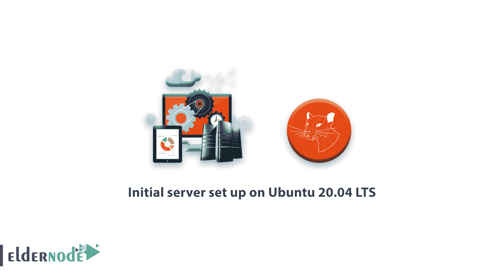
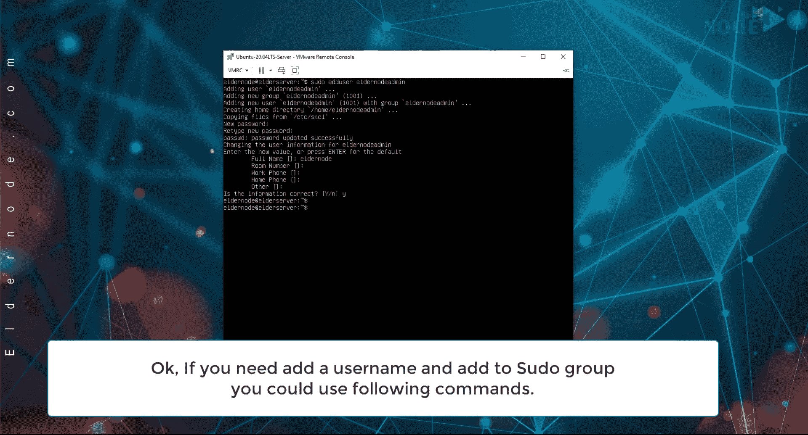
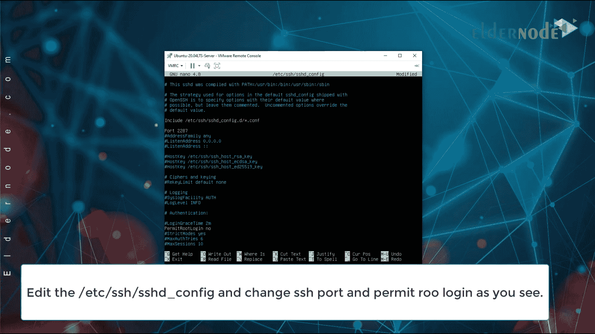

# 在 Ubuntu 20.04 LTS 上设置初始服务器-在 Ubuntu 20 上使用安全 ssh

> 原文：<https://blog.eldernode.com/initial-server-set-up-on-ubuntu-20-04-lts/>



在本教程中，我们想谈谈在 Ubuntu 20.04 LTS 上设置的**初始服务器。所以我认为，当所有用户使用 Ubuntu 作为服务器时，尤其是在互联网上，这是很重要的**

在你 **[买了一个 Ubuntu VPS](https://eldernode.com/ubuntu-vps/)** 之后，你要知道，提供商除了给你设置一个 IP 和密码之外，并没有给你设置任何东西。除非您订购安全配置。

所以我们会考虑，你买一个新鲜的 [Linux VPS](https://eldernode.com/linux-vps/) 或者安装它。

安装完成后，需要 **[为 Ubuntu 20.04](https://eldernode.com/set-ip-static-on-ubuntu-20-04-lts-server-with-netplan/)** 设置静态 IP，并在 Ubuntu 20.04 LTS 上设置初始服务器。

让我们看看如何设置主机名、更新和升级、添加 sudo 用户、保护 SSH 以及为 Ubuntu 20.04 LTS 安装防火墙。

## 在 Ubuntu 20.04 上设置的初始服务器

### 在 ubuntu 20.04 上检查并设置主机名

要检查主机名，您可以发出如下命令:

```
hostname  hostnamectl
```

两个命令都显示您的主机名，但是 hostnamectl 显示更多的信息。

用于在 Ubuntu 20.04 上设置新主机名。您可以使用以下命令。

```
sudo hostnamectl set-hostname Ubuntu20
```

在这个命令中，我们将 Ubuntu 主机名改为 Ubuntu20。你设置你最喜欢的名字。

更改主机名后，您可以更改 /etc/hosts 文件上的主机名以进行解析。

```
sudo nano /etc/hosts
```

您只需要找到一个旧的主机名并替换新的主机名。

**像这样**

```
127.0.0.1  Ubuntu20
```

### 更新升级 Ubuntu

要进行更新并检查 ubuntu 上的所有包和缓存库，请运行以下命令\

```
sudo apt update
```

检查完所有软件包后，Ubuntu 会显示需要更新的软件包数量。现在，您可以运行以下命令来升级软件包和操作系统。

```
sudo apt upgrade
```

### 添加新的 sudo 用户到 Ubuntu 20.04 LTS

首先，您需要运行以下命令来添加用户名和密码。

```
sudo adduser eldernodeadmin
```

除了 eldernodeadmin，你得换掉你最喜欢的名字

运行命令后， [Ubuntu](https://blog.eldernode.com/tag/ubuntu/) 询问密码和用户的一些信息，你可以输入。



现在，我们使用以下命令将用户添加到 sudo 组。

```
sudo usermod -aG sudo eldernodeadmin
```

同样，您需要替换您的用户名，而不是 eldernodeadmin

### Ubuntu 20.04 上的安全 SSH

保护 SSH 有很多说明，但是在本教程中，我们只讨论 root 登录的端口和权限。这两种配置对于某些安全性来说已经足够了，但是您可以搜索其他安全性并找到我们的博客。

首先需要编辑 /etc/ssh/sshd_config 文件。

```
sudo nano /etc/ssh/sshd_config
```

取消端口注释，将 **22** 更改为您喜欢的端口。在那之后，取消对 PermitRootLogin 部分和 change prohibits 的注释，如下图所示。



编辑完成后，用 **ctrl + x** 保存并退出文件，按两次**回车键**。

### 在 Ubuntu 20.04 上安装 firewalld LTS

Ubuntu 安装时没有任何防火墙来保护你的端口和服务，你需要安装一个防火墙服务。在本教程中，我们决定安装 firewalld。

用于在 ubuntu 20.04 上安装 [firewalld](https://firewalld.org/) ，遵循命令。

```
sudo apt install firewalld
```

安装 firewalld 后，需要在启动时启动并启用 firewalld。

```
sudo systemctl start firewalld  sudo systemctl enable firewalld
```

好的，现在我们添加一些关于防火墙的规则，但是如果你想了解更多关于防火墙的内容，你可以去 Eldernode 博客上的[什么是防火墙](https://eldernode.com/configure-firewalld-on-centos-8/)文章

```
firewall-cmd --permanent  --add-service=http  firewall-cmd --permanent  --add-port=2287/tcp
```

添加一些规则后，您需要使用以下命令重新加载防火墙配置。

```
firewall-cmd --reload
```

最后，如果您需要检查所有 firewalld 的规则和配置，只需运行以下命令。

```
firewall-cmd --list-all
```

###### 结论

在本教程《Ubuntu 20.04 LTS 上的服务器初始设置》中，了解一下如何在 [ubuntu 20.04](https://eldernode.com/tag/ubuntu-20-04/) 上进行一些初始设置，当然也可以设置更多的安全配置等东西，不过这一步对于在互联网上工作已经足够了。

如果您对本教程有任何疑问，您可以对其进行评论，或者前往长老节点上的 [**提问页面**](https://eldernode.com/ask) 。

在文章的最后，你可以看到视频，我们只是在这个视频上运行所有的命令和所有的解释。