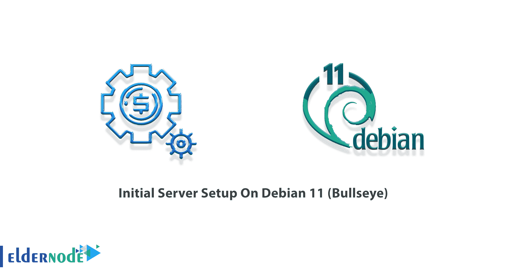

# Debian 11(牛眼)- Eldernode 博客上的初始服务器设置

> 原文：<https://blog.eldernode.com/initial-server-setup-on-debian-11/>



Debian 是一个免费的操作系统，由来自世界各地的数千名在线工作的志愿者开发。Debian 项目的主要优势是它的自愿基础，它对 Debian 社会契约和自由软件的贡献，以及它对提供最好的操作系统的承诺。Debian 版本 11 是这个方向上的另一个重要步骤。在这篇文章中，我们将教你如何在 Debian 11(牛眼)上进行**初始服务器设置。如果你想买一个 [**Linux VPS**](https://eldernode.com/linux-vps/) 服务器，你可以在 [Eldernode](https://eldernode.com/) 看到可用的软件包。**

## **Debian 11(牛眼)上的初始服务器设置步骤**

## **关于 Debian 的一切 11【牛眼】**

2 年后，Debian 项目发布了新的稳定版本 11(代号牛眼)。由于 Debian 安全团队的共同努力，这个版本将在未来 5 年内得到支持。有趣的是，Debian 11 bullseye 附带了几个应用程序和桌面环境。这些桌面环境包括以下选项:

_ Gnome 3.38

_ KDE Plasma 5.20

_ LXDE 11

_ LXQt 0.16

_ MATE 1.24

_ Xfce 4.16

Bullseye 是第一个为 [Linux](https://blog.eldernode.com/tag/linux/) 内核提供对 **exFAT** 文件系统支持的版本，并在默认情况下使用它来安装 exFAT 文件系统。因此，不需要在通过 exfat-fuse 包提供的空间中的用户中使用文件系统实现。ExFAT 文件系统创建和检查工具在 **exfatprogs** 包中提供。

中文、日文、韩文等多种语言现在都有了新的 Fcitx 5 输入法，是 buster 中流行的 Fcitx4 的继承者；这个新版本有一个更好的 Wayland(默认显示管理器)插件支持。

Debian 11 bullseye 包括几个更新的软件包，包括:

-阿帕奇 2.4.48

–绑定 DNS 服务器 9.16

–卡利格拉 3.2

–加密设置 2.3

–Emacs 27.1

–GIMP 2 . 10 . 22

–GNU 编译器集合 10.2

– GnuPG 2.2.20

– Inkscape 1.0.2

-7.0 库

–Linux 内核 5.10 系列

–Maria db 10.5

–OpenSSH 8.4p 1

–Perl 5.32

–PHP 7.4

–PostgreSQL 13

–Python 3，3.9.1

–Rustc 1.48

-samba 4.13

-我是 8.2

Debian 11 适用于以下系统:

1.台式机系统和上网本

2.开发服务器和集群系统

3.数据库ˌ资料库

4.Web 和存储服务器

与此同时，额外的质量保证工作，如对 Debian 档案中的所有软件包进行自动安装和升级测试，确保牛眼满足 Debian 稳定版本用户的高期望。

### **如何升级 Debian**

成功登录 Debian 服务器后，第一步是升级当前的 Debian 系统包。为此，您必须首先使用以下命令**更新您的 Apt 缓存**:

```
sudo apt update
```

在下一步中，您必须使用以下命令**来升级软件包**:

```
sudo apt upgrade
```

要在新系统中**升级 dist** ，运行以下命令:

```
sudo apt dist-upgrade
```

***注意:*** 执行完上述命令后，必须按 **Y** 确认请求，完成软件包的安装。

如果要删除不再需要的软件包，可以使用以下命令:

```
sudo apt autoremove
```

### **如何在 Debian 11 上创建 Sudo 用户**

在本教程中，我们建议您创建一个拥有 Sudo 权限的新用户，并使用它来访问您的 Debian 实例。假设您已经使用 root 帐户登录。因此，您必须运行下面的命令来在 Debian 中创建新用户:

```
sudo adduser eldernode
```

请注意，新创建的帐户是一个普通用户。

应该注意的是，您将需要管理权限来执行几个任务。您可以使用以下命令将用户添加到 Sudo 组:

```
sudo usermod -a -G sudo eldernode
```

有关更多说明，您可以使用以下命令切换到新帐户:

```
sudo su - eldernode
```

### **如何配置系统的主机名**

系统的主机名有助于用户和网络设备以人类可读的格式轻松识别网络上的设备。

要为您的实例指定合适的主机名，您可以在系统终端中键入以下命令，然后按 **enter** :

```
hostnamectl
```

执行上述命令后，在下一步中，您必须将系统主机的名称更改为以下命令:

```
sudo hostnamectl set-hostname debian11
```

既然您已经成功地更新了系统主机名，现在您必须切换到一个新的 shell 来激活当前会话。完成上述操作后，shell 通知将被重命名为新主机。

```
hostname
```

### **如何在 Debian 上保护 SSH**

在这一节，我们将教你如何在 Debian 上保护 SSH。打开**OpenSSH/etc/ssh/sshd _ config**配置文件进行编辑和修改。

你可以使用下面的命令**改变默认端口**:

```
 Port 2232
```

您还可以使用下面的命令**禁用 Root SSH 登录**:

```
 PermitRootLogin no
```

完成上述更改后，保存配置文件并重启 OpenSSH 服务:

```
sudo systemctl restart ssh
```

### **如何在 Debian 11 上配置防火墙(Firewalld)**

在这一节，我们将讨论如何在 Debian 11 上配置防火墙(Firewalld)。因为 Debian 防火墙服务器的默认版本没有安装在上面，所以您可以简单地从默认的存储库中安装所需的包。为此，只需运行以下命令:

```
sudo apt install firewalld -y
```

重要的是，默认的 SSH 防火墙允许远程用户。但是如果 SSH 端口发生变化，您需要允许 SSH 访问另一个端口。为此，请运行以下命令:

```
sudo firewall-cmd --permanent --add-port=2232/tcp
```

正如您在下面的命令中看到的，您可以直接提供服务名，如“HTTP”或“HTTPS”以获得权限:

```
sudo firewall-cmd --permanent --add-service=http
```

```
sudo firewall-cmd --permanent --add-service=https
```

您现在应该上传您所做的更改:

```
sudo firewall-cmd --reload
```

## 结论

在本文的开头，我们将向您介绍 Debian 发行版的新版本，Debian 11(牛眼)。然后我们向您展示了如何更新和创建 Sudo 用户。然后，我们教您如何配置系统主机名和 SSH 安全性。最后，我们告诉你如何配置防火墙。本文描述的步骤是如何在 Debian 11 上初始化服务器。如果你愿意，可以参考 Ubuntu 21.04 和 [CentOS 8](https://blog.eldernode.com/initial-set-up-centos-8/) 上的文章[初始服务器设置。](https://blog.eldernode.com/initial-server-setup-on-ubuntu-21-04/)