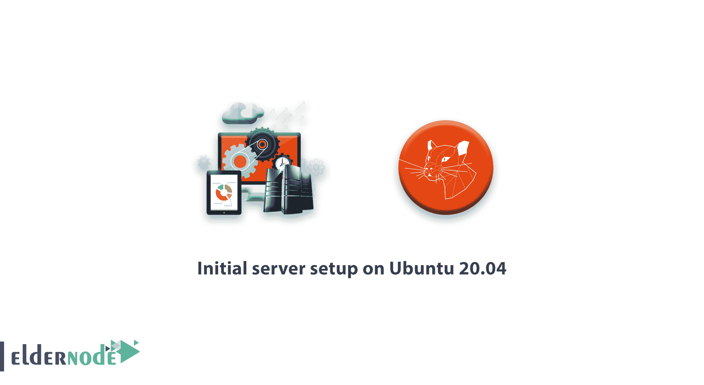

# Ubuntu 20.04 上的初始服务器设置- Eldernode

> 原文：<https://blog.eldernode.com/initial-server-setup-on-ubuntu-20/>



在这个[教程](https://eldernode.com/category/tutorial/ "tutorial")中，我们讨论在你的 [Ubuntu 20.04 服务器](https://eldernode.com/introducing-ubuntu-20/)上的安装后步骤。本教程包括在 Ubuntu 20.04 服务器上的**初始服务器设置。**

如你所知，我们讨论了 Ubuntu 20.04，并介绍了 ubuntu focal fossa 和上一篇关于 eldernode 的文章中的一个新特性。在本文中，我们将讨论 ubuntu 上防火墙的安全性、更新和工作的安装后步骤。

在阅读完这篇文章并遵循所有步骤后，你的服务器现在就可以用于任何服务了，比如网络服务器，LAMP 服务器，LEMP 服务器，VPN 服务器，MySQL 服务器，或者其他你喜欢的服务。

请继续关注 Ubuntu 20.04 的初始服务器设置(Focal Fossa)

## Ubuntu 20.04 上的初始服务器设置

### 1-更新升级你的 ubuntu 20.04

首先通过 SSH 或控制台登录 **Ubuntu 20.04** 系统[。现在，执行以下命令来更新 apt-cache 并升级系统上的所有包。](https://eldernode.com/tag/how-to-connect-ssh/)

```
sudo apt update  sudo apt upgrade
```

### 2-在 Ubuntu 20.04 上创建用户账号

我们不建议使用 root 用户在 Ubuntu 20.04 上工作。让我们为系统管理创建一个帐户，并启用 sudo 访问。

```
sudo adduser newuser
```

现在，将新创建的用户添加到 sudo 组，以便它可以获得所有 sudo 特权。

sudo usermod -aG sudo 新用户

你可以用 newuser 替换你最喜欢的名字。

现在，您必须使用以下命令为该用户更改和创建新密码:

```
sudo passwd newuser
```

输入命令后，Ubuntu 会询问您密码并确认密码。请使用复杂的密码，并使用字母、数字、符号，如 [【电子邮件保护】](/cdn-cgi/l/email-protection)&*()。

### 3-安全 SSH 服务器

我们建议更改默认的 SSH 端口，这有助于保护您的系统免受 bot 和 hack 的攻击。要更改默认端口，请编辑 OpenSSH 配置文件**/etc/ssh/sshd _ config**，并进行以下更改。

键入以下命令:

```
nano /etc/ssh/sshd_config
```

更改默认端口。这将是一个很好的改变默认的 ssh 端口，因为默认端口总是对攻击者。

```
 before edit:    #port 22
```

编辑后(取消端口 22 的注释并添加您喜欢的端口)

```
port 2245
```

禁用超级用户 ssh 登录–您还想通过 SSH 禁用超级用户登录。

```
 PermitRootLogin no
```

更改端口和 PermitRootLogin 后，按 Ctrl + x 并按两次 Enter 保存并退出文件。

#### 4-用防火墙配置防火墙

Ubuntu 20.04 上初始服务器设置的下一步是配置防火墙。默认的 Ubuntu 20.04 服务器版，没有安装 firewalld。您可以简单地运行以下命令，从默认的存储库中安装所需的软件包。

```
sudo apt install firewalld
```

安装后，启动防火墙服务，并使其在系统启动时自动启动。

```
sudo systemctl start firewalld  sudo systemctl enable firewalld
```

默认情况下，防火墙允许远程用户进行 SSH 访问。但是您需要添加您最喜欢的端口来添加防火墙，因为我们在最后一步进行了更改，并且您可能还需要允许其他服务通过防火墙到达远程用户。

现在。第一个命令必须是添加 ssh 新端口。

```
firewall-cmd --permanent --add-port=2245/tcp
```

您可以直接提供类似“http”或“https”的服务名来允许。防火墙使用 **/etc/services** 文件来确定服务对应的端口。

```
firewall-cmd --permanent --add-service=http  firewall-cmd --permanent --add-service=https
```

如果 **/etc/services** 文件中没有定义任何服务名。您可以直接使用端口号进行防火墙规则。例如，允许 TCP 端口 2080 进入您的防火墙。

```
firewall-cmd --permanent --add-port=2080/tcp
```

对防火墙进行任何更改后，确保使用以下命令重新加载更改。

```
firewall-cmd --reload
```

要查看所有允许的服务和端口，请使用以下命令。

```
firewall-cmd --permanent --list-all
```

您会看到如下输出:

```
Output:    public    target: default    icmp-block-inversion: no    interfaces:    sources:    services: cockpit dhcpv6-client http https ssh    ports: 2080/tcp 2245/tcp    protocols:    masquerade: no    forward-ports:    source-ports:    icmp-blocks:    rich rules:
```

##### 结论

现在你的 [ubuntu 20.04](https://releases.ubuntu.com/20.04/) 服务器已经可以使用了，你的服务器安装完成了。

我希望在 eldernode 上享受 ubuntu 20.04 的初始服务器设置。

你可以在 [**的 ubuntu 20.04 教程**](https://eldernode.com/tag/ubuntu-20-04/) 上再发一篇关于 Ubuntu 20.04 的帖子。