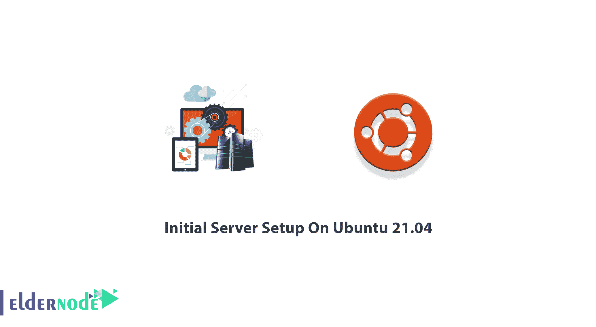
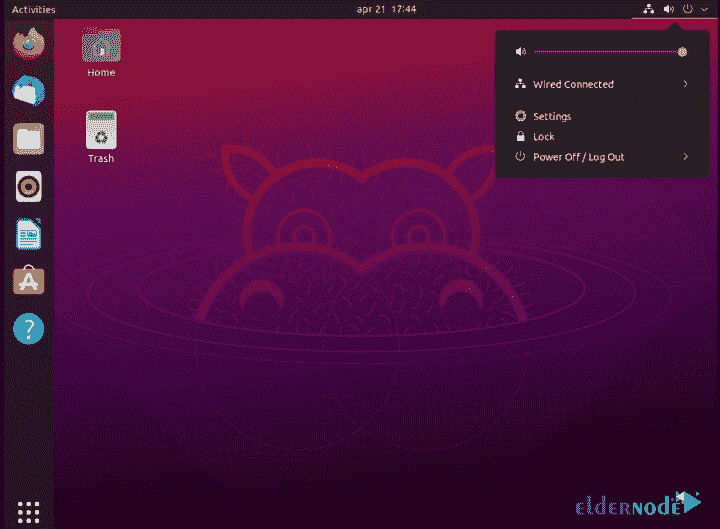

# Ubuntu 21.04 上的初始服务器设置- Eldernode 博客

> 原文：<https://blog.eldernode.com/initial-server-setup-on-ubuntu-21-04/>



2021 年 4 月 22 日，Ubuntu 21.04 发布。这是自 2006 年以来的第 34 次发布。由于 Ubuntu 21.04 附带 9 个月的安全更新、关键修复和精选软件更新，因此支持到 2022 年 1 月。新版本包括一个重新设计的黑暗主题 Yaru，在导航和新的文件图标方面有了可访问性的改进。你在这里是因为你喜欢这个最流行的开源桌面操作系统。此外，你会发现 Ubuntu 21.04 的新功能，以及在这个版本中你找不到的东西。所以，加入我们这篇文章来回顾一下 Ubuntu 21.04 上的**初始服务器设置。和 [Eldernode](https://eldernode.com/) 一起庆祝这次发布！如果你正在寻找便宜但重要的 [Ubuntu VPS](https://eldernode.com/ubuntu-vps/) ，我们的技术团队会帮助你购买你自己的。**

## **所有关于 Ubuntu 21.04 多毛河马**

首先，我们来多了解一下[Ubuntu](https://blog.eldernode.com/tag/ubuntu/)21.04‘多毛河马’。虽然新的 Ubuntu 版本包括最新的 GNOME 版本，但 Ubuntu 21.04 不**不**包括 GNOME 40。但将来可能会在 Ubuntu 21.04 上安装 GNOME 40。另外，**在 Ubuntu 21.04 上没有 GTK4** 可用。它带有一个新的桌面图标实现。为了根据您的需求策划 Ubuntu 桌面体验，Ubuntu 21.04 拥有大量**附加设置**。

你可以在 Ubuntu 21.04 上使用 **Mozilla Firefox** 、**雷鸟**和 **LibreOffice** 的更新版本。新版本的 *GNOME 图像查看器*、*字符应用*、*磁盘使用分析器*、*系统监视器*也在这个版本中可用。这个新版本中还有其他一些变化，如默认的 Wayland、私有主目录、Raspberry Pi 计算模块 4 上的 Wi-Fi +蓝牙支持、Linux 5.11 内核、智能卡认证支持、APT 分阶段更新等等。



### **Ubuntu 21.04 初始服务器设置的先决条件**

为了让本教程更好地工作，请考虑以下先决条件:

_ 拥有 Sudo 权限的非 root 用户。

_ 至少 2GB 的可用存储空间。

_ 访问包含您要安装的 Ubuntu Server 版本的 DVD 或 USB 闪存驱动器。

_ 如果你打算在安装 Ubuntu Server 的同时安装你想保留的数据，请确保你有一个最新的备份。

_ 如果您正在远程访问 Ubuntu Server 21.04，请参考[在 Linux 服务器上连接到 ssh](https://blog.eldernode.com/tutorial-connect-to-ssh-on-linux/)以查看如何通过 SSH 访问终端。

## **Ubuntu 21.04 初始服务器设置步骤**步骤

可以[下载](https://ubuntu.com/tutorials/upgrading-ubuntu-desktop#download)直接安装 **Ubuntu 21.04(多毛河马)**。也可以从 20.10 升级到 Ubuntu 21.04。升级比全新安装要容易得多，因为它会保留您的所有文件、应用和应用设置。

让我们来看一下这个指南中的步骤，以便用 Ubuntu 21.04 成功地进行初始服务器设置。一旦你完成本教程，你可以使用服务器的任何服务，如网络服务器，[灯](https://blog.eldernode.com/how-to-install-lamp-on-ubuntu-20-04/)服务器， [LEMP](https://blog.eldernode.com/install-lemp-stack-ubuntu20/) 服务器，VPN 服务器， [MySQL](https://blog.eldernode.com/install-mysql-on-linux-ubuntu-20-04/) 服务器，或任何所需的服务。

### **第一步:更新升级 Ubuntu 21.04**

像往常一样，建议您从更新系统开始。所以，通过 SSH 或者控制台登录你的 Ubuntu 21.04 系统。为此，请运行以下命令:

```
sudo apt update
```

```
sudo apt upgrade
```

### **第二步:在 Ubuntu 21.04** 上创建新用户

正如我们在先决条件一节中提到的，您需要使用拥有超级用户特权的用户。现在，运行下面的命令让**为系统管理创建一个账户**，并启用 Sudo 访问:

```
sudo adduser newuser
```

创建新用户后，您需要将创建的用户添加到 Sudo 组，以获得所有 Sudo 权限:

```
sudo usermod -aG sudo newuser
```

**记住**在上面的命令中用 **newuser** 替换你喜欢的名字。

接下来，系统会提示您输入一个**新密码**。尝试选择一个强密码，并确保其安全。使用下面的命令为用户更改和创建新密码:

```
sudo passwd newuser
```

***注意** :* 在 Linux 中输入密码时，你将看不到星星或圆点，看起来好像什么也没输入。

### **步骤三:SSH 配置**

为了保护您的系统免受 bot 和 hack 的攻击，您必须更改默认的 SSH 端口。因此，要更改默认端口编辑 **OpenSSH** 配置文件 **/etc/ssh/sshd_config** 并做如下更改:

```
nano /etc/ssh/sshd_config
```

因为默认的 ssh 端口总是在攻击者身上，所以更改它们是个好主意:

```
before edit: #port 22
```

**取消对**端口 22 的注释，并添加您喜欢的端口:

```
port 2245
```

另外，您可以**禁用 Root SSH 登录**。运行以下命令以禁用通过 ssh 的 root 登录:

```
PermitRootLogin no
```

当你完成并更改端口后，按下 **Ctrl + x** 并按下 **Enter** 两次以**保存**并退出文件。

### **步骤 4:配置防火墙**

在本指南的最后一步，您将使用 FirewallD 配置防火墙。要从默认存储库中安装所需的软件包，请运行:

```
sudo apt install firewalld
```

安装防火墙后，使用下面的命令**启动防火墙服务**并使其在系统启动时自动启动:

```
sudo systemctl start firewall
```

```
sudo systemctl enable firewalld
```

默认情况下，防火墙允许远程用户进行 SSH 访问。如果您希望添加您喜欢的端口，您需要添加**防火墙和**，因为您可能需要允许其他服务通过防火墙到达远程用户。使用下面的命令给**添加 ssh 新端口**:

```
firewall-cmd --permanent --add-port=2245/tcp
```

你可以直接提供一个类似“ **http** 或者“ **https** 的服务名来允许。**防火墙**使用 **/etc/services** 文件来确定服务对应的端口:

```
firewall-cmd --permanent --add-service=http firewall-cmd --permanent --add-service=https
```

您可能会发现在 **/etc/services** 文件中没有定义任何服务名。所以，你需要防火墙规则直接使用端口号。例如，要允许 TCP 端口 2080 连接到您的防火墙:

```
firewall-cmd --permanent --add-port=2080/tcp
```

进行任何更改后重新加载更改。为此，请运行:

```
firewall-cmd --reload
```

最后，您可以查看所有允许的服务和端口:

```
firewall-cmd --permanent --list-all
```

## 结论

在本文中，您学习了 Ubuntu 21.04 **的初始服务器设置。**遵循上述步骤有助于提高服务器的安全性和可用性。如果您已经完成了所有的说明和基本设置，您就可以开始享受新设置的服务器了。向你在 [Eldernode 社区](https://community.eldernode.com/)的朋友发送反馈，或者询问他们关于 Ubuntu 21.04 的新测试。