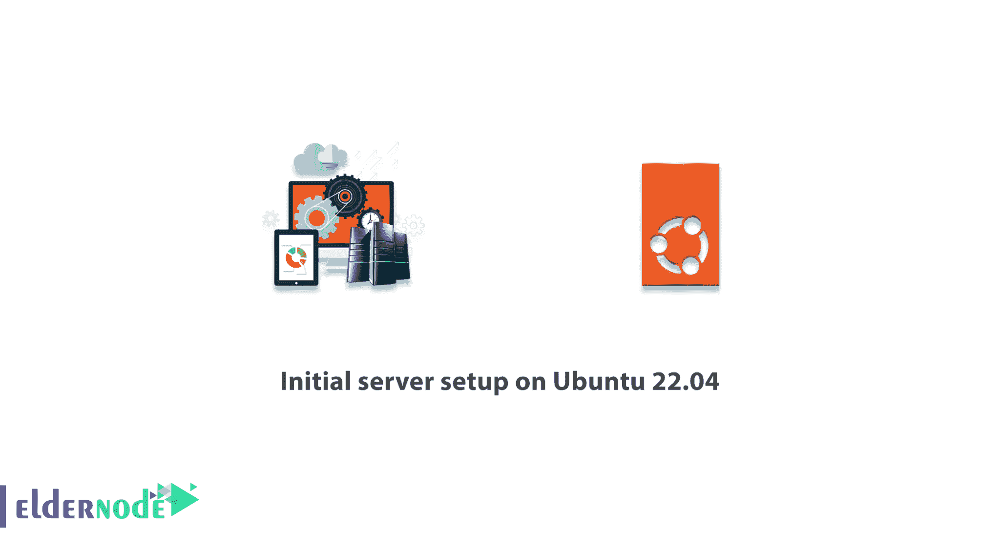
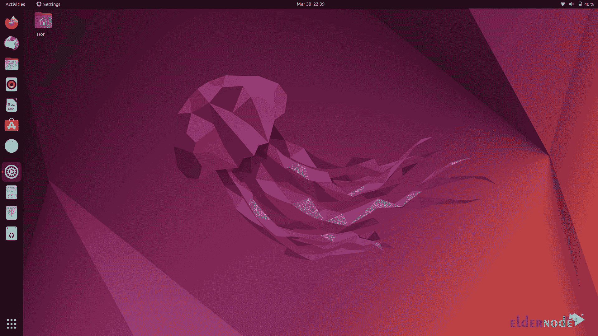

# Ubuntu 22.04 上的初始服务器设置- Eldernode 博客

> 原文：<https://blog.eldernode.com/initial-server-setup-on-ubuntu-22-04/>



Ubuntu 仍然是企业使用的首选之一，也是 Linux Mint 和 Elementary OS 等项目的技术基础。有趣的是，Ubuntu 有两个主要版本，每年发布两次。Ubuntu 22.04 LTS 现已推出。在本文的续篇中，我们将一步步解释 Ubuntu 22.04 上的**初始服务器设置。需要注意的是，您可以通过访问 [**Eldernode**](https://eldernode.com/) 网站查看和购买现有的 [**Ubuntu VPS**](https://eldernode.com/ubuntu-vps/) 包。**

## **Ubuntu 22.04 简介**

Ubuntu 22.08 于 2022 年 4 月 21 日发布。Ubuntu 22.04 是第一个可以在所有**树莓 Pi 4** 机型上使用的完整桌面环境版本。关于 Ubuntu 22.04 的一个非常基础和实用的点是，它包括 Rust 编程语言、OpenSSL v3、远程桌面协议(RDP)、Linux 5.15 内核和 Mesa 22 图形。

Ubuntu 22.04 目前可用于各种基于 AMD 的 32 位和 64 位 PC。此外，Docker、WSL 和其他提供 Ubuntu 图像的服务正在发布 Ubuntu 22.04。



### **Ubuntu 22.04 相比之前版本的变化**

对 Ubuntu 22.04 所做的一些改变包括新的截图功能，更新的颜色，以及 Ubuntu 系统主题和软件程序中的黑暗模式。你可能有兴趣知道，默认的网络浏览器 Firefox 现在是一个 Snap 包，而不是传统的 APT 包。

为了保持 22.04 的稳定，一些应用和功能已经停止使用。主要变化是这个版本的 Ubuntu 现在使用了 **Gnome 42 桌面环境**。Gnome 42 改为水平工作区切换器和应用程序启动器，类似于 Windows 11 和 macOS。在这个版本中，还有一些新的触摸板移动功能，可以在工作区和窗口之间移动。

### **Ubuntu 22.04 初始服务器设置的先决条件**

->至少 2GB 的可用存储空间

->具有 Sudo 权限的非超级用户

-->如果你要在安装 Ubuntu Server 的同时安装你想保留的数据，请确保你有一个最新的备份。

## **如何在 Ubuntu 22.04 上进行初始服务器设置**

在这篇文章的后续部分，我们将教你如何在 Ubuntu 22.04 上初始化服务器。要开始，第一步是能够使用以下命令以 root 用户身份登录。请注意，输入以下命令后，您需要输入 root 密码才能登录。您还将在第一次使用密码登录服务器时更改**根密码**。

```
ssh [[email protected]](/cdn-cgi/l/email-protection)_server_ip
```

对于 Ubuntu 22.04 上的初始服务器设置，请按照下面的步骤操作，直到本文结束。

### **如何创建新用户**

在您通过运行上面的命令成功登录后，您现在需要使用下面的命令**创建一个新用户**:

```
adduser michael
```

运行上述命令后，您可以输入您的**密码**，然后按**回车**。

### **如何授予管理权限**

一旦你能够创建一个新用户，你现在需要为一个普通用户帐户设置所谓的**超级用户**或**根权限**，以获得更多的用户权限。

***注意:*** 注意，在这之后你可以在命令前键入 **sudo** 并以超级用户权限执行它们。

```
usermod -aG sudo michael
```

### **如何设置防火墙**

在这一部分，我们将教你如何设置防火墙。你应该注意，一旦安装，应用程序可以在 **UFW** 中注册它们的配置文件。这些配置文件允许 UFW 按名称管理这些应用程序。

您可以通过运行以下命令来检查已安装的 UFW 配置文件列表:

```
ufw app list
```

然后，您需要在下一步中允许 **SSH 连接**。为此，请运行以下命令:

```
ufw allow OpenSSH
```

现在是时候使用下面的命令来启用防火墙了:

```
ufw enable
```

运行以下命令后，键入“ **y** ”，然后按**回车**。

如果您想检查 **SSH 连接**的状态，您可以使用以下命令:

```
ufw status
```

### **如何为用户** 启用外部访问

在本节中，我们将为我们创建的新用户启用外部访问。需要知道的重要一点是，为新用户配置 SSH 访问取决于您的服务器 root 帐户是使用密码还是 SSH 密钥。

如前所述，有两种方法可以访问 SSH，第一种是使用密码，第二种是使用 SSH 密钥进行身份验证。在第一种方法中，如果您使用密码登录您的主帐户**，您应该知道 SSH 启用了密码认证。因此，您可以使用以下命令 SSH 到您的新帐户:**

```
ssh [[email protected]](/cdn-cgi/l/email-protection)_server_ip
```

如果您想使用**管理权限**运行命令，您可以使用以下命令:

```
sudo command_to_run
```

在第二种方法中，您应该注意，如果您已经使用 SSH 密钥登录到您的主帐户，SSH 的**密码验证**将被禁用。因此，要以普通用户的身份使用 SSH 密钥登录，您需要将本地公钥的副本添加到下面的文件中，这是为新用户准备的。

```
~/.ssh/authorized_keys
```

您可以使用下面的命令来复制文件，比如包含在 **~/中的公钥。ssh /authorized_keys** 文件到具有正确所有权和权限的 root 帐户:

```
rsync --archive --chown=michael:michael ~/.ssh /home/michael
```

完成上述所有步骤后，您现在可以在本地设备上打开一个新的终端会话，并使用 SSH 和您的新用户名，如以下命令所示:

```
ssh [[email protected]](/cdn-cgi/l/email-protection)_server_ip
```

***注意:*** 您可以在本教程的说明中输入您想要的用户名，而不是“**迈克尔**”。

## 结论

Ubuntu 集成到公共云中，并针对性能、安全性和易用性进行了优化。其中一个关键的新功能是机密计算，它改善了领先公共云中的数据保护和隐私。在这篇文章中，我们试图一步一步地教你如何在 Ubuntu 22.04 上初始化服务器。