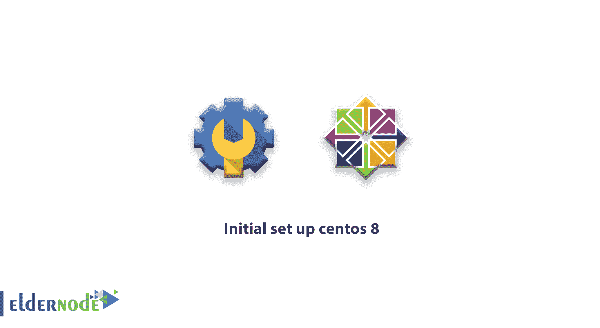

# 初始设置 centos 8 使用 centos 8 进行初始服务器设置

> 原文：<https://blog.eldernode.com/initial-set-up-centos-8/>



在这个[教程](https://eldernode.com/blog/)中，我们将看看在服务器中为**初始设置 Centos 8** 执行的几个重要任务。这些步骤将增加你的服务器或 [VPS 服务器](https://eldernode.com/vps/)的安全性以及可用性。

当您获得一台新的 [centos vps 服务器](https://eldernode.com/centos-vps/)时，您必须对 centos 8 进行一些初始设置，如下所示:

### 初始设置 CentOS 8

#### 步骤 A:通过 SSH 登录 T3

当你的服务器创建完成后，Eldernode 会给你发送邮件和票，包括默认的用户名，密码和服务器 IP 地址。

所以您可以使用这些信息通过 SSH 连接到服务器。

如果你不熟悉如何连接和使用 SSH，请看看我们的“ [什么是 putty 和它做什么](https://eldernode.com/what-is-putty-and-what-does-it-do/) ”文章。

#### 步骤 B:首次登录后更改 root 密码

首次登录时，更改 root 用户的密码非常重要。使用以下命令

```
passwd
```

键入此命令后，centos 会询问新密码并确认密码。

#### 步骤 C:更新您的密码

为您的服务器安装最新的安全补丁和更新非常重要。为相同的运行以下命令。

```
yum update -y
```

#### 步骤 D:设置时区

您可能希望您的服务器与您在同一个时区。对于这种情况，您可以按照命令获取可用时区的列表。

```
timedatectl list-timezones
```

确定时区后，使用下面的命令设置您喜欢的时区。

```
timedatectl set-timezone Europe/Berlin
```

执行完最后一个命令后，您可以通过运行以下命令来确认时区。

要点:可用时区列表也可用[此链接](https://www.timeanddate.com/time/zones/)。

#### 步骤 E:设置主机名

要检查您的现有主机名，请运行以下命令。

```
hostnamectl
```

使用此命令，您可以获得 centos 8 vps 服务器的一些信息，如下所示

```
[[[email protected]](/cdn-cgi/l/email-protection) ~]$ hostnamectl  Static hostname: vps.eldernode.com  Icon name: computer-vm  Chassis: vm  Machine ID:  Boot ID:  Virtualization: Vmware  Operating System: CentOS Linux 8 (Core)  CPE OS Name: cpe:/o:centos:centos:8  Kernel: Linux 4.18.0-80.11.2.el8_0.x86_64  Architecture: x86-64
```

要设置主机名，请运行以下命令

```
hostnamectl set-hostname myserver.eldernode.com
```

用你最喜欢的主机名替换myserver.eldernode.com。如果您没有使用主机名的域名，您可以使用本地域，如 mine.local 或…但是要解析这个名称，您必须在 hosts 文件上设置本地名称。

要解析本地服务器的主机名，您需要用编辑器打开 **/etc/hosts** 文件，并在上面添加主机名。

首先，运行下面的命令安装纳米编辑器，因为我非常喜欢它😀

```
yum install -y nano
```

安装完成后，您可以用这个编辑器编辑您想要的每个文件

对于编辑 **/etc/hosts** 请遵循此命令

```
nano /etc/hosts
```

打开文件后，您可以在以 127.0.0.1 开头的行尾附加您的主机名。例如

```
127.0.0.1             localhost             myserver.eldernode.com
```

不要忘记你必须键入你的主机名，而不是 myserver.eldernode.com。

##### 结论

在这篇文章中，你学习了如何**初始设置 centos 8** ，现在你可以使用所有命令为你的 [**centos 8 服务器**](https://eldernode.com/tag/centos-8/) 。我们在 centos 8 上为我们的博客粉丝发布了另一篇关于安全性的文章。