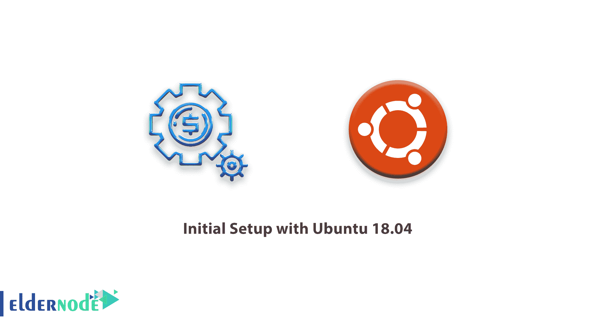

# Ubuntu 18.04 的初始设置- Eldernode

> 原文：<https://blog.eldernode.com/initial-setup-ubuntu-18/>



要开始学习 Ubuntu 18.04 的初始设置，值得一提的是，作为基本设置的一部分，您应该尽早采取一些配置步骤。为了增加你的服务器的安全性和可用性，你可以决定创建一个新的 Ubuntu 18.04，让你的系统为后续的操作打下坚实的基础。

为了让你的学习更好地进行，选择你自己的 [Ubuntu VPS 服务器](https://eldernode.com/ubuntu-vps/)并立即激活。

## Ubuntu 18.04 初始设置

让我们通过本教程的步骤来回顾 Ubuntu 18.04 的初始设置。如果你有兴趣学习最新版本的初始设置，可以在 Ubuntu 20.04 上找到我们关于[初始服务器设置的文章。](https://blog.eldernode.com/initial-server-setup-on-ubuntu-20/)

### 第一步:如何以 Root 身份登录

很明显，你需要知道你的 IP 地址才能登录到你的服务器。如果您已经安装了 SSH 密钥进行身份验证，那么您需要 **root** 用户帐户的私钥或密码。但是如果这是您第一次连接到您的服务器，您应该以 root 用户的身份登录。要继续，请运行以下命令:

```
ssh [[email protected]](/cdn-cgi/l/email-protection)your_server_ip
```

**点**:将命令的( your_server_ip )替换为你的服务器的公共 ip 地址。

如果您面临主机真实性警告，接受它，并提供您的 root 密码登录(如果您使用密码验证)。

此外，如果您使用受密码保护的 SSH 密钥，则每次会话第一次使用该密钥时，您将被强制输入密码。您可以猜测，如果您还没有连接到您的服务器，您可能还会被提示更改 **root** 密码。

### `什么是根`

`在 Linux 中拥有非常广泛特权的管理用户。但是您可能会因为它的特权而不愿意经常使用它。`

`但是还有一条路可以走！`

`您可以为日常工作设置一个影响范围较小的备用用户帐户。所以请继续阅读这篇文章，看看如何在必要的时候获得更多的特权。`

### `第二步:如何创建新用户`

`在以 root 用户身份登录后，您可以添加新的用户帐户，从现在开始您将使用该帐户登录。要了解如何创建新用户，请看下面的例子。`

`**点**:本文中用户叫 noodi，记得用你喜欢的用户名替换。`

```
`adduser noodi`
```

`此时，您应该回答一些问题，首先是帐户密码。`

`不要忘记选择一个强密码。为了更安全，即使不需要，也要填写附加信息。此外，您可以在任何想要跳过的字段中点击 **输入** 。`

### `步骤 3:如何授予管理权限`

`由于您有一个拥有常规帐户权限的新用户帐户，因此有时您可能需要执行管理任务。尝试为我们的普通帐户设置所谓的“超级用户”或 root 权限，以计划避免注销您的普通用户，并作为 **root** 帐户重新登录。这样，通过在每个命令前加上单词 **sudo** ，您可以让普通用户以管理权限运行命令。向新用户添加这些权限后，需要向 sudo 组添加新用户。总之，在 Ubuntu 18.04 上属于 sudo 组的用户，默认允许使用 sudo 命令。`

`要将新用户添加到 **sudo** 组，请以 **root** 的身份键入下面的命令。`

```
`usermod -aG sudo noodi`
```

`**点**:用你的新用户替换“noodi”。`

`如果您想以超级用户权限执行操作，`

`以普通用户身份登录后，在命令前输入 **sudo** 。`

### `第四步:如何设置基本防火墙`

`由于 Ubuntu 18.04 服务器使用 UFW 防火墙，您可以使用该应用程序非常容易地设置一个基本的防火墙，以确保只允许连接到某些服务。`

`不同的应用程序可以在安装时向 UFW 注册它们的配置文件。这些配置文件允许 UFW 按名称管理这些应用程序。OpenSSH，现在允许我们连接到我们的服务器的服务，在 UFW 注册了一个概要文件。`

`您可以通过键入以下命令看到这一点:`

```
`ufw app list`
```

`输出`

```
`Available applications:    OpenSSH`
```

`然后，您需要确保防火墙允许 SSH 连接，以便您下次可以重新登录。使用以下命令允许这些连接:`

`之后，使用以下命令启用防火墙:`

```
`ufw allow OpenSSH`
```

`输入“ **y** ”，按 **回车** 继续。您可以通过键入以下命令看到 SSH 连接仍然被允许:`

```
`ufw enable`
```

`输出`

```
`ufw status`
```

`从现在开始，您需要调整防火墙设置，以允许可接受的流量进入，因为防火墙目前正在**阻止**除 SSH 之外的所有连接`

```
`Status: active    To                         Action      From  --                         ------      ----  OpenSSH                    ALLOW       Anywhere  OpenSSH (v6)               ALLOW       Anywhere (v6)`
```

`From now on, you need to adjust the firewall settings to allow acceptable traffic in because the firewall is currently **blocking** all connections except for SSH`

### `步骤 5:如何为您的普通用户启用外部访问`

### `到目前为止，你有一个日常使用的固定用户。因此，请确保您可以直接 SSH 到该帐户。根据您的服务器的 **root** 帐户是使用密码还是 SSH 密钥进行认证，您可以看到为您的新用户配置 SSH 访问的过程。`

### `**请注意** :建议您保持以 **root** 的身份登录，直到您确保可以与新用户一起登录并使用 sudo。原因是让您在遇到问题时，以 **root** 的身份进行故障诊断和任何必要的更改。`

`如果根账户使用密码认证`

`如果您使用密码登录到您的 **root** 帐户，那么 SSH 会启用密码验证。您可以通过打开一个新的终端会话并使用 SSH 和您的新用户名:来 SSH 到您的新用户帐户`

### `输入您的普通用户密码后，您将登录。**记住**，如果你需要运行一个有管理权限的命令，在它前面输入 **sudo** ，就像这样:`

`每次首次使用 **sudo** 时，系统会提示您输入常规用户密码(以后会定期提示)。`

```
`ssh [[email protected]](/cdn-cgi/l/email-protection)your_server_ip`
```

`为了增强服务器的安全性，**我们强烈建议**设置 SSH 密钥，而不是使用密码认证。`

```
`sudo command_to_run`
```

`如果 Root 账户使用 SSH 密钥认证`

`如果您使用 SSH 密钥登录到您的 **root** 帐户，那么 SSH 的密码验证将被禁用。您需要将本地公钥的副本添加到新用户的 **~/中。ssh/authorized_keys** 文件登录成功。`

### `因为你的公钥已经在**根**账户的 **~/里了。ssh/authorized_keys** 文件，您可以将该文件和目录结构复制到我们现有会话中的新用户帐户。`

`使用正确的所有权和权限复制文件的最简单方法是使用 **rsync** 命令。这将复制**根**用户的 **。ssh** 目录、保留权限和修改文件所有者，所有这些都在一个命令中完成。`

`**注意**:不要忘记将 noodi : noodi 替换为您的常规用户名。`

`**请注意:****rsync**命令对以结尾斜杠结束的源和目的地的处理方式与没有结尾斜杠的不同。当使用下面的 **rsync** 时，确保源目录( **~/)。ssh**)**不包含尾随斜线(检查以确保您没有使用 **~/)。宋承宪/** )。**`

```
**`rsync --archive --chown=noodi:noodi ~/.ssh /home/noodi`**
```

`**如果不小心在命令后面加了一个斜杠， **rsync** 就会复制 **root** 账号的 **~/的内容。ssh** 目录复制到 **sudo** 用户的主目录，而不是复制整个 **~/。ssh** 目录结构。这些文件将位于错误的位置，SSH 将无法找到并使用它们**`

`**现在，打开一个新的终端会话，使用 SSH 和您的新用户名:**`

`**您应该在不使用密码的情况下登录到新用户帐户。请记住，如果您需要使用管理权限运行一个命令，请在它前面键入 **sudo** ，如下所示:**`

`**每次首次使用 **sudo** 时，系统会提示您输入常规用户密码(之后会定期提示)。**`

```
**`ssh [[email protected]](/cdn-cgi/l/email-protection)_server_ip`**
```

`**结论**`

```
**`sudo command_to_run`**
```

`**在本文中，您了解了 Ubuntu 18.04 的初始设置，现在您已经为您的服务器打下了坚实的基础。现在，您可以在服务器上安装任何您需要的软件。为了更深入地了解您在本指南中所学的主题，请看一下我们的文章，关于[在 linux 上安装 SSH 服务器并允许根用户登录](https://blog.eldernode.com/install-ssh-server-on-linux-and-allow-root-user-login/) **和** [教程在 Linux 上连接 SSH](https://blog.eldernode.com/tutorial-connect-to-ssh-on-linux/)。**`

## `**`Conclusion`**`

`**`In this article, you learned about Initial Setup with Ubuntu 18.04 and now you have a solid foundation for your server. You can install any of the software you need on your server now. To get more involved with the subjects you learned in this guide, have a look at our articles on [Install SSH Server on Linux and allow root user login](https://blog.eldernode.com/install-ssh-server-on-linux-and-allow-root-user-login/) **AND** [Tutorial connect to ssh on linux](https://blog.eldernode.com/tutorial-connect-to-ssh-on-linux/).`**`