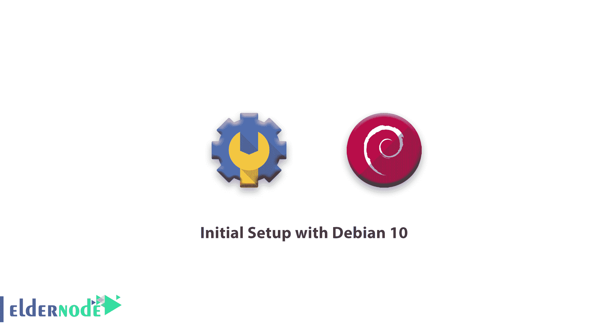

# Debian 10 的初始设置——开始使用 Debian 10

> 原文：<https://blog.eldernode.com/initial-setup-with-debian-10/>



要开始基本设置，有几个配置步骤。在本文中，您将学习 Debian 10 的**初始设置。因此，请遵循本教程，了解如何提高服务器的安全性和可用性，并为后续操作打下坚实的基础。最后，你将成为一名专家，知道如何以 **root** 用户的身份登录我们的服务器，创建一个具有管理员权限的新用户，并设置一个基本的防火墙。**

## Debian 10 的初始设置

**第一步**–**以 Root 身份登录**

您需要熟悉您的**服务器的公共 IP 地址**才能登录您的服务器。如果您已经安装了 SSH 密钥认证，您还需要知道密码。使用以下命令作为 **root** 用户登录，连接到您的服务器。

```
ssh [[email protected]](/cdn-cgi/l/email-protection)your_server_ip 
```

如果您使用 SSH 密钥，可能会要求您输入密码。如果这是你第一次使用密码登录服务器，你应该更改 **root** 密码。

**第二步**–**创建新用户**

当您以 root 用户身份登录时，您需要添加一个新的用户帐户。正如您在下面的命令中看到的，它被称为 noodi，您可以用您最喜欢的命令来替换它。

```
adduser noodi 
```

当你被询问时，尝试输入一个强密码。

[**买便宜的 Linux VPS**](https://eldernode.com/linux-vps/)

**第三步**—**授予管理权限**

如果您需要限制普通用户作为 **root** 帐户登录和重新登录，您可以为我们的普通帐户设置超级用户或 root 权限。因此，普通用户应该在命令前加上单词 sudo ，以管理权限运行命令。注意，您应该将新用户添加到 sudo 组中。运行这个命令将新的用户添加到 sudo 组。

```
`usermod -aG sudo noodi`
```

``**第四步**–**设置基础防火墙**``

``您将学习如何使用 [UFW 防火墙](https://wiki.debian.org/Uncomplicated%20Firewall%20%28ufw%29)来使用防火墙策略和管理例外。你可以使用 apt 包管理器来安装 UFW。但是首先更新本地索引以检索最新信息。然后使用下面的命令安装 UFW 防火墙软件。``

```
``apt update    apt install ufw`` 
```

``您可以使用防火墙概要文件管理防火墙的命名集。通过键入以下命令，将列出所有可用的应用程序配置文件:``

```
``ufw app list`` 
```

``输出``

```
``Available applications:   . . .   OpenSSH   . . .``
```

``不要忘记通过输入以下命令来确保防火墙允许 SSH 连接。``

```
``ufw allow OpenSSH`` 
```

``要继续，您可以键入 y 并按下 ENTER 。要检查是否允许 SSH 连接，请键入以下命令。``

```
``ufw status`` 
```

``输出``

```
``Status: active    To             Action   From  --             ------   ----  OpenSSH          ALLOW    Anywhere  OpenSSH (v6)     ALLOW    Anywhere (v6)``
```

``**第五步**–**为您的普通用户启用外部访问**``

``由于您有一个日常使用的普通用户，您应该确保 SSH 直接进入帐户。每当您登录到您的 **root** 帐户时，SSH 就会启用密码验证。使用您的新用户名和 SSH 到您的新用户帐户打开一个新的终端会话。``

``请注意，如果您使用管理权限运行命令，请在它前面键入 sudo 。``

```
``ssh noodi@your_server_ip`` 
```

``如果公钥在根帐户的 ~/中，您可以使用 cp 命令将文件和目录结构复制到您现有会话中的新用户帐户。服务器上的 ssh/authorized_keys 文件。``

```
``sudo command_to_run`` 
```

``然后使用 chown 命令调整文件的所有权。``

``现在，使用新用户名通过 SSH 登录，打开一个新的终端会话。``

```
``p -r ~/.ssh /home/noodi    chown -R noodi:noodi /home/noodi/.ssh``
```

``在运行具有管理权限的命令的情况下，在其前面键入 sudo 。``

```
``ssh noodi@your_server_ip`` 
```

``亲爱的用户，我们希望这个 Debian 初始设置教程能对你有所帮助，如果你有任何问题或者想查看我们用户关于这篇文章的对话，请访问[提问页面](https://eldernode.com/ask)。也为了提高你的知识，有这么多有用的教程为[老年节点培训](https://eldernode.com/blog/)准备。``

```
```sudo command_to_run``` 
```

```亦作，见```

```[教程在 Linux Debian 10 上安装 VLC 媒体播放器](https://eldernode.com/install-vlc-on-linux-debian-10/)```

```[Tutorial Install VLC Media Player on Linux Debian 10](https://eldernode.com/install-vlc-on-linux-debian-10/)```