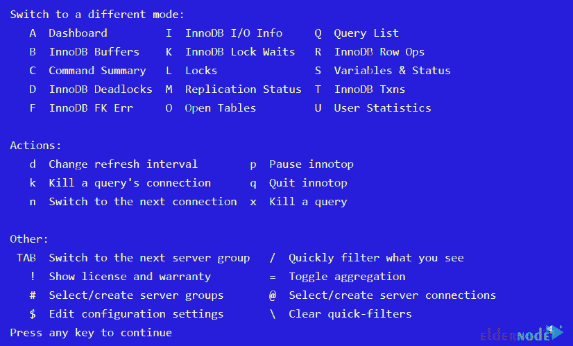
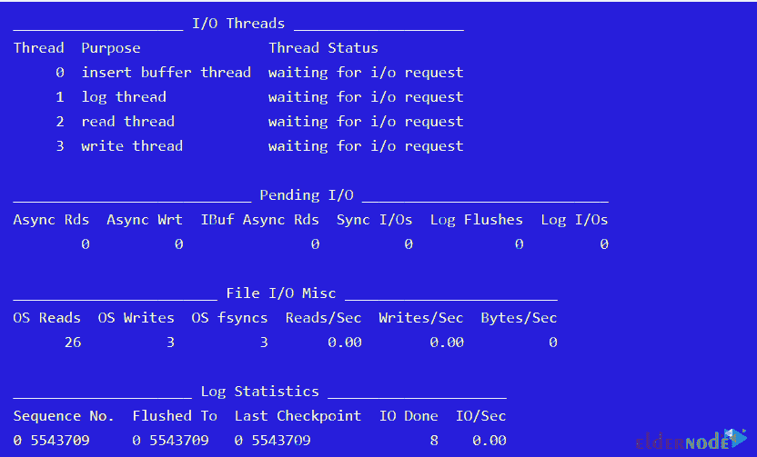
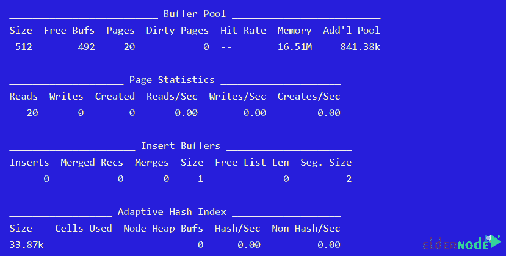
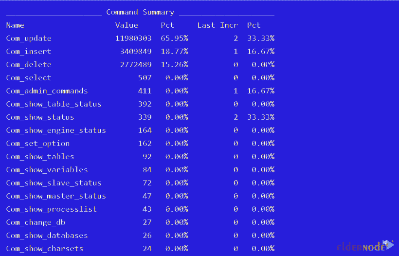
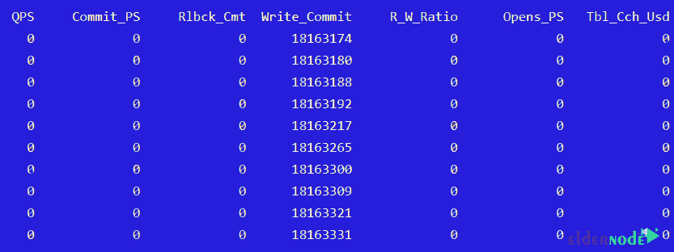

# 教程安装 Innotop 来监控 CentOS - Eldernode 博客上的 MySQL

> 原文：<https://blog.eldernode.com/innotop-to-monitor-mysql-on-centos/>


Innotop 是一个基于命令行的高级研究应用程序，用于监控 InnoDB 引擎下的本地服务器和 MySQL 输出。Innotop 包括许多功能和不同类型的模式/选项。这些特性帮助用户避开 MySQL 输出性能的各个方面，找出 MySQL 服务器的问题所在。在本文中，我们试图向您介绍**教程在 CentOS** 上安装 Innotop 以监控 MySQL。你可以访问 [Eldernode](https://eldernode.com/) 提供的套装来购买 [CentOS VPS](https://eldernode.com/centos-vps/) 服务器。

## **如何在 CentOS 7 | 8** 上安装 Innotop 监控 MySQL

### **在 CentOS** 上安装 Innotop 监控 MySQL

由于 Innotop 软件包现在默认不包含在 [CentOS](https://blog.eldernode.com/tag/centos/) 中，您需要通过激活 Epel 第三方存储库来安装它。为此，您可以使用以下命令:

```
yum install innotop
```

在启动 Innotop 的下一步中，您必须键入“ **innotop** ”，如以下命令所示。在下面的命令行中， **-u** 和 **-p** 选项分别是用户名和密码。

```
innotop -u root -p 'eldernode'
```

当您可以成功连接到 MySQL 服务器时，您将看到以下信息:

```
[RO] Dashboard (? for help) localhost, 61d, 254.70 QPS, 5/2/200 con/run/cac thds, 5.1.61-log  Uptime MaxSQL ReplLag Cxns Lock QPS QPS Run Run Tbls Repl SQL  61d 4 0 254.70 _ _ 462 Off 1
```

需要注意的是，如果你想知道 Innotop 中可用的特性，你可以很容易地运行“**？**”。通过这样做，您将看到如下信息。



下一节是**用户统计**。本节显示了按读取排序的用户统计信息和索引。

```
CXN When Load QPS Slow QCacheHit KCacheHit BpsIn BpsOut   localhost Total 0.00 1.07k 697 0.00% 98.17% 476.83k 242.83k
```

下一种模式是查询列表。注意，该模式显示了**显示完整进程列表**的输出。

```
When Load Cxns QPS Slow Se/In/Up/De% QCacheHit KCacheHit BpsIn BpsOut  Now 0.05 1 0.20 0 0/200/450/100 0.00% 100.00% 882.54 803.24  Total 0.00 151 0.00 0 31/231470/813290/188205 0.00% 99.97% 1.40k 0.22    Cmd ID State User Host DB Time Query  Connect 25 Has read all relay system u 05:26:04
```

下一部分是关于 **InnoDB I/O 信息**。应该注意，默认情况下，该模式显示 InnoDB I/O 统计信息、挂起的 I/O、I/O 线程、文件 I/O 和日志统计表。



接下来需要说的部分是 **InnoDB Buffers** 。在这个部分中，您可以查看关于 InnoDB 缓冲池、页面统计、缓冲区导入和自适应散列索引的信息。



在名为 **InnoDB Row Ops** 的下一部分中，您将看到 InnoDB 行操作、行故障、信号量和数组表的默认输出。

```
________________ InnoDB Row Operations _________________  Ins Upd Read Del Ins/Sec Upd/Sec Read/Sec Del/Sec  0 0 0 0 0.00 0.00 0.00 0.00    ________________________ Row Operation Misc _________________________  Queries Queued Queries Inside Rd Views Main Thread State   0 0 1 waiting for server activity    _____________________________ InnoDB Semaphores _____________________________  Waits Spins Rounds RW Waits RW Spins Sh Waits Sh Spins Signals ResCnt  2 0 41 1 1 2 4 5 5    ____________________________ InnoDB Wait Array _____________________________  Thread Time File Line Type Readers Lck Var Waiters Waiting? Ending?
```

如下图所示，**命令摘要**模式显示了整个 cmd_summary 表。



下一部分是调用变量**和状态**。在这一部分中，与每秒查询数一样，统计信息以多种不同的模式进行计算和显示。



### 了解如何在 CentOS 上设置 Innotop 来监控 MySQL

请注意，另一个重要部分是**复制状态**。在这种情况下，您可以看到从属 SQL 状态、从属 I/O 状态和主状态的输出。前两部分显示从机状态和 I/O 从机状态，最后一部分显示主机状态。

```
_______________________ Slave SQL Status _______________________  Master On? TimeLag Catchup Temp Relay Pos Last Error  178.16.24.115 Yes 00:00 0.00 0 41295853    _______________________ Slave I/O Status _______________________  Master On? File Relay Size Pos State   178.16.24.115 Yes mysql-bin.000025 39.38M 41295708 Waiting for master to send event    ____________ Master Status _____________  File Position Binlog Cache  mysql-bin.000010 10887846 0.00%
```

下一部分是非交互地调用**。您可以使用以下命令以非交互方式运行“Innotop”。**

```
`innotop --count 5 -d 1 -n`
```

**最后一部分是**监控远程数据库**，您可以使用以下命令以及用户名、密码和主机名来完成。**

```
`innotop -u username -p password -h hostname`
```

## **结论**

**Innotop 是一个非常简单有用的工具，可以提供 MySQL 工作的很多细节。在本文中，我们试图向您介绍如何在 CentOS 上安装 Innotop 来监控 MySQL。我们还为您描述了 Innotop 的各种特性和功能。**