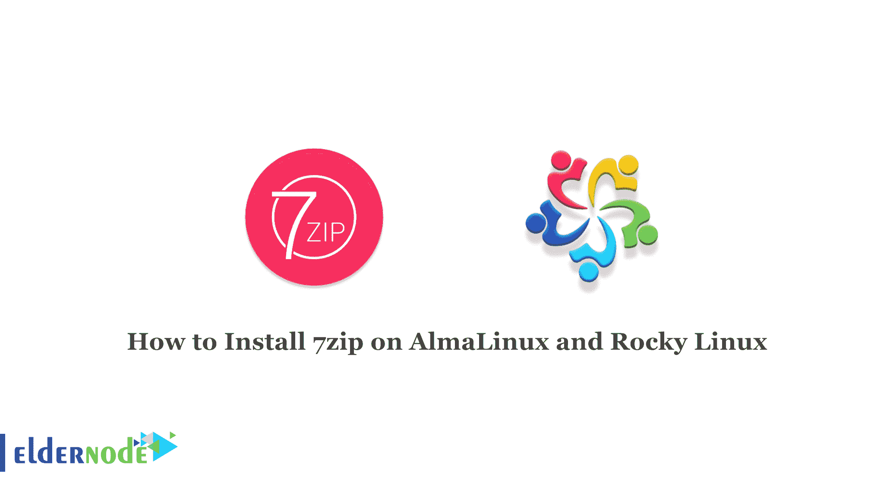

# 如何在 AlmaLinux 和 Rocky Linux 上安装 7zip-elder node 博客

> 原文：<https://blog.eldernode.com/install-7zip-on-almalinux-and-rocky-linux/>



7zip 是一个用于压缩和解压缩文件的免费开源软件，是使用 7z 文件格式的较为流行的压缩工具之一。这个工具可以读写其他文件格式。在本文中，我们将教你如何在 AlmaLinux 和 Rocky Linux 上安装 7zip。如果你想购买一台 [**Linux VPS**](https://eldernode.com/linux-vps/) 服务器，你可以访问 [Eldernode](https://eldernode.com/) 中的软件包。

## **教程在 AlmaLinux 和 Rocky Linux 上安装 7zip**

7zip 是一种压缩存档格式，它比其他类型的压缩格式速度更快，在不同类型的压缩格式之间进行的实验中名列第一。

### 7 压缩功能

–具有 7z 文件格式的自解压功能

–压缩比比其他产品高出约 2-10%

–类似工具

–支持 87 种语言

–使用强 AES-256 加密

## **在 AlmaLinux 和 Rocky Linux 上安装 7zip 8**

7zip 在大多数 [Linux](https://blog.eldernode.com/tag/linux/) 发行版上默认是不启用的。Linux 发行版中的 7zip 包称为 p7zip。所以没有从 7zip 开始的安装候选。

有三个 7zip 包:p7zip、p7zip-full 和 p7zip-rar。p7zip-rar 包支持 rar 文件和 7z。安装 p7zip-full 在大多数情况下就足够了，但是也可以安装 p7zip-rar 来进一步支持 rar 文件。

您应该**更新**您的系统数据库:

```
sudo dnf update -y
```

然后，您必须使用以下命令**启用 Epel 存储库**:

```
sudo dnf install epel-release
```

最后，您现在可以通过运行下面的命令轻松地安装 7-Zip 了:

```
sudo dnf install p7zip p7zip-plugins
```

为了确保 7-Zip 的正确安装，您可以使用以下命令**验证**:

```
7z
```

### **如何在 AlmaLinux 和 Rocky Linux 上使用 7zip**

现在，您应该选择任何文件来使用 7zip 创建一个压缩文件。你需要下面的命令来显示当前目录下所有文件和文件夹的列表:

```
ls -la
```

您可以借助下面的命令**创建一个压缩文件**。命令中的选项 a 用于压缩。

```
7z a data.7z data.txt
```

现在下面的命令给**显示每个归档文件的详细信息列表**:

```
7z l data.7z
```

在这一步中，您需要**提取文件和文件夹**:

```
7z e data.7z
```

## 结论

7zip archiver 是压缩和解压缩重要文件和文件夹的有效工具，它可以用来传输大量数据。本文教你如何在 AlmaLinux 8 和 Rocky Linux 8 上安装 7zip。