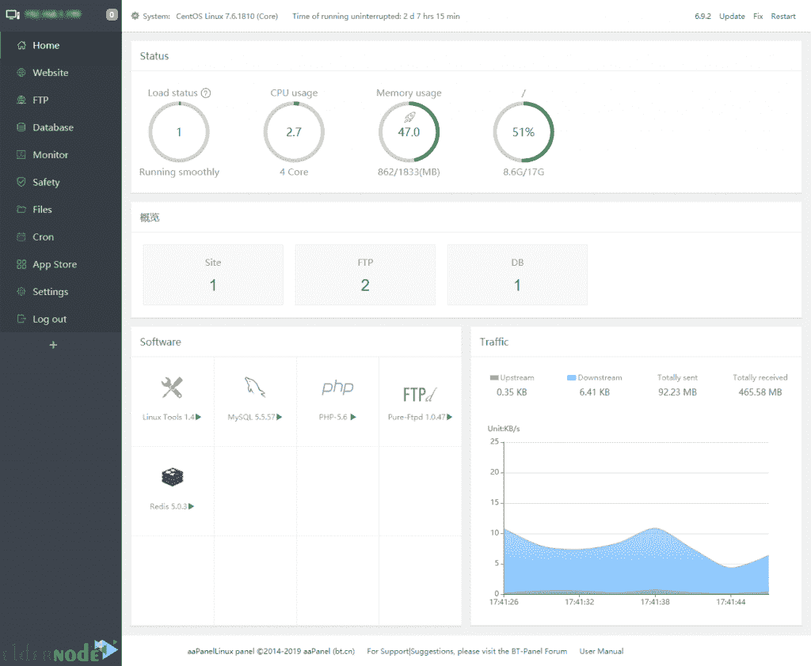

# 如何在 Linux 服务器上安装 aaPanel-elder node 博客

> 原文：<https://blog.eldernode.com/install-aapanel-on-linux-server/>


之前大家已经熟悉了 [aaPanel](https://blog.eldernode.com/introducing-aapanel-hosting-control-panel/) 。简单但功能强大的主机控制面板。在这篇文章中，你将学习如何**在 Linux 服务器**上安装 aaPanel。虽然 aaPanle 支持 Linux 发行版，但建议在 CentOS 上安装，因为 aaPanel 是基于 CentOS 开发的。所以，准备好你自己的 [Linux VPS](https://eldernode.com/linux-vps/) 立即开始这篇指南吧。最终，你学会了安装 Ubuntu 和 CentOS。一些用户经常抱怨 aapanel 占用大量空间，但其他人更喜欢安装这个完美的主机控制面板，即使是通过分配这个空间。

## **教程在 Linux 服务器上安装 aa panel**

为了让本教程更好地发挥作用，请考虑以下**先决条件**:

**内存** : 512M 以上，768 以上。纯面板约 60 米

**硬盘:100M 以上的空闲硬盘空间。纯面板约 20M**

**系统** : CentOS 7.1 以上，Ubuntu 6.4 以上

**注意**:你必须准备一个**干净的操作系统**。不应该已经安装了 Apache、Nginx、PHP 和 MySQL 等环境。

拥有 sudo 权限的非 root 用户。

要进行设置，请遵循我们在 Ubuntu 20.04 & [上的](https://blog.eldernode.com/initial-set-up-centos-8/)[初始服务器设置初始设置 Centos 8](https://blog.eldernode.com/initial-server-setup-on-ubuntu-20/) 。

## **如何在 Ubuntu 和 CentOS 上安装 aapanel**

虽然 apanle 是众所周知的一键式功能，但你只需运行一个命令行就可以在你的操作系统上安装它。但一如既往，让我们从更新您当前的操作系统安装开始:

```
apt-get update
```

```
apt-get upgrade -y
```

### **如何在 Ubuntu 上安装 aaPanle**:

```
wget -O install.sh http://www.aapanel.com/script/install-ubuntu_6.0_en.sh && sudo bash install.sh
```

*注 1* :在 Deepin 上安装 aaPanel 和在 Ubuntu 上是一样的。

注意 2:你会被询问是否要现在安装 aaPanel 到/www 目录？(是/否):“，请键入一个字母:

```
y
```

然后按回车键。

接下来，运行下面的命令下载 aaPanel 的安装脚本。

```
wget -O install.sh http://www.aapanel.com/script/install-ubuntu_6.0_en.sh
```

*注意*:会询问你是否需要启用面板 SSl？(是/否):**否**

### **如何在 CentOS 上安装 aaPanle:**

你可以用 curl，但是我们要用 wget。因此，要安装 wget，请运行以下命令:

```
sudo yum install wget
```

然后，使用以下命令在 [CentOS](https://blog.eldernode.com/tag/centos/) 上安装 aaPanel:

```
yum install -y wget && wget -O install.sh http://www.aapanel.com/script/install_6.0_en.sh && bash install.sh
```

当您按照**先决条件**部分的要求以 root 权限登录时，您可以运行支持 ipv6 的实验性 Centos/Ubuntu/Debian/Fedora 安装命令。

```
curl -sSO http://www.aapanel.com/script/new_install_en.sh && bash new_install_en.sh
```

再次下载 aaPanel 的安装脚本，运行下面的命令:

```
wget -O install.sh http://www.aapanel.com/script/install_6.0_en.sh
```

主页将显示如下:



完成安装后，您将获得一个登录链接。在那里找到用户名和密码，并使用它们进入控制面板。


第一次登录仪表板时，你会被要求在 **LNMP** (Nginx、MySQL、PHP、Pure-Ftpd 和 phpMyAdmin)或 **LAMP** (Apache、MySQL、PHP、Pure-Ftpd 和 PHPMyAdmin)之间进行设置。


选择您认为合适的 web 服务器环境，然后点击安装。它可以稍后从这个 Linux 面板的应用程序部分安装。


安装其中一个环境可能需要一个小时。然后，您就可以在您喜欢的操作系统上使用 aaPanle 了。

如果您想在远程服务器上安装一个 Panle，您将能够访问它并管理您的服务器集群。

要停止:

```
service bt stop
```

首先:

```
service bt start
```

要重新启动:

```
service bt restart
```

**如何卸载 aapanel web 控制面板**

### 任何时候你决定**移除**你的服务器控制面板，你应该运行下面的命令来移除安装:

如果上述命令不起作用，请使用以下命令:

```
sudo service bt stop && chkconfig --del bt && rm -f /etc/init.d/bt && rm -rf /www/server/panel
```

```
sudo bt stop &&sudo update-rc.d -f bt remove &&sudo rm -f /etc/init.d/bt &&sudo rm -rf /www/server/panel
```

结论

## 在本文中，您了解了如何在 Linux 服务器上安装 aaPanel。你学习了如何在两个 Linux 操作系统上安装这个免费的主机控制面板。开始管理您的主机并享受其免费功能。用户正在使用这一工具而不是 Cpanel，并对这一替代方案给予了积极的评价。

In this article, you learned How To Install aaPanel On Linux Server. You learned how to install this free hosting control panel on two OS of Linux. Start managing your host and enjoy its free features. Users are using this tool instead of Cpanel and have reported positively for this alternative.