# 如何在 Windows Server 2019 上安装 Active Directory-elder node 博客

> 原文：<https://blog.eldernode.com/install-active-directory-on-windows-server/>

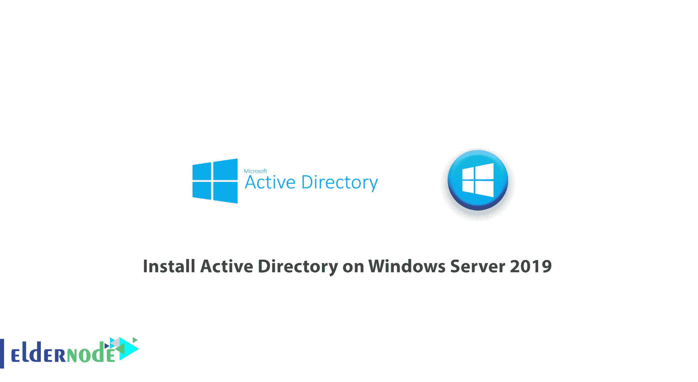

如何在 Windows Server 2019 上安装 Active Directory？Active Directory 存储有关网络对象的信息，并通过提供分层结构，轻松地组织域和资源。在本文中，我们将教你如何在一个新的 AD 森林中设置 [Active Directory](https://en.wikipedia.org/wiki/Active_Directory) 2019。

我们准备了以下清单，并将逐步实施:

1。活动目录设计文档的制作

2 。为 DC 提供物理/虚拟资源

3。安装 Windows Server 2019 标准版/数据中心

4。执行最新的 Windows 更新

5。向 DC 分配知识产权

6。安装 AD DS 卷

7。根据设计进行 AD DS 配置

8。登录以检查健康 AD DS 的安装和配置

9。已配置服务的监控和性能

我们安装此服务的拓扑如下:

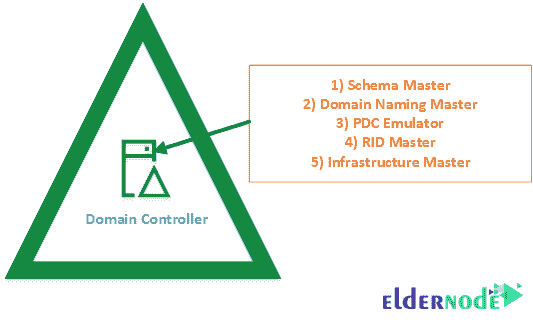

如上图所述，在演示环境中，我们将 Michaeladmin.local 视为 Forrest 中的根域。

《阿甘正传》中的第一个域控制器将扮演全部五个 **FSMO** 角色。

### 教程在 Windows Server 2019 上安装 Active Directory

**1-** 在[安装配置 Windows Server 2019](https://eldernode.com/windows-server-2019-install-and-config/) 之后，就应该做好所有的更新了。

在做任何事情之前，重要的是将 Windows 的名称改为一个有意义的名称。

您还必须将 Windows 服务器 IP 从**自动**改为**手动**。

我把这个窗口重命名为迈克尔-dc1 。接下来，我们将使用 [Powershell 命令](http://eldernode.com/tag/powershell-commands/)进行 IP 设置。因此，我使用管理员用户在本地登录 Windows，并使用以下命令获取有关 IP 和接口的信息。

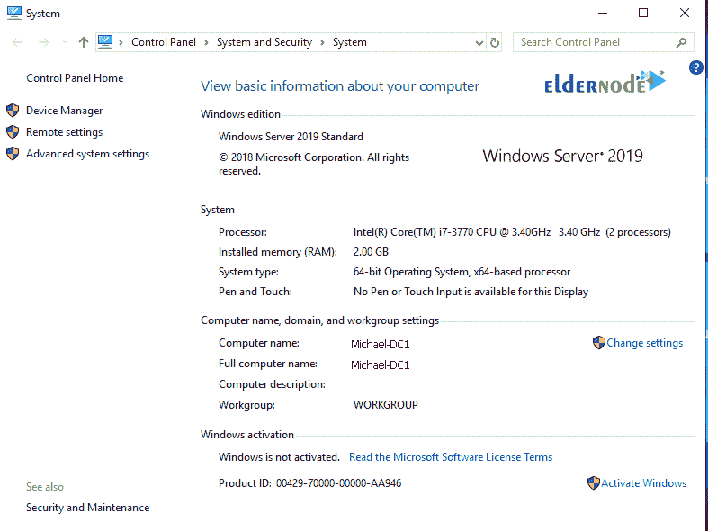

```
Get-NetIPAddress
```

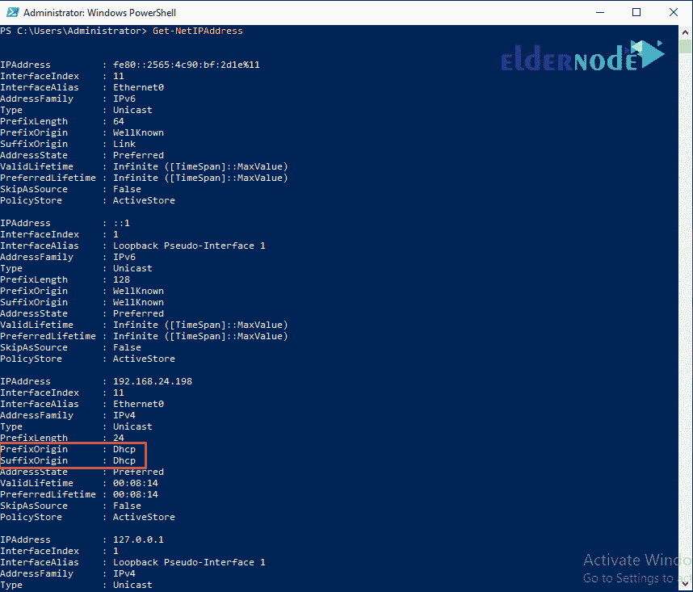

**2-** 要设置 IP，我们使用以下命令:

```
New-NetIPAddress -InterfaceIndex 11 -IPAddress 192.168.24.1 -PrefixLength 24 -DefaultGateway 192.168.24.254
```

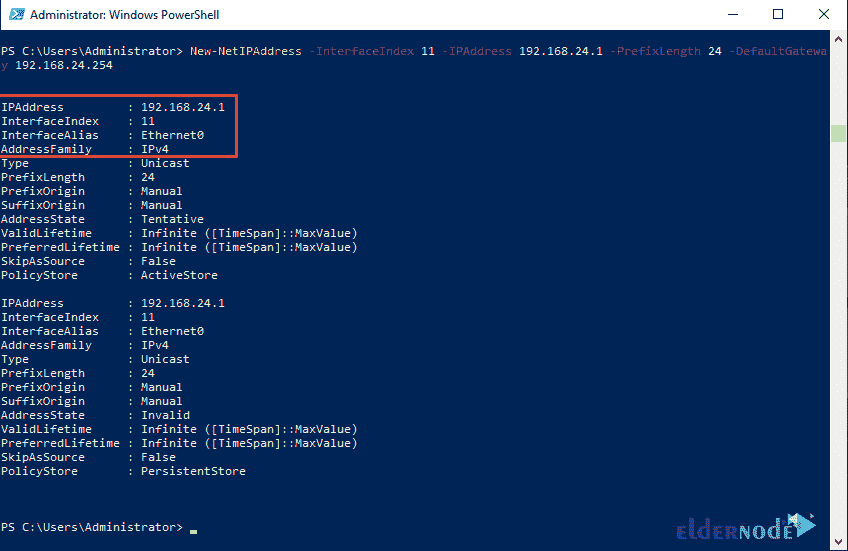

**3-** 下一步就是设置 DNS 相关的 IP。

在这个阶段你必须小心，因为它是第一个域控制器和主 DC 。

我们将 IP 设置为主 DNS。因此，我们使用以下代码来实现这一目的:

```
Set-DnsClientServerAddress -InterfaceIndex 4 -ServerAddresses ("192.168.24.1","8.8.8.8")
```

您可以通过输入命令 ipconfig /all 来查看结果:

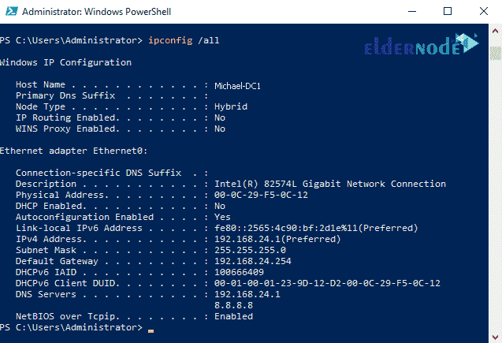

你可以使用下面的命令**找到**的接口索引:

```
netsh interface ipv4 show interfaces
```

使用以下命令删除 IP 接口:

```
Remove-NetIPAddress -IPAddress 192.168.0.1
```

**4-** 在 AD 配置流程之前，我们必须**在指定的服务器上安装**AD DS 角色。为此，您可以使用以下命令:

```
Install-WindowsFeature –Name AD-Domain-Services -IncludeManagementTools
```

**注意:** 你不需要为此重启 Windows。

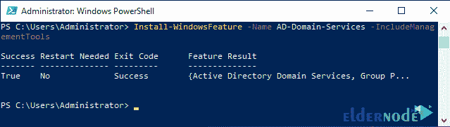

**5-** 下一步是配置 AD DS 。

为此，请使用以下命令(最好在 Powershell ISE 中执行这些命令):

```
Install-ADDSForest   -DomainName "Michaeladmin.local"  -CreateDnsDelegation:$false    -DatabasePath "C:\Windows\NTDS"  -DomainMode "7"    -DomainNetbiosName "Michaeladmin"  -ForestMode "7"    -InstallDns:$true  -LogPath "C:\Windows\NTDS"    -NoRebootOnCompletion:$True  -SysvolPath "C:\Windows\SYSVOL" ` -Force:$true
```

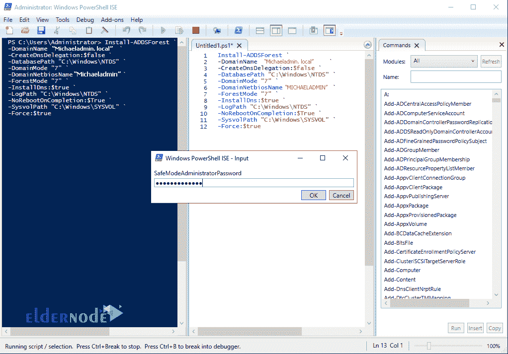

执行这段代码时，系统会提示您输入一个**目录服务恢复模式(DSRM)** 密码。

**注意:** 您必须输入一个组合密码，否则安装过程将会停止。在此步骤之后，将询问您是否继续这些步骤，如果您同意，安装步骤将继续，并且在系统完成后重启。

**6-** 开机后登录系统。当然，这一次拿出网络管理员，检查工作是否正确。

```
Get-Service adws,kdc,netlogon,dns
```

以上命令列出了域控制器中运行的 Active Directory 服务的状态。

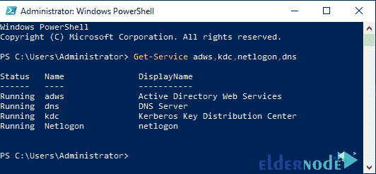

您可以使用以下命令检查关于域控制器的所有细节:

```
Get-ADDomainController
```

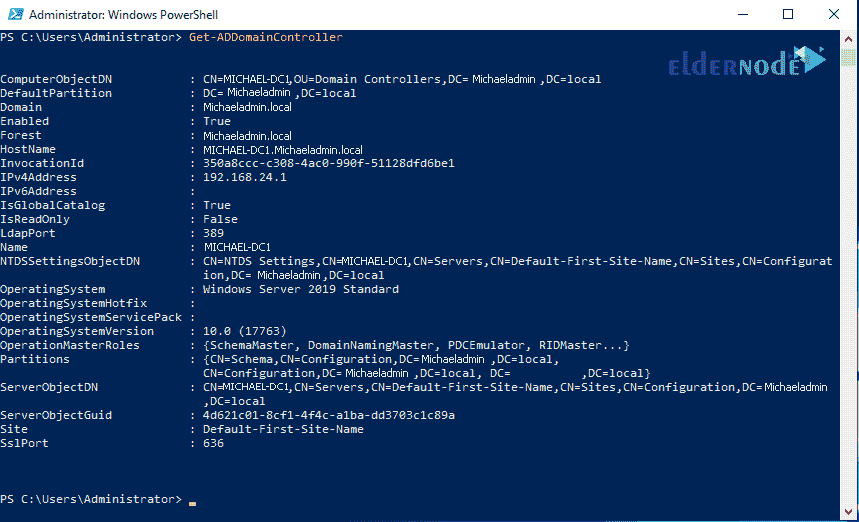

以下命令还为您列出了域中的活动目录的详细信息:

```
Get-ADDomain Michaeladmin.local
```

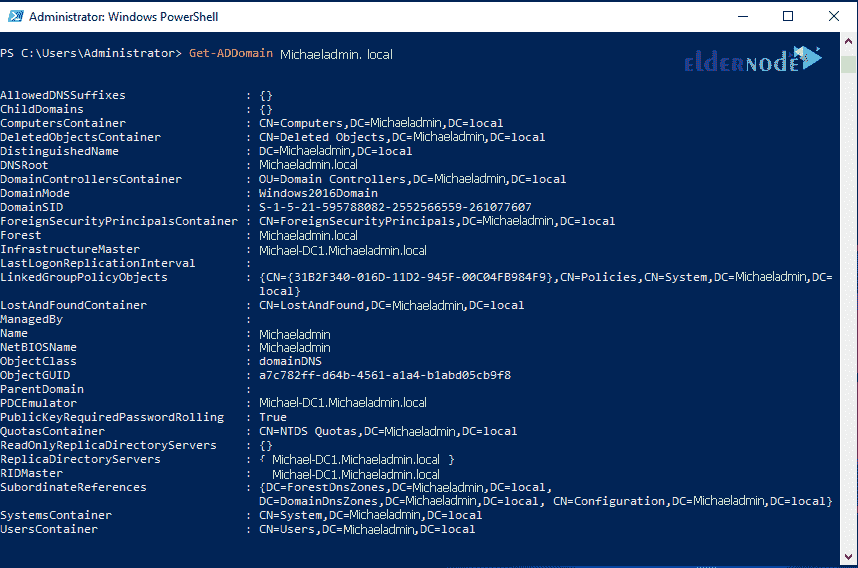

要检查**森林**中的活动目录，使用以下命令:

```
Get-ADForest Michaeladmin.local
```

最后，下面的命令显示了目录中的 SYSVOL 文件夹的**路径**:

```
Get-smbshare SYSVOL
```

**亦作，见:**

[教程在 Windows IIS Server 2019 上配置虚拟目录](https://eldernode.com/configure-virtual-directory-on-windows-server/)

[使用 PowerShell 管理 Windows 服务](https://eldernode.com/manage-windows-services-with-powershell/)

[减小 Windows 服务器的体积](https://eldernode.com/reduce-the-volume-of-the-windows-server/)

[教程在 Windows Server 2019 上安装 OpenSSL](https://eldernode.com/install-openssl-on-windows-server-2019/)

[如何使用 PowerShell 在 Windows 上安装 SSH 客户端](https://eldernode.com/install-ssh-client-on-windows-using-powershell/)

**尊敬的用户**，我们希望您能喜欢这个[教程](https://eldernode.com/category/tutorial/)，您可以在评论区提出关于本次培训的问题，或者解决[老年人节点培训](https://eldernode.com/blog/)领域的其他问题，请参考[提问页面](https://eldernode.com/ask)部分，并尽快提出您的问题。腾出时间给其他用户和专家来回答你的问题。

好运。