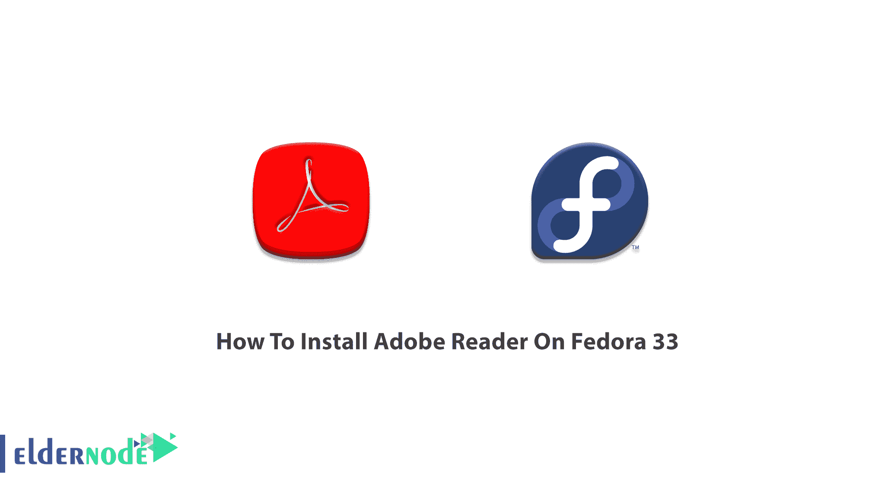
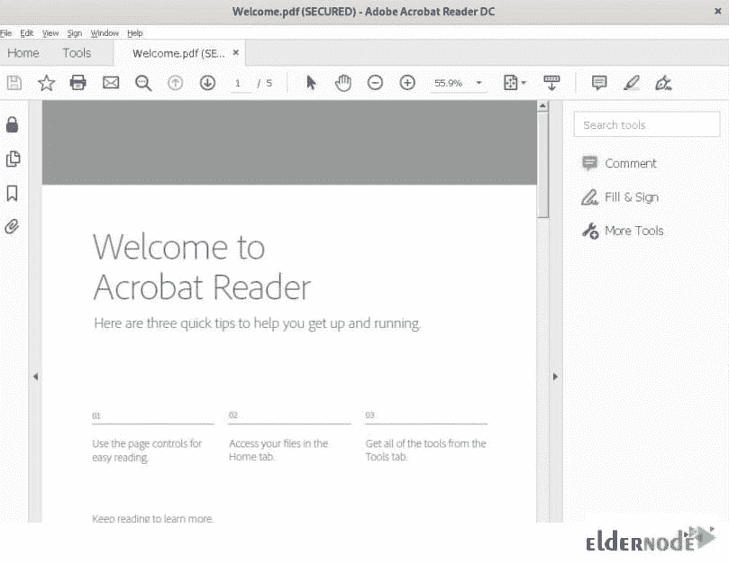

# 如何在 Fedora 33 - Eldernode 博客上安装 Adobe Reader

> 原文：<https://blog.eldernode.com/install-adobe-reader-on-fedora/>



Adobe Acrobat Reader 是使用最广泛的免费软件，用于可靠地查看、打印和评论 PDF 文档。使用此 PDF 查看器，您可以打开所有类型的 PDF 内容并与之交互，包括和多媒体。它设计了一个简单的用户界面，允许用户在其环境中工作，即使知识最少。在那里，您可以打印 PDF 文件，并复制文件中的文本和内容。它为基于 RPM 的 Linux 发行版提供了两种类型的安装包。但是，安装取决于安装程序包的类型。在这篇文章中，你将学习**如何在 Fedora 33** 上安装 Adobe Reader。要购买您自己的 [VPS 服务器](https://eldernode.com/vps/)，请访问 [Eldernode](https://eldernode.com/) 上的可用软件包来购买您需要的东西。

## **教程一步一步在 Fedora 33 上安装 Adobe Reader**

众所周知，Adobe Reader 是查看可移植文档格式(PDF)文档最流行的软件，您可能到目前为止只使用过一次，因为它可以安装在几乎所有类型的操作系统中，如 [Windows](https://blog.eldernode.com/tag/windows/) 、 [Linux](https://blog.eldernode.com/tag/linux/) 、Mac OS、Android、IOS，并且有 29 种语言版本。Adobe 提供在线文档云服务，因此您可以从任何地方和任何设备管理您的工作。在它的高级版本中，你可以创建 pdf，转换成其他格式，编辑和保护它们。加入我们这篇文章，看看如何在 [Fedora](https://blog.eldernode.com/install-fedora-on-vps-server/) 上安装 Adobe Acrobat Reader。

### **Adobe Reader 在 Fedora 33 上的安装方法**

要在 Fedora 上安装 Adobe Reader，有两种可能的方法:

1-使用 Fedora 的快照库安装 Adobe Acrobat Reader **。(易于安装)**

2-使用 Tarball 在 Fedora **上安装 Adobe Acrobat Reader。(稳定安装)**

本指南将解释这两种方法。和我们一起学习，完成它。

### **如何在 Fedora 33 上启用 snaps 并安装 Adobe Reader**

首先，我们从安装 Adobe Acrobat Reader 的第一种也是最简单的方法开始。正如您在以前的文章中读到的，快照是打包了所有依赖项的应用程序，可以在所有流行的 Linux 发行版上运行。让我们来看看第一种方法的必要步骤。

*第一步:*

通过运行以下命令，打开一个终端(Alt+Ctrl+T)来**在 Fedora 上安装 snap** :

```
sudo dnf install snapd
```

*第二步:*

为避免收到错误，请注销并再次登录，或者重新启动系统。它让您确认快照的路径是否已更新。否则，您将面临如下所示的错误:

*错误:操作太早，设备尚未植入或设备型号未确认*

*第三步:*

要启用经典支持，您需要创建一个符号链接。

```
ln -s /var/lib/snapd/snap /snap
```

*第四步:*

在这一步中，您已经准备好安装 AdobReader，因为 snap 已经安装。所以，运行:

```
snap install acrordrdc
```

耐心等待各种文件(snapd、core18 等)下载(下载的数据将位于系统显示器的左下方)

让这个过程完成。在 Fedora 操作系统上打开系统监视器，然后转到资源选项卡。

*第五步:*

要启动 Adobe Acrobat Reader，请运行以下命令:

```
acrordrdc
```

由于 winetricks 等各种葡萄酒文件将被初始化和下载，请等到此过程结束。

***注意** :* 安装过程中会要求你输入语言。选择您的首选语言，然后单击“安装”开始下载。

*第六步:*

为了防止来自沙盒应用程序进程的攻击，将要求您是否以保护模式打开 Adobe Reader。因此，帮助 Adobe Reader 在您的系统配置下顺利运行，并选择“总是在禁用保护模式的情况下打开”。然后单击“确定”启动 Adobe Reader 主窗口。此外，接受 Adobe Reader 分发许可协议。

*第七步:*

在此步骤中，您可以检查 PDF 文件是否可以用安装的 Adobe Reader 打开。为此，请转到工具栏顶部的文件菜单，然后在子菜单中热打开。然后，选择“Welcome.pdf”文件。

如果您仔细查看了所有步骤，您应该会看到下面的窗口，显示文件已成功打开。



### **如何从 Fedora 卸载 Adobe Reader 33**

您可以根据需要从 snap 存储库中卸载 Adobe Acrobat Reader。为此，请运行以下命令。

```
snap remove acrordrdc
```

### **如何使用 Tarball** 在 Fedora 33 上安装 Adobe Reader

正如我们提到的，在 Fedora 上安装 Adobe Reader 有两种方法。使用这种方法可以让您轻松浏览本地文件。但是用方法 1 安装后就不容易了，因为你会被限制在葡萄酒的环境里。

此安装需要 136 MB 的可用磁盘空间。让我们看看第二种方法是如何使用 Tarball 安装 Adobe Reader 的。

*第一步:*

首先，使用下面的命令下载 Adobe Reader 的 tar 文件。

```
wget ftp://ftp.adobe.com/pub/adobe/reader/unix/9.x/9.5.5/enu/AdbeRdr9.5.5-1_i486linux_enu.tar.bz2
```

*第二步:*

运行 tar 命令来提取这个文件。

```
tar -xf AdbeRdr9.5.5-1_i486linux_enu.tar.bz2
```

第三步:

然后，使用命令输入提取的文件夹:

```
cd AdobeReader
```

第四步:

当您在解压缩的文件夹中时，使用以下安装脚本并安装 Adobe Reader。

```
./INSTALL
```

运筹学

```
sudo ./INSTALL
```

这样，文本将打印在终端上，并要求您输入安装目录。选择默认值(/opt)或输入一个新值。如果你按回车键，你可以选择默认目录。当脚本完成时，将安装 Adobe Reader。您可以在下一步中配置安装过程并启动 Adobe Reader。

*第五步:*

要启动 Adobe Reader，请运行以下命令:

```
/opt/Adobe/Reader9/bin/acroreadv
```

注意:如果您之前以 root (#)身份登录或使用 Sudo 关键字登录，您将需要使用普通用户帐户并从上面的命令中删除' [sudo](https://blog.eldernode.com/sudoers-configurations-setting-sudo/) '。如果您继续使用 root 帐户或“Sudo ”,将会出现以下错误:

Adobe Reader 不需要以特权用户的身份运行。请从命令的开头删除“Sudo”。

此外，在运行上述命令(步骤 5)时，您可能会遇到错误。因此，您需要从下面的命令安装一些软件包来帮助您消除这些错误。

```
sudo dnf install libgdk_pixbuf_xlib-2.0.so.0 libxml2.so.2 https://download-ib01.fedoraproject.org/pub/fedora/linux/updates/33/Everything/x86_64/Packages/g/gtk2-2.24.33-1.fc33.i686.rpm -y
```

同样，在安装完所有依赖项后，运行以下命令。

```
/opt/Adobe/Reader9/bin/acroread
```

*第六步:*

接下来，它会要求您选择安装语言并接受 Adobe 许可协议。所以，接受它启动 Adobe Acrobat Reader。开始使用 Adobe Reader，从顶部栏的“文件”菜单中打开您想要的任何文件。

## 结论

在本文中，您了解了如何在 Fedora 33 上安装 Adobe Reader。您回顾了两种安装方法，您应该在简单安装和稳定安装之间进行选择。在 [Eldernode Community](https://community.eldernode.com/) 上与你的朋友讨论这两种方法及其利弊。