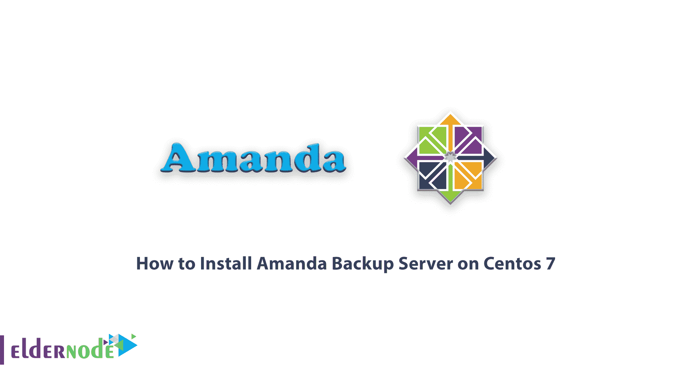

# 如何在 Centos 7 - Eldernode 博客上安装 Amanda 备份服务器

> 原文：<https://blog.eldernode.com/install-amanda-backup-server-on-centos-7/>



阿曼达代表先进的马里兰自动网络磁盘归档。它是一个开源的计算机存档工具，可以备份网络上多台计算机的数据。Amanda 使用客户机-服务器模型。当服务器联系每个客户机以在预定时间进行备份时。在本文中，我们试图向您学习如何在 Centos 7 上安装 Amanda Backup Server。你可以从[长老节点](https://eldernode.com/)的套装中购买 [CentOS VPS](https://eldernode.com/centos-vps/) 服务器。

## 教程在 Centos 7 上安装 Amanda 备份服务器

Amanda 备份服务器是世界上最流行的开源备份和归档软件之一。该工具允许系统管理员备份服务器，并能够备份磁带、磁盘或基于云的存储系统上的多个主机。Amanda 使用本机归档工具，可以备份大量运行不同版本操作系统的工作站和服务器。加入我们，了解如何在 Centos 7 上安装 Amanda 备份服务器。

### 如何准备安装 Amanda 备份服务器的依赖关系

在安装 Amanda 备份服务器之前，您需要安装它的依赖项。按照以下步骤，在安装之前准备好所有必需的依赖项。第一步，你需要用拥有**管理员**权限的**用户**输入 **SSH** 。

成功登录后，必须使用以下命令更新软件包:

```
sudo yum update
```

执行上述命令后，如果您收到一条错误消息，指出**无法为 repo** 找到有效的 baseurl，您可以使用以下命令来修复它:

```
sudo dhclient
```

需要注意的是，执行上面的命令会在 **/etc/resolv.conf** 中创建一个文件。

在这一步中，您需要安装 wget 以使用以下命令获取安装包:

```
yum install wget -y
```

安装 wget 后，您需要运行以下命令来安装所需的需求:

```
yum install glib* xinetd perl-Data-Dumper perl-Encode-Locale perl-JSON perl-URI-Escape perl-XML-Simple
```

## **在 Centos 7** 上安装 Amanda 备份服务器

在安装 Amanda 备份服务器之前，必须安装依赖项。现在您已经成功完成了这一步，是时候在 [CentOS](https://blog.eldernode.com/tag/centos/) 7 上安装 Amanda 备份服务器了。

在第一步中，您必须以 SSH 用户的身份使用 admin 权限登录到服务器。然后，您必须使用以下命令下载安装包:

```
wget https://www.zmanda.com/downloads/community/Amanda/3.5.1/Redhat_Enterprise_7.0/amanda-backup_server-3.5.1-1.rhel7.x86_64.rpm
```

下载安装包后，必须使用以下命令运行它:

```
sudo rpm -ivh amanda-backup_server-3.5.1-1.rhel7.x86_64.rpm
```

最后，在最后一步中，您必须使用以下命令重新加载 **xinetd 文件**:

```
service xinetd reload
```

## 结论

Amanda 备份服务器是用于备份服务器的软件。换句话说，它是用于备份的网络连接存储系统的控制器。该工具支持基于磁带和磁盘的备份。还应注意的是，Amanda 备份服务器提供了一些其他备份产品所不具备的有用功能。Amanda Backup Server 有免费社区版和完全支持的企业版两种版本。在本文中，我们试图教你如何在 CentOS 7 上安装 Amanda 备份服务器。