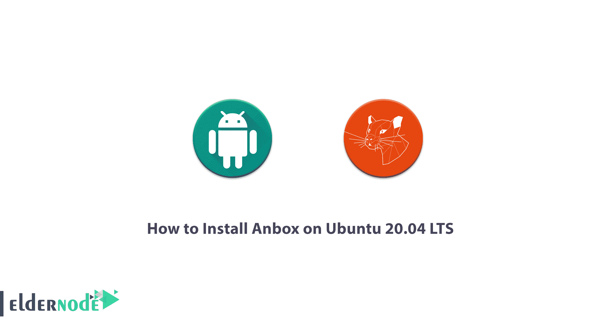

# 如何在 Ubuntu 20.04 上安装 Anbox LTS-elder node 博客

> 原文：<https://blog.eldernode.com/install-anbox-on-ubuntu-20-04/>



访问您最喜爱的 Android 应用程序和游戏为 Linux 带来了新的生产力。从设计上来说，移动应用程序比桌面操作系统上的要简单得多。与此同时，手机游戏变得越来越复杂。你可能想在另一台设备上继续玩，这是有道理的。 [Linux](https://blog.eldernode.com/tag/linux/) 用户应该使用一款名为 Anbox 的免费开源工具在 Linux 上运行 Android 应用。它基于最新版本的 Android 开源项目(AOSP ),提供了一个 Android 环境。在这篇文章中，我们将教你**如何在 Ubuntu 20.04 LTS** 上安装 Anbox。你可以在 [Eldernode](https://eldernode.com/) 查看可用的包来购买 [Ubuntu VPS](https://eldernode.com/ubuntu-vps/) 服务器。

## **教程在 Ubuntu 20.04 上安装 Anbox LTS**

Anbox 或 Android in A Box 使用基于[容器](https://blog.eldernode.com/run-linux-containers-on-windows-server/)的方法在 GNU/Linux 发行版上完全运行 Android 操作系统，这消除了在 Linux 上运行 Android 应用程序的任何模拟需求。

Anbox 没有限制，所以理论上你可以在 Linux 上运行任何 Android 应用。在这篇文章的后续部分，加入我们来学习如何在 Ubuntu 20.04 上安装这个程序。

## **在 Ubuntu 20.04 上安装 Anbox**

首先我们想通过 snapd 安装一个 Anbox。这个软件包最近被默认安装在 Ubuntu 发行版中。如果该软件包不存在，您必须首先使用以下命令更新标准 Ubuntu 存储库:

```
sudo apt update
```

然后运行以下命令安装 snapd:

```
sudo apt install snapd
```

成功安装 snapd 后，现在应该在开发者模式下安装 Anbox 的测试版。

***注意:*** 如果要安装 Anbox Edge 版本，必须在下面的命令中用-edge 替换-beta:

```
sudo snap install --beta --devmode anbox
```

接下来，您需要使用以下命令来确保 Anbox 会话管理器处于活动状态，直到退出/关闭 Anbox 程序管理器:

```
anbox session-manager
```

您还需要使用以下命令轻松运行 Anbox 应用程序管理器:

```
anbox.appmgr
```

### **如何修复在 Ubuntu** 上安装 Anbox 时的错误信息

一些用户可能会遇到以下错误信息:

```
[daemon.cpp] Failed to connect to DBus
```

如果看到上面的错误信息，应该安装 **dbus-x11** 包。因为 Anbox 管理员无法连接到 DBus。之后，您需要将 DBus 会话地址变量直接导出到 Anbox 管理员。注意因为 **dbus-x11** 包已经在标准的 Ubuntu 存储库中可用，所以您必须首先更新存储库以获得该包的最新版本。为此，您必须使用以下命令:

```
sudo apt update
```

现在，要安装 dbus-x11，您需要运行以下命令:

```
sudo apt install dbus-x11
```

下一步是导出 DBus 会话的变量:

```
export $(dbus-launch)
```

现在，您需要再次运行以下命令来完成 Anbox 安装过程:

```
anbox session-manager    anbox.appmgr
```

## 结论

Anbox 确保人们可以在 Linux 发行版上运行 Android 应用程序，通过这种方式，anbox 使用基于容器的方法来最大化安全性和性能。这种方法比完整的 Android 内核模拟需要更少的资源。在这篇文章中，我们试图解释如何在 Ubuntu 20.04 LTS 上安装 Anbox，并给出了可能的修复。