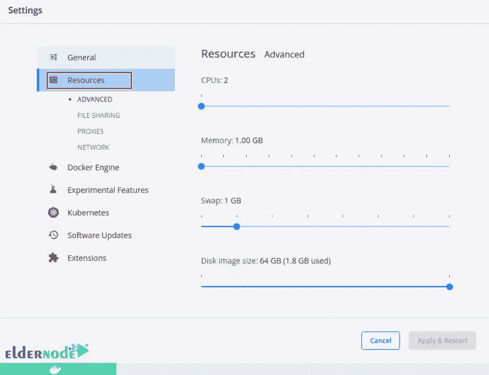
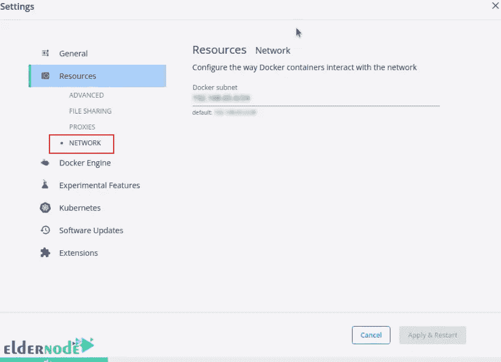

# 如何在 Ubuntu 22.04 上安装和访问 Docker 桌面

> 原文：<https://blog.eldernode.com/install-and-access-docker-desktop-on-ubuntu-22-04/>


Docker 是一个构建、运行、调试和测试容器应用程序的平台。如今，Docker 已经成为软件开发人员和系统管理员的标准工具。Docker 是一种快速运行应用程序而不影响系统其他部分的创新方法。在本文中，我们将教你如何在 Ubuntu 22.04 上安装和访问 Docker Desktop。如果你想购买一台 [**Ubuntu VPS**](https://eldernode.com/ubuntu-vps/) 服务器，你可以查看 [Eldernode](https://eldernode.com/) 网站上提供的软件包。

## **教程在 Ubuntu 22.04 上安装并访问 Docker 桌面**

### **Docker 桌面是什么？**

Docker Desktop 是一个基于 Linux 和 Windows 操作系统的本地开源桌面应用程序，它创建了一个虚拟环境。在这个虚拟环境中，您可以实现和运行各种应用程序。Docker 的第一个版本发布于 2013 年。Docker 是一个工具，它允许开发人员在称为容器的沙箱中轻松开发应用程序，并在 Docker 中起关键作用的主机操作系统上运行这些应用程序。在 Docker 的帮助下，用户可以在一个标准化的软件开发单元中打包一个应用程序及其所有依赖项。

### **Docker 桌面功能**

1-轻松安装完整的 Docker 开发环境

2-自动更新

3-本机 Windows Hyper-V 虚拟化带来快速可靠的性能

使用支持的 ide 进行 4- In-container 开发和调试

5-能够在 Windows 中的 Linux 和 Windows 服务器环境之间切换，以构建应用程序

6-能够通过 Windows 机器上的 WSL 2 在 Linux 上本地工作

7-能够以多种语言和框架在任何云平台上封装和共享任何应用程序

用于代码和数据的 8 卷安装

### **在 Ubuntu 22.04 上安装 Docker 桌面的先决条件**

–支持用于虚拟化的 64 位内核和 CPU

–KVM 虚拟化支持

–systemd 初始化系统

–至少 4 GB 内存

–Gnome 或 KDE 桌面环境

–QEMU 的新版本

下一节，我们将一步步教你如何在 [Ubuntu](https://blog.eldernode.com/tag/ubuntu/) 22.04 上安装 Docker 引擎。

### **在 Ubuntu 22.04 上安装 Docker 引擎**

首先，您应该使用以下命令**删除现有的 Docker 存储库**:

```
sudo apt remove docker docker-engine docker.io 2>/dev/null
```

并且**更新您的系统**:

```
sudo apt update 
```

```
sudo apt upgrade
```

现在，您需要通过运行以下命令来安装所需的包:

```
sudo apt -y install apt-transport-https ca-certificates curl software-properties-common
```

在这一步中，运行以下命令将**添加到 Docker 存储库**:

```
curl -fsSL https://download.docker.com/linux/ubuntu/gpg | sudo gpg --dearmor -o /etc/apt/trusted.gpg.d/docker-archive-keyring.gpg 
```

```
sudo add-apt-repository "deb [arch=amd64] https://download.docker.com/linux/ubuntu $(lsb_release -cs) stable"
```

现在你可以通过输入以下命令在 Ubuntu 上安装 Docker :

```
sudo apt install docker-ce docker-ce-cli containerd.io uidmap
```

然后**使用以下命令将您的用户帐户**添加到 docker 组:

```
sudo usermod -aG docker $USER 
```

```
newgrp docker
```

## **如何在 Ubuntu 22.04 上安装 Docker 桌面**

首先，您应该**移除现有的 Docker 桌面**:

```
sudo apt remove docker-desktop
```

和**用以下命令清理系统**:

```
rm -r $HOME/.docker/desktop 
```

```
sudo rm /usr/local/bin/com.docker.cli
```

要**删除数据文件**，运行以下命令:

```
sudo apt purge docker-desktop
```

您可以使用以下命令**下载最新的 Docker 桌面**包:

```
wget https://desktop.docker.com/linux/main/amd64/docker-desktop-4.9.1-amd64.deb
```

如果您使用非 Gnome 桌面环境，**使用以下命令安装 Gnome-terminal** 包:

```
sudo apt install gnome-terminal
```

现在是时候**安装 Docker 桌面**了:

```
sudo apt install ./docker-desktop-*-amd64.deb
```

然后接受所需的依赖项安装，在 Kubernetes 的 **/etc/hosts** 中添加一个新条目:

```
....  0 upgraded, 44 newly installed, 0 to remove and 0 not upgraded.  Need to get 35.5 MB/439 MB of archives.  After this operation, 129 MB of additional disk space will be used.  Do you want to continue? [Y/n] y
```

将在 **/etc/hosts** 中添加一个新条目，如下所示:

```
cat /etc/hosts  127.0.0.1 localhost  127.0.1.1 ubuntu    # The following lines are desirable for IPv6 capable hosts  ::1 ip6-localhost ip6-loopback  fe00::0 ip6-localnet  ff00::0 ip6-mcastprefix  ff02::1 ip6-allnodes  ff02::2 ip6-allrouters  # Added by Docker Desktop  # To allow the same kube context to work on the host and the container:  127.0.0.1 kubernetes.docker.internal  # End of section
```

### **如何在 Ubuntu 22.04 上访问 Docker 桌面**

您可以从应用程序菜单或通过终端启动 Docker Desktop。输入以下命令，通过终端启动它:

```
systemctl --user start docker-desktop
```

现在你应该看到下面的页面。勾选**“我接受条款”**框，点击**接受**:


Docker 桌面启动后，您将看到以下主页:


现在，您应该使用以下可执行文件来检查版本:

```
docker compose version 
```

```
docker --version 
```

```
docker version
```

Docker 桌面的映像和容器存储在虚拟机中的一个独立存储位置。如果同时运行 Docker 桌面和 Docker 引擎导致错误，您可以使用以下命令**停止 Docker 引擎**服务:

```
sudo systemctl stop docker docker.socket containerd
```

并通过以下命令**禁用**:

```
sudo systemctl disable docker docker.socket containerd
```

如果您想查看可用的上下文:

```
docker context ls
```

您可以通过运行以下命令来使用首选上下文:

```
docker context use default
```

输入以下命令以使用 docker-desktop 上下文:

```
docker context use desktop-linux
```

### **如何在 Ubuntu 22.04 上配置 Docker 桌面**

进入**设置**选项卡，选择**通用**选项:


如果您选中**“登录时启动 Docker 桌面”**框，您可以启用 Docker 桌面在您打开会话时自动启动。此外，您可以使用以下命令来完成此操作:

```
systemctl --user enable docker-desktop
```

如果您选中**“发送使用统计数据”**框，报告将被发送到 Docker 桌面。

您可以通过勾选**“显示每周提示”**框来查看关于该工具的建议消息。

勾选**“启动时打开 Docker 仪表板”**框，在启动时显示仪表板。

如果您想启用 docker-compose 来使用 Docker Compose V2，请勾选**“启用 Docker Compose V1/V2 兼容模式”**框。

现在在**设置**选项卡中选择**资源**选项:



在这一部分，您可以限制 Docker 使用的资源。如果您在**高级**设置中配置了**文件共享**，您就可以与 Linux 容器共享本地目录。点击 **(+)** 添加目录，点击 **(-)** 删除目录。进行任何更改后，记得点击**应用&重启**:


**资源**选项卡中的**网络**部分对于网络配置非常有用。如果默认选择的子网干扰了系统中的某些东西，您可以在此处指定自定义子网:



就是这样！Docker 桌面已成功安装在 Ubuntu 22.04 上。

## 结论

Docker 是一个构建和开发基于容器的应用程序的软件平台。它独立地共享操作系统内核。在本文中，我们向您介绍了 Docker Desktop，并教您如何在 Ubuntu 22.04 上安装和访问它。我希望这篇教程对你有用。如有疑问，可在评论中联系我们。