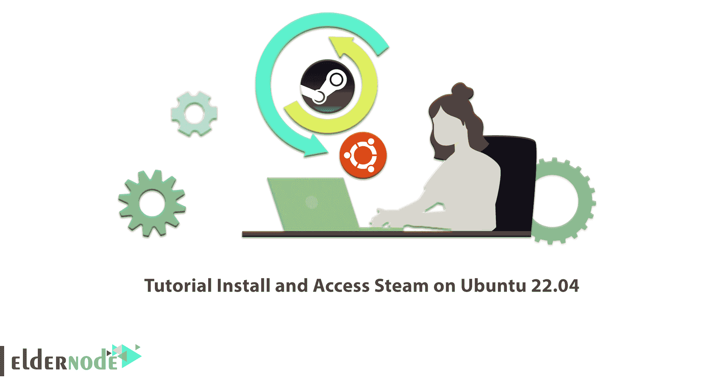
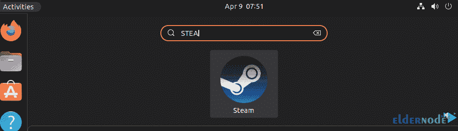
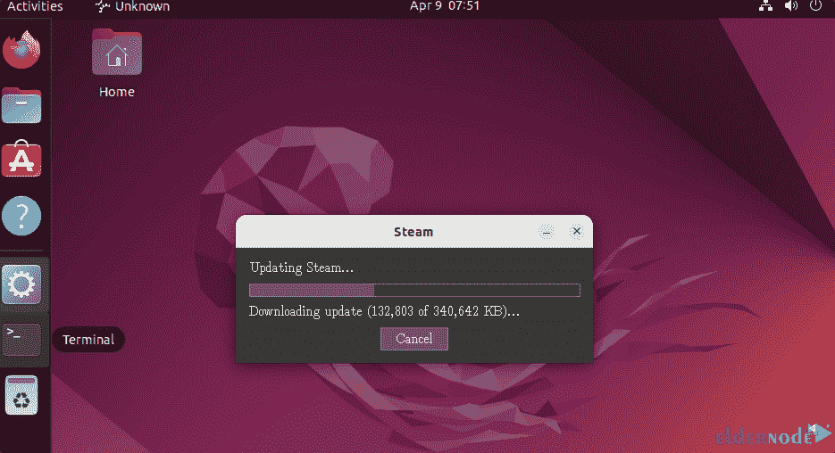
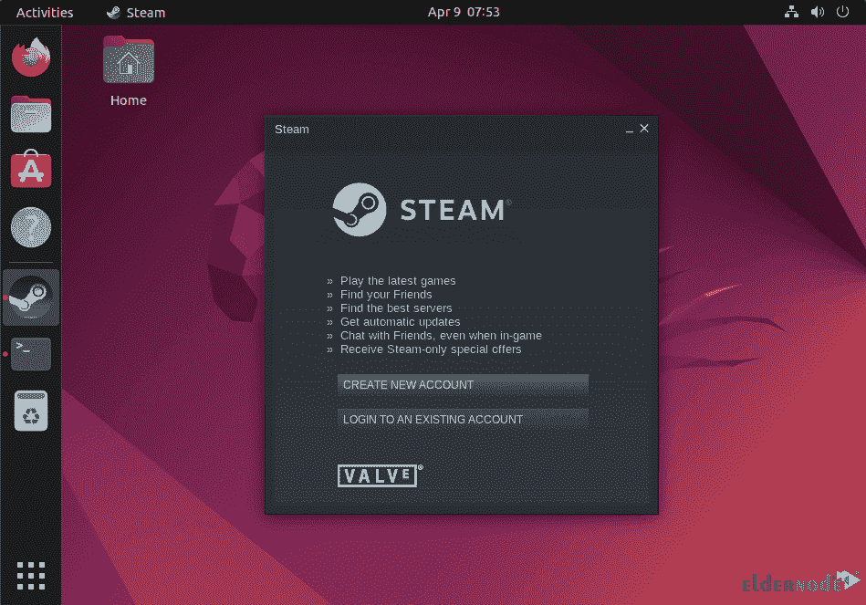
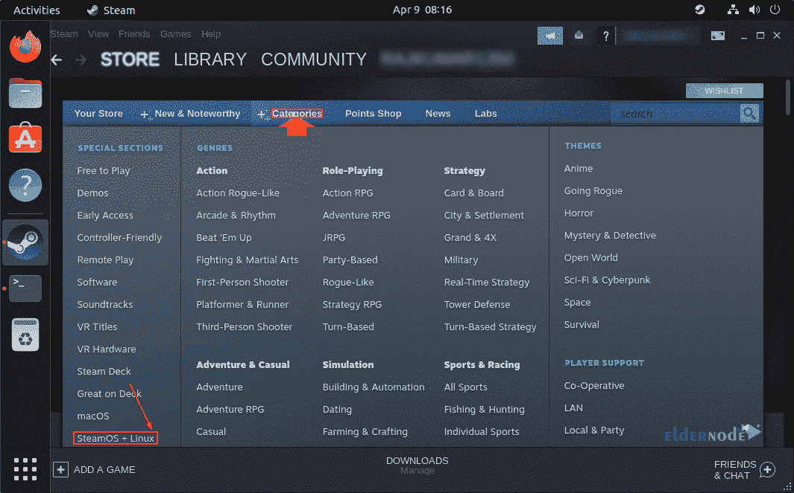
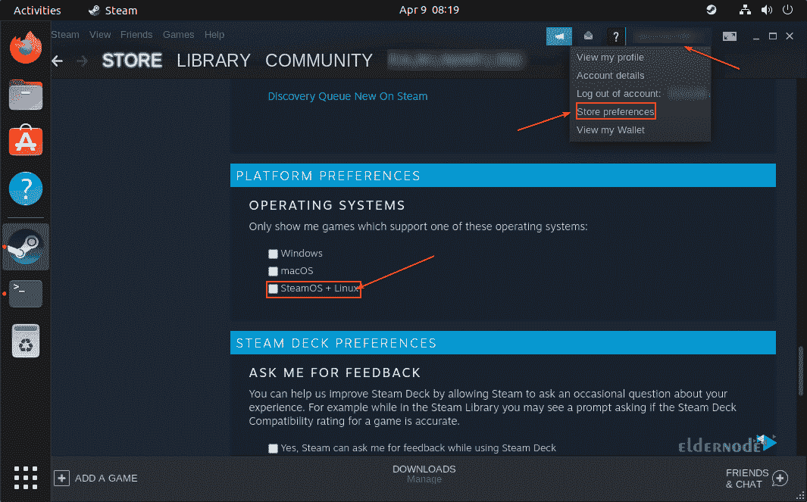
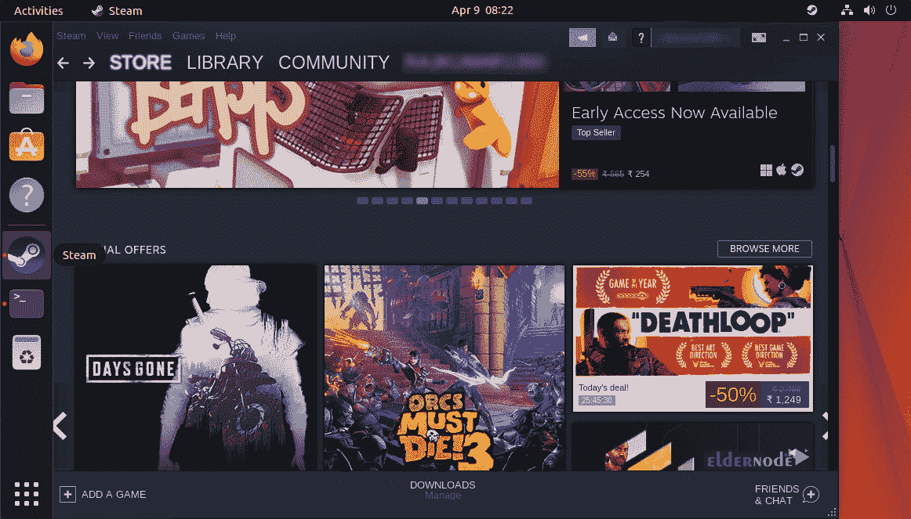

# 教程在 Ubuntu 22.04 - Eldernode 博客上安装和访问 Steam

> 原文：<https://blog.eldernode.com/install-and-access-steam-on-ubuntu-22-04/>



如果你想进入在线电脑游戏的虚拟世界，Steam 软件是你不错的选择。这个软件是由 Valve 在 2003 年发布的，它在短时间内发展了很多，并成为最大的视频游戏商店。在本文中，我们将首先介绍 Steam，然后您将学习如何在 Ubuntu 22.04 上安装和访问 Steam。如果你想购买 [**Ubuntu VPS**](https://eldernode.com/ubuntu-vps/) 服务器，请查看 [Eldernode](https://eldernode.com/) 网站上提供的套装。

## **如何在 Ubuntu 22.04 上安装和访问 Steam**

### **什么是蒸汽？**

Steam 是一个数字平台，允许用户直接在云驱动器上在线安装 PC 游戏。Steam 客户端有几个功能，例如自动更新游戏、访问好友列表、游戏中的语音聊天以及与朋友分享游戏的功能。

下一节，我们将教你如何在 [Ubuntu](https://blog.eldernode.com/tag/ubuntu/) 22.04 上安装 Steam。

## **如何在 Ubuntu 22.04 上安装 Steam**

首先**用下面的命令更新 APT 包**:

```
sudo apt update
```

然后运行下面的命令**开始安装**:

```
sudo apt install steam-installer
```

### **如何在 Ubuntu 22.04 上访问 Steam**

安装完成后，从 Ubuntu 应用程序启动 Steam 平台:



然后，可以在 Linux 上运行的最新可用更新将通过自动下载来下载:



在此阶段，**创建一个账户**或使用现有账户登录:



要在 Steam 上观看兼容 Ubuntu 的游戏，进入**菜单**，选择**类别—>Steam OS+Linux**:



要选择 Linux 作为您在 Steam 上显示和搜索游戏的默认操作系统，请点击您的**帐户**名称，然后选择**帐户默认值**。然后选择**首选项**并向下滚动选择 **SteamOS + Linux** :



最后，您将看到下面的屏幕:



您可以通过运行以下命令来更新 Steam :

```
sudo apt update
```

```
sudo apt upgrade
```

如果您不再需要这个游戏分发平台，运行下面的命令**将它**从您的系统中删除:

```
sudo apt remove steam-installer
```

```
sudo apt autoremove
```

## 结论

在本文中，您将了解最有用的在线游戏平台之一 Steam。您还学习了如何在 Ubuntu 22.04 上安装和访问 Steam。现在你可以通过这个平台直接在你的云驱动器上在线安装电脑游戏。