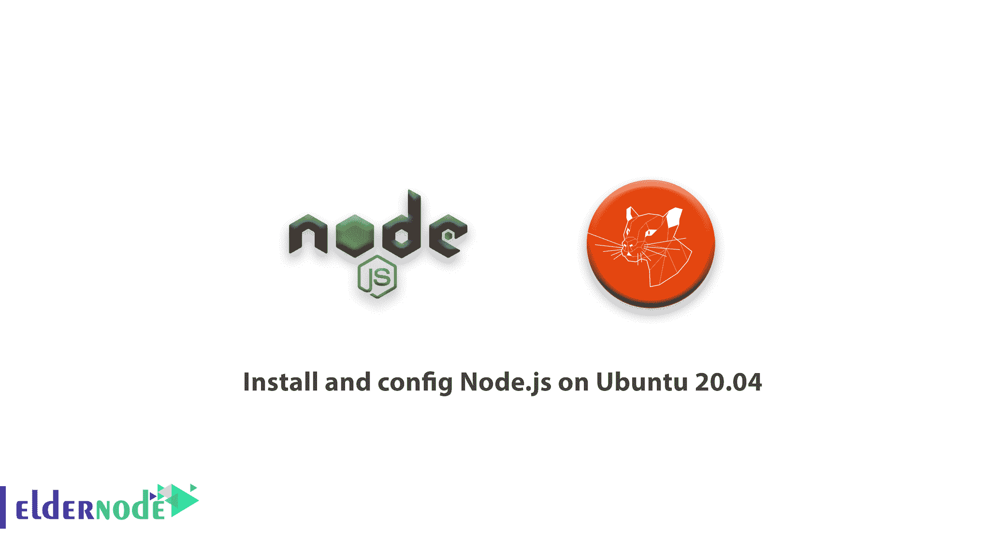

# 如何在 Ubuntu 20.04 - Eldernode 博客上安装和配置 Node.js

> 原文：<https://blog.eldernode.com/install-and-config-node-js-on-ubuntu-20-04/>



【更新日期:2021-01-23】node . js 是运行 JavaScript 的环境。节点的可执行环境包括运行用 JavaScript 编写的程序所需的一切。在过去，当 JavaScript 的主要开发者试图开发这种语言时，这种语言当时只适用于浏览器，以便你可以在操作系统上独立拥有它，node.js 就诞生了。现在除了设计互动网站，还可以做很多。JavaScript 现在可以做其他语言可以做的事情，比如 Python。加入我们这篇文章，学习如何在 Ubuntu 20.04 上**安装和配置 Node.js。不要错过 [Eldernode](https://eldernode.com/) 的可用折扣，购买自己的 [Linux VPS](https://eldernode.com/linux-vps/) 。**

## **教程在 Ubuntu 20.04 上安装和配置 node . js**

为了让本教程更好地发挥作用，请考虑以下**先决条件**:

拥有 sudo 权限的非 root 用户。

要进行设置，请遵循我们在 Ubuntu 20.04 上的[初始服务器设置。](https://blog.eldernode.com/initial-server-setup-on-ubuntu-20/)

## **在 Ubuntu 20.04 上安装并配置 node . js | Ubuntu 18.04**

Node.js 是免费的、开源的、功能强大的，可以用来创建后端应用程序。让我们看看安装 Node 的不同方法。然后选择一个更接近你需求的。

### 第一步:安装稳定节点。来自 Ubuntu 库的 js

首先，让我们从最值得推荐的 Node 安装方式开始。Js on Ubuntu 20.04。使用下面的命令从标准的 Ubuntu 库安装它。

```
sudo apt install nodejs
```

安装完成后，检查节点。Js 版本，方法是运行:

```
node --version  v10.15.2
```

### 第 2 步:用 NVM 安装 Node.js】

在这一步，你将学习如何使用**N**ode**V**version**M**anager 安装 Node.js。如果您选择方法 [NVM](https://blog.eldernode.com/nvm-on-eldernode-linux/) ，您可以同时维护 Node.js 的许多不同的独立版本及其关联的节点包。

```
sudo apt install curl  curl https://raw.githubusercontent.com/creationix/nvm/master/install.sh | bash 
```

安装完成后，您需要使用以下命令在当前 shell 中加载 nvm 环境:

```
source ~/.profile 
```

当 NVM 安装成功后，可以用 NVM 的方式安装 Node.js 版本:

```
nvm install v12.16.2 
```

您也可以使用下面的命令来安装多个 Node.js 版本:

```
nvm use v12.16.2 
```

### 第三步:用 PPA 安装 Node.js】

您可以使用个人软件包档案来安装不同版本的 Node . js。PPA 有更多版本的 Node。Js 比如 v10，v12，v13，v14。运行以下命令，记得用您考虑的版本替换 *12.x* 。

```
sudo apt install curl  curl -sL https://deb.nodesource.com/setup_12.x | sudo -E bash - 
```

添加存储库后，通过下面的命令安装 Node.js:

```
sudo apt install nodejs 
```

完成安装后，运行下面的命令来查看当前的 Node.js 版本。

```
node -v 
```

### 第四步:安装节点。来自源的 js

您可以使用此方法安装任何版本的 Node.js。首先，您应该安装 NVM 管理器:

```
wget -qO- https://raw.githubusercontent.com/creationix/nvm/v0.33.8/install.sh | bash
```

然后，使用以下命令更新您的 shell 环境。

```
source ~/.profile
```

要检查 NVM 的可用性，请使用以下命令检查其版本。

```
nvm --version  0.33.8
```

然后，通过运行以下命令列出所有可用的 Node.js 版本:

```
nvm ls-remote  ...  v12.13.0 (LTS: Erbium)  v12.13.1 (Latest LTS: Erbium)  v13.0.0  v13.0.1  v13.1.0  -> v13.2.0
```

接下来，您需要选择希望安装的 Node.js 版本号(如果您可能忘记了，请记下来)。运行以下命令安装任何考虑的版本。例如:

```
nvm install 13.2.0
```

最后，要检查安装的 Node.js 版本，请键入:

```
node -v  v13.2.0
```

## 结论

在本文中，您了解了如何在 Ubuntu 20.04 上安装和配置 Node.js。您已经安装了流行节点。Js，你可以根据它的版本用不同的方法安装它。你也可以手动选择你喜欢的安装方式。如果您有兴趣阅读更多内容，请找到我们关于如何在 Windows 上安装 node.js 的相关文章。