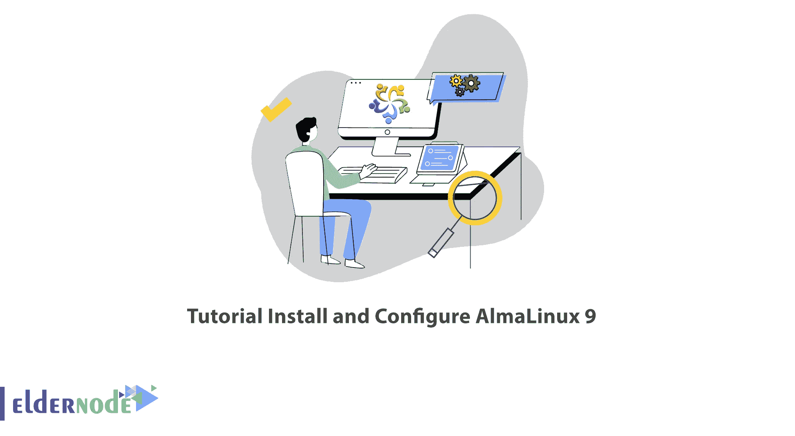

# 教程安装和配置 AlmaLinux 9 - Eldernode 博客

> 原文：<https://blog.eldernode.com/install-and-configure-almalinux-9/>



在社区的支持下，CloudLinux company 停止了 CentOS 8 的开发，创建了 AlmaLinux 作为 CentOS 的可行替代方案。AlmaLinux 是 CentOS 的一个替代品，有一个通用的版本，使用过 Linux Enterprise 的人都很欢迎它。在本文中，我们将教你如何安装和配置 AlmaLinux 9 。如果你想购买 **[Linux VPS](https://eldernode.com/linux-vps/)** 服务器，请查看 [Eldernode](https://eldernode.com/) 网站上提供的软件包。

## **如何安装配置 AlmaLinux 9**

### **alma Linux 简介 9**

AlmaLinux 是与 RHEL 和 CentOS 兼容的二进制文件，是 CentOS 的替代品。它是由开源社区开发的开源、免费的企业级操作系统。此外，这个操作系统有一个错误跟踪系统，允许用户报告他们的操作系统中的错误。CloudLinux 团队已经创建了 AlmaLinux，它提供共享托管服务，并且拥有自己的商业 Linux 发行版 CloudLinux OS。AlmaLinux 操作系统由一个名为 AlmaLinux OS 基金会的非营利组织管理。

在这篇来自 [Linux 教程](https://blog.eldernode.com/tag/linux/)系列的文章的续篇中，我们将一步步教你如何安装和配置 AlmaLinux 9。

### **如何下载 AlmaLinux 9**

在做任何事情之前，你应该**下载 AlmaLinux** ISO 镜像。为此，请访问 [AlmaLinux ISO 链接](https://mirrors.almalinux.org/isos.html)官方网站并选择合适的版本。点击它开始下载:


现在你需要选择你的镜子并点击它:


然后点击您想要的 AlmaLinux 索引:


接下来，您应该创建一个**可引导 USB 驱动器**。

然后插入安装介质并**重启**你的电脑。请注意，BIOS 应该配置为从 USB 安装介质引导。为此，您可以将介质设置为第一引导优先级。

### **如何用 AlmaLinux 9** 引导系统

系统重新启动后，将出现以下页面。选择**安装 AlmaLinux 9.0** :


您将收到一些启动消息。

现在选择你的语言并点击**继续:**


现在是时候对你的 AlmaLinux 9 磁盘进行分区了。为此，请转到**安装目的地。**您会看到存储配置被设置为**自动**，安装程序会在所选磁盘上自动创建分区:


如果您选择**自定义**选项，您可以手动创建自己的分区。如果选择自定义路径，选择**硬盘**，点击**完成**:


在这一步，您将看到**手动分区**部分，在这里您可以开始创建分区。为此，点击 **+** :


然后，您应该创建单独的分区，并在弹出窗口中指定每个分区。请注意，分区表应该显示您之前创建的分区。最后，点击 **Done** 保存更改。


### **如何在 Almalinux 9 上配置用户设置**

你应该配置**用户设置**以 root 密码开始。为此，点击**根密码**:


默认情况下，Root 帐户被锁定，SSH 登录被禁用。您可以通过输入并确认 root 密码来解锁它。您可以选择是否允许通过 SSH 进行远程 root 访问。全部完成后，点击**完成:**


现在您应该选择**用户创建**并创建一个常规用户登录。填写信息，最后点击**完成:**


## **如何安装 AlmaLinux 9**

现在是时候**安装 AlmaLinux 9** 了。为此，点击**开始安装**:


请等待安装完成。

最后，你应该**重启你的系统**，所以点击**重启系统**:


### **如何登录 AlmaLinux 9**

首先，你应该选择 grub 菜单中的第一个选项，然后按**回车:**


现在您需要登录到您的普通用户:


接下来，您将看到一个欢迎参观向导。您可以点击**否，谢谢**拒绝。


现在你可以看到 **AlmaLinux 9 桌面**:


要确认系统安装，只需运行以下命令:

```
cat /etc/redhat-release
```

就是这样。

## 结论

AlmaLinux 是由 Red Hat Linux 派生出来的企业 Linux 发行版，由 CloudLinux 发布。这个高度稳定的操作系统是为操作环境而设计的。在本文中，我们教了您如何安装和配置 AlmaLinux 9，并解释了所有必要的依赖项。我希望你喜欢这篇文章。