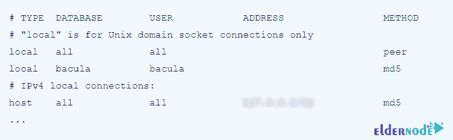

# 如何在 CentOS 8 - Eldernode 博客上安装和配置 Bacula

> 原文：<https://blog.eldernode.com/install-and-configure-bacula-on-centos-8/>


Bacula 是用于备份和恢复 Linux 的最流行和最广泛使用的解决方案之一。您可以完全在计算机上运行 Bacula，并将数据备份到其他介质上，如磁盘和备份磁带。这非常高效，也相对容易使用。Bacula 是模块化的，因为它采用模块化设计，可以在单台计算机上运行，也可以在拥有数百台设备的广域网上运行。在本文中，我们想一步一步地向您介绍如何在 CentOS 8，7 上安装和配置 Bacula。需要注意的是，如果你想购买一台 [CentOS VPS](https://eldernode.com/centos-vps/) 服务器，你可以访问 [Eldernode](https://eldernode.com/) 中提供的软件包。

## **教程在 CentOS 8 上安装和配置 Bacula**

Bacula 是一个开源应用程序，使您能够完成以下任务:

1-备份数据。

2-检查网络中的数据。

3-快速恢复损坏或丢失的文件。

在下一节中，我们将教您如何在 [CentOS](https://blog.eldernode.com/tag/centos/) 8 上安装 Bacula。然后在最后一节中，我们将展示如何配置 Bacula。请继续关注本文的其余部分。

## **在 CentOS 8 | CentOS 7**T3 上安装 Bacula

在本节中，我们将讨论如何在 CentOS 8 上安装 Bacula。注意 Bacula 可以和 **PostgreSQL** **数据库** **管理** **系统**一起工作。因此，按顺序执行以下步骤就足够了:

```
dnf install postgresql-server
```

```
postgresql-setup initdb
```

```
systemctl enable --now postgresql
```

下一步是**为 Bacula 创建一个用户**。为此，请按顺序运行以下命令:

```
sudo su - postgres
```

```
$ createuser bacula
```

```
$ psql
```

```
psql (10.14)
```

```
Type "help" for help.
```

```
postgres=# ALTER USER bacula PASSWORD 'bacula';
```

```
ALTER ROLE
```

```
postgres=# ALTER USER bacula LOGIN SUPERUSER CREATEDB CREATEROLE;
```

```
ALTER ROLE
```

```
postgres=# \q
```

```
$ exit
```

```
logout
```

现在，您应该在**/var/lib/pgsql/data/PostgreSQL . conf**文件中取消对以下设置的注释:

```
listen_addresses = 'localhost'
```

现在您需要在**/var/lib/pg SQL/data/pg _ HBA . conf**文件中将连接配置更改为以下格式:



最后，您必须使用以下命令**重启**服务以应用更改:

```
systemctl restart postgresql.service
```

在您成功安装 Postgresql 之后，现在我们来安装 Bacula。第一步是使用以下命令安装 Bacula 组件:

```
dnf install bacula-director bacula-storage bacula-console bacula-client
```

您可以按照下面的说明创建数据库、表和权限。请注意，您必须代表新创建的 Bacula 用户运行它们:

```
cd /usr/libexec/bacula/
```

```
sudo -u bacula ./create_postgresql_database
```

```
sudo -u bacula ./make_postgresql_tables
```

```
sudo -u bacula ./grant_postgresql_privileges
```

### **如何在 CentOS 8 上配置 Bacula**

在本节中，我们将教您如何配置 Bacula。需要注意的是，您可以使用以下命令创建任何文件夹来保存备份，并将 bacula 设置为其所有者:

```
mkdir /opt/bacula
```

```
chown bacula:bacula /opt/bacula
```

接下来，你需要打开**/etc/bacula/bacula-dir . conf**文件，找到名为**全套**的**文件集**部分。然后在这里的**包含**部分，可以设置备份需要的文件夹。在**排除**部分增加 **/opt/bacula** :

```
FileSet {  Name = "Full Set"  Include {  ...  File = /home/user  File = /folder/to/backup  }  Exclude {  File = /opt/bacula  …  }}
```

成功完成上一步后，您现在应该打开**/etc/bacula/bacula-SD . conf**文件，并为两个**设备**设置**归档设备= /opt/bacula** :

```
Device {  ...  Archive Device = /opt/bacula  ...  }
```

现在，您可以使用以下命令启动服务:

```
systemctl enable --now bacula-dir.service
```

```
systemctl enable --now bacula-fd.service
```

```
systemctl enable --now bacula-sd.service
```

请注意，文件集的 **Include** 部分中指定的文件夹现在每天都进行备份。您可以使用以下命令进入 **Bacula 管理控制台**开始备份:

```
bconsole
```

然后输入 **run** 命令，按照指示进行操作。您可以使用 **restore** 命令来恢复文件。也可以进入**状态**查看已安排的作业，然后进入 **1** 。键入 **help** 查看所有可用命令。

## 结论

Bacula 是一套计算机程序，允许您或系统管理员从技术上管理不同类型计算机网络上计算机数据的备份、恢复和验证。Bacula 是一个基于网络的备份应用程序。尽管 Bacula 仍在销售，但它拥有许多高级存储管理功能，可以轻松找到丢失或损坏的文件。在本文中，我们试图教您如何在 CentOS 8 上安装和配置 Bacula。