# 如何在 Windows 10 上安装和配置 Bacula-elder node 博客

> 原文：<https://blog.eldernode.com/install-and-configure-bacula-on-windows-10/>

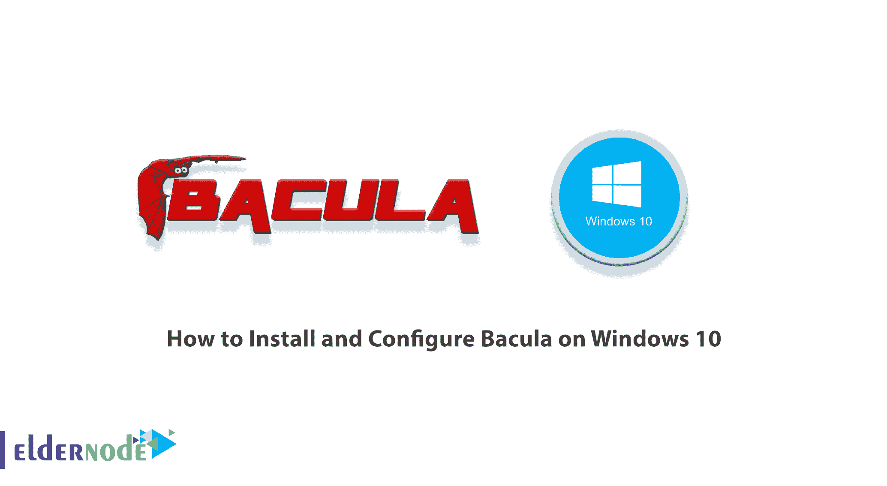

Bacula 是一个支持解决方案的开源网络，允许您在计算机系统上创建备份文件和执行数据恢复操作。这个系统非常灵活和稳定。尽管配置起来可能有点困难，但在大多数情况下，这是设置支持的一个好选择。备份系统是大多数服务器基础架构的重要组成部分。因为在发生各种灾难时，恢复丢失的数据通常是恢复计划中至关重要的一部分。在本文中，我们想向您介绍**如何在 Windows 10** 上安装和配置 Bacula。需要注意的是，如果你想购买一台 **[Windows VPS](https://eldernode.com/windows-vps/)** 服务器，你可以访问 [Eldernode](https://eldernode.com/) 中提供的软件包。

## **教程在 Windows 10 上安装和配置 Bacula**

Bacula 是一个备份软件包，包括一组用于在计算机网络下存储、检索和验证信息的程序。该软件还可以选择以加密形式备份和保存数据。Bacula 经过多年的发展，已经成为一个适用于各种环境的完整且易于使用的备份套件。

***注:*** Bacula 软件支持 DVD、u 盘等可移动设备。

Bacula 可以考虑备份领域最流行的开源软件。在接下来的章节中，加入我们向您展示如何在 [Windows](https://blog.eldernode.com/tag/windows/) 10 上安装和配置 Bacula。

### **什么是 Bacula**

简而言之，Bacula 是一个强大的软件，用于在 Windows 和 Linux 计算机上存储、检索和验证信息。它还可以选择以加密形式备份和存储数据。Bacula 的一个很好的特点就是多平台。在下一节中，我们将回顾 Bacula 组件。

### **Bacula 组件概述**

虽然 Bacula 由几个软件组件组成，但它使用服务器-客户端备份方法。以下是 Bacula 最重要的组成部分:

**1- Bacula Director (DIR):** 这是控制由文件和存储守护程序执行的备份和恢复操作的软件。

**2-存储守护程序(SD):** 它是一种软件，负责读取和写入用于备份的存储设备。

**3- Catalog:** 是在数据库中存储备份文件的服务。这个数据库是作为一个 SQL 数据库来维护的，比如 [MySQL](https://blog.eldernode.com/install-mysql-on-windows-server/) 或者 [PostgreSQL](https://blog.eldernode.com/postgresql-installation-tutorial/) 。

**4- Bacula 控制台:**命令行界面，允许备份管理器与 Bacula 交互并控制 Bacula Director。

下一节，我们将教你如何在 Windows 10 上安装 Bacula。请加入我们。

## **在 Windows 10 上安装 Bacula**

在这一节，我们想教你如何在 Windows 10 中安装 Bacula。为此，只需遵循以下步骤。第一步是去 [Bacula 网站](https://www.bacula.org/binary-download-center/)下载 Windows 版本:

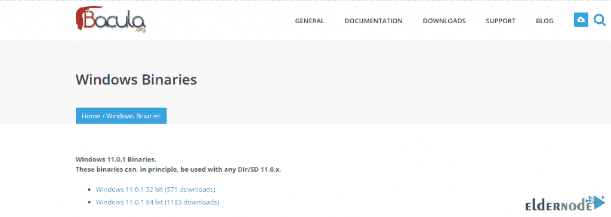

然后去你下载 Bacula 的地方。右键单击该文件，然后单击**以管理员身份运行**开始安装过程:

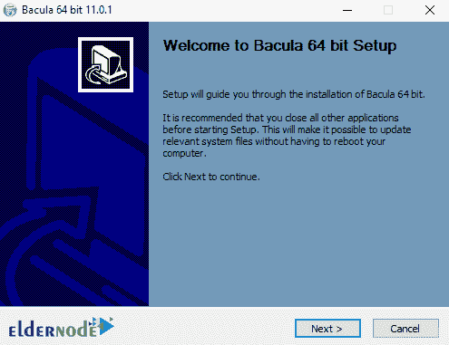

在打开的窗口中，点击**下一步。**

然后，单击**我同意**接受许可协议:

在下一步中，您必须选择**安装类型**并点击**下一步**:

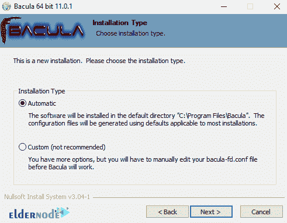

在下一步的**后选择安装类型**部分，点击下拉菜单。然后选择所需选项，点击**下一步**继续。

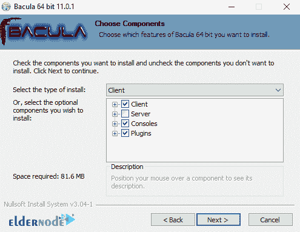

在下一步中，将要求您输入关于您的配置的非常基本的信息。完成必填字段后，点击**安装**。

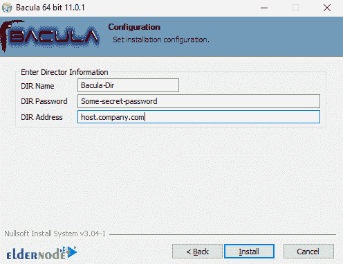

*

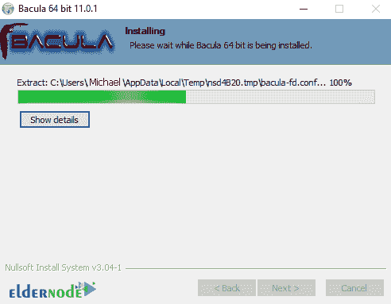

最后，点击 **Finish** 成功完成安装过程。

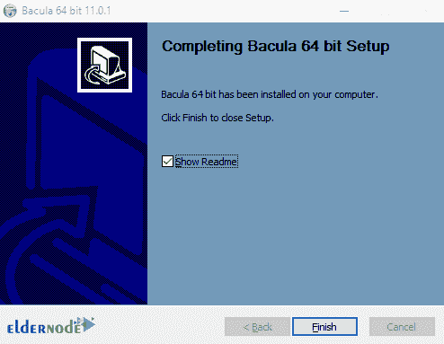

### **如何在 Windows 10 上配置 Bacula**

成功安装 Bacula 后，在这一步，我们将了解如何配置它的设置。第一步，在 Windows 搜索框中键入 Bacula。然后从右栏点击**打开文件位置**。

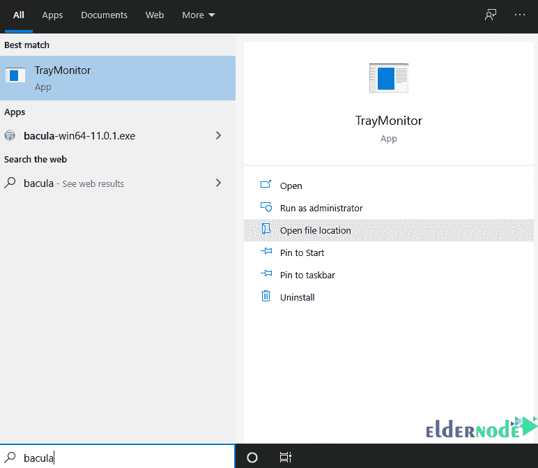

在打开的页面上，双击**编辑客户端配置**，如下图所示:

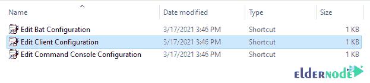

打开文件后，设置密码以连接到 Director 守护程序，如下所示:

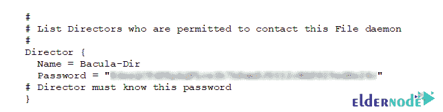

制作如下图所示的监视器部分注释。然后，**保存**文件并关闭。

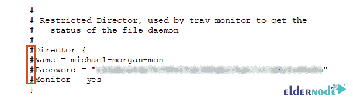

要对系统进行更改，您必须**重启**一次。

最后，您需要允许 Windows 防火墙上的 9102 和 9103 端口。

## 结论

Bacula 的 Windows 版本是一个原生的 Windows 端口，但是对 Unix 代码的源代码更改非常少。这意味着 Windows 版本大部分运行的代码在 Unix 系统上已经被证明是稳定的。Bacula 运行时，与 Windows 完美集成，并在系统图标托盘中显示其图标，并提供系统托盘菜单，以获取有关 Bacula 如何运行的更多信息。在这篇文章中，我们试图教你如何在 Windows 10 上安装和配置 Bacula。