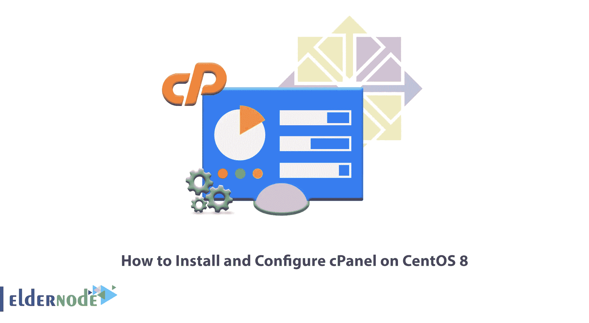
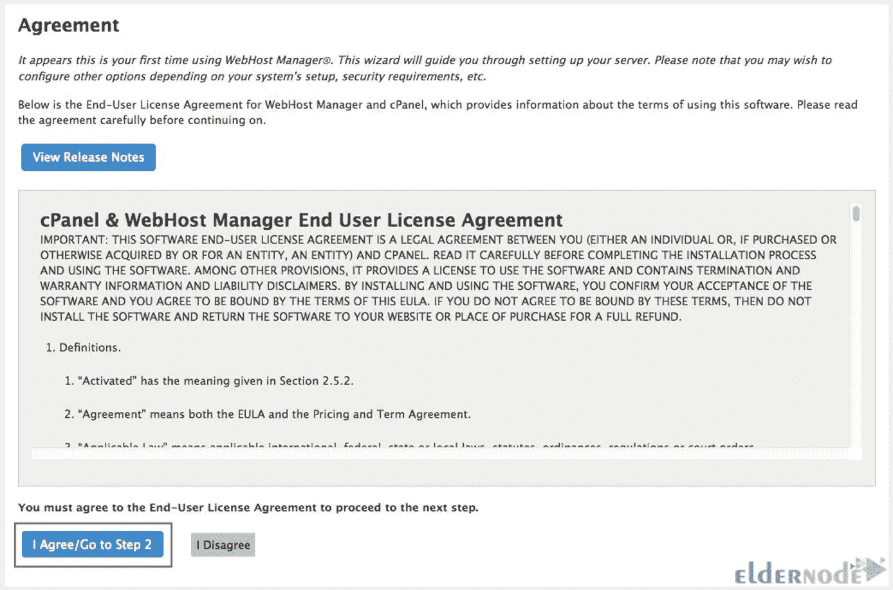
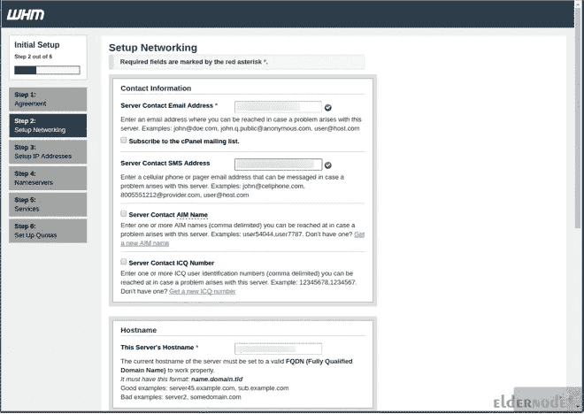
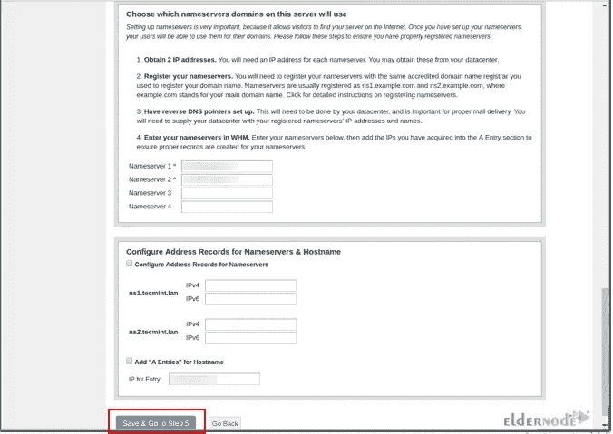

# 如何在 CentOS 8 上安装和配置 cPanel

> 原文：<https://blog.eldernode.com/install-and-configure-cpanel-on-centos-8/>



当你得到一台服务器时，你需要一个控制面板来更好地使用它。网站托管控制面板是一种软件，它充当用户和主机中可用设施之间的图形界面。它们提供了许多服务，如传输文件、发送和接收电子邮件、安装 SSL 安全证书、数据库管理、域管理等。Cpanel 是著名的控制面板之一，本文将教你如何在 CentOS 8 上安装和配置 cPanel。如果您打算购买一台 [**CentOS VPS**](https://eldernode.com/centos-vps/) 服务器，请查看 [Eldernode](https://eldernode.com/) 网站上提供的套装。

cPanel 是一个安全和流行的商业托管控制面板，用于托管服务。它允许用户轻松管理他们的网络托管服务器操作和基于 Linux 的主机；它还可以通过一个强大的图形用户界面来管理共享，转售，商业托管服务，等等。该控制面板由两个不同的用户界面组成，一个是基于客户端的界面，另一个是服务器管理界面。您可以从基于客户端的界面登录以满足您的网站要求，但服务器管理界面不可用。

在这篇来自 [CentOS 培训](https://blog.eldernode.com/tag/centos/)系列的文章的续篇中，您将学习如何在 CentOS 8 上安装和配置 cPanel。

### **在 CentOS 8 上安装 cPanel**

在本节中，我们将解释 cPanel 在 CentOS 8 上的安装过程。只需按照下面的步骤，并输入所需的命令。

您的服务器应该有一个标准的主机名。首先，检查你的服务器的主机名，如果你的服务器没有标准的主机名，设置如下:

```
hostnamectl set-hostname cpanel.eldernode
```

cPanel 是用 Perl 编写的，所以您需要使用下面的命令安装 Perl:

```
yum install perl
```

您可以使用自动安装程序脚本来安装 cPanel。在下载 cPanel 安装程序脚本之前，**用以下命令安装 curl** :

```
yum install curl
```

现在是时候**下载 cPanel 安装程序**脚本了。为此，您应该将目录更改为 **/home** ，并通过运行以下命令下载它:

```
cd /home
```

```
curl -o latest -L https://securedownloads.cpanel.net/latest
```

```
sh latest
```

从 cPanel 基于 web 的界面完成安装向导。

最后，您的会话将被切换到主目录，并下载 cPanel 的最新版本。

### **在 CentOS 8 上配置 cPanel**

在本步骤中，您将了解如何在 CentOS 8 上配置 cPanel。首先，**通过运行以下命令来访问 cPanel WHM** :

```
https://SERVER_IP:2087
```

然后提供您的 root 用户和密码。

登录后，接受许可协议并点击**我同意/转到步骤 2** :



导航至**设置网络**并记住提供您的服务器电子邮件地址和短信地址以接收短信。您可以通过电子邮件接收所有必要的通知:



现在，您应该转到**主机名>网络**路径，并输入有效的 FQDN 和服务器解析器值。

如果您选择**主网络/以太网设备**，您将看到预定义的 IP 地址与您的服务器的主服务器 IP 地址相同。

在这一步中，您需要设置服务器的静态 IP 地址。为此，从下拉列表中选择 IP 并点击**进入设置 4。**

然后，您可以添加名称服务器(DNS)的 A 条目和服务器的主机名。如果您想为您的主机名和名称服务器添加一个条目，选择复选框并点击**保存&转到步骤 5** :



就是这样！您已经在 CentOS 8 上成功安装和配置了 cPanel。我们的网站提供经济实惠的 [CentOS VPS](https://eldernode.com/centos-vps/) 服务器，是购买 VPS 服务器的最佳选择。

## 结论

cPanel 是用于服务器系统的基于 web 的商用控制面板。在本文中，我们教您如何在 CentOS 8 上安装和配置 cPanel。我希望这篇教程能帮助你在 CentOS 8 上安装和配置 cPanel，并且对你有用。如果您有任何问题或建议，可以在评论区联系我们。