# 如何在 Windows Server 2019 上安装和配置 DHCP 服务器- Eldernode

> 原文：<https://blog.eldernode.com/install-and-configure-dhcp-server/>

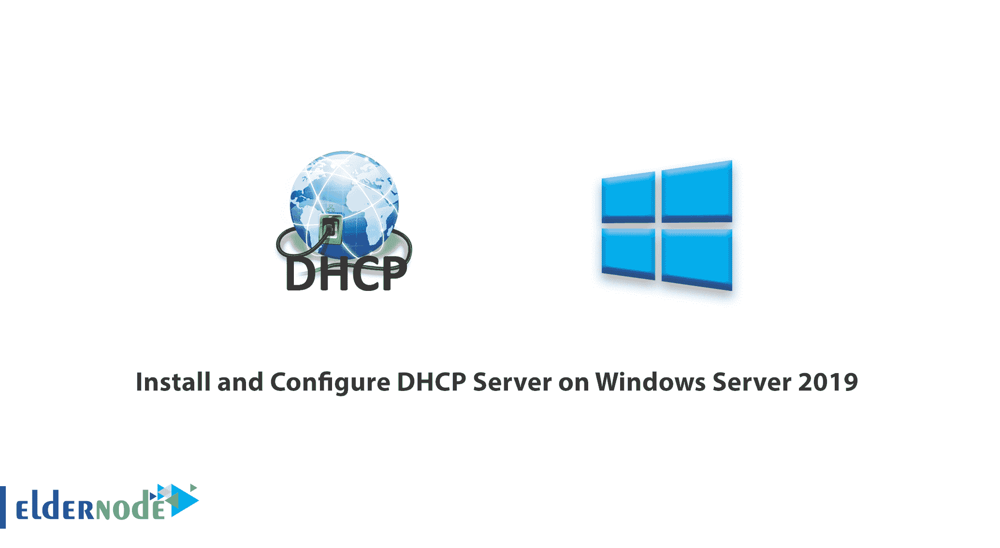

如何在 [Windows Server 2019](https://eldernode.com/tag/windows-server-2019/) 上安装配置 [DHCP 服务器](https://en.wikipedia.org/wiki/Dynamic_Host_Configuration_Protocol)。DHCP 代表动态主机配置协议，是大多数网络中的重要协议和服务之一。 DHCP 协议的作用是将 ip 地址分配给网络上的系统和设备的其他 **TCP/ IP** 参数。 DHCP 服务器是对网络上的系统和设备进行分配 IP 地址和子网掩码以及其他 **TCP/ IP** 参数的集中操作的系统。

在本文中，我们将教你如何在 Windows Server 2019 上安装和配置 DHCP 服务器。请继续关注本文的其余部分。

[***在 Eldernode***](https://eldernode.com/windows-vps/) 选择您的完美 Windows 虚拟专用服务器包

### A) 服务器管理器

第一步是打开服务器管理器，这样我们就可以开始安装过程了。

点击你的窗口按钮，输入服务器管理器，选择应用程序。

一旦打开，进入**步骤 B** 。

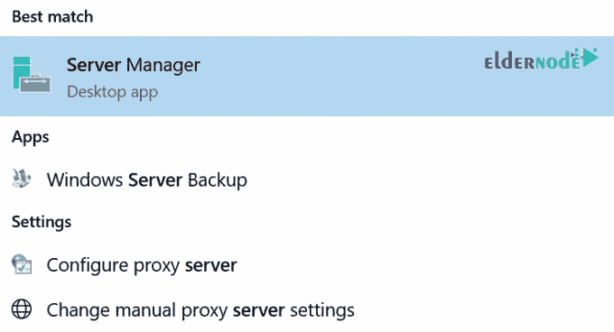

### B) 添加角色和功能

在你的服务器管理器窗口中，点击添加角色和功能。

这将弹出一个窗口。点击弹出窗口上的下一个

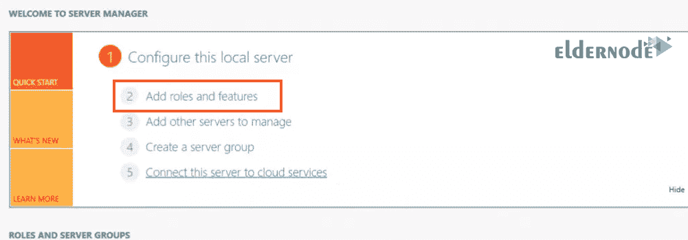

### C) 基于角色或基于功能的安装

在该页面上，选择基于角色或基于功能的安装单选选项，并点击下一步。

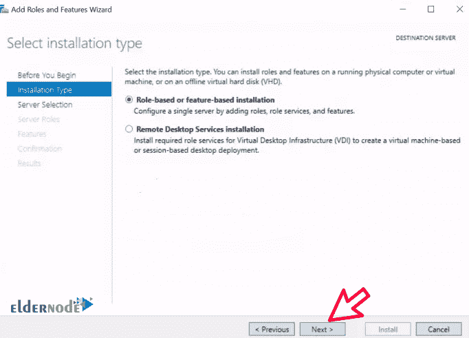

### D) 选择宿主

选择您希望安装 **DHCP 服务器**的服务器。

在本指南中，我们选择了本地服务器。

之后点击下一个。

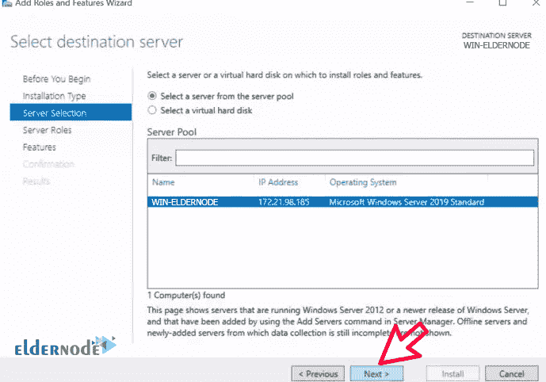

### E) 选择服务器角色

下一页的标题是选择服务器角色，并且有一个要安装的角色列表。

你可以猜到，我们将选择 DHCP 服务器。请继续选择它。

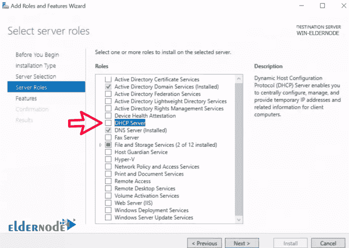

### F) 添加功能

在上一步选择了 DHCP 服务器后，会出现另一个名为 **添加 DHCP 服务器所需的功能的弹出窗口。** 。

只需点击添加功能。之后点击下一个。

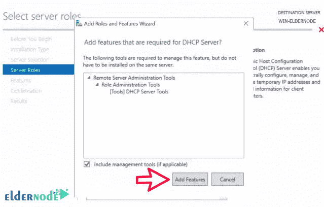

### G) DHCP 服务器

在下一个标题为 **DHCP 服务器**的页面上，只需点击下一步。

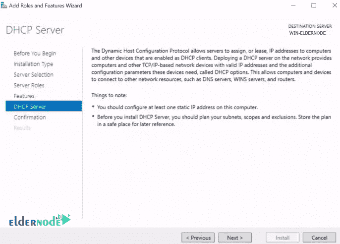

### H) 确认选择

查看提供的列表，确认 DHCP 服务器和其他设备都已列出。之后点击安装。

一切安装成功后，点击关闭和你的 DHCP 服务器就安装好了。

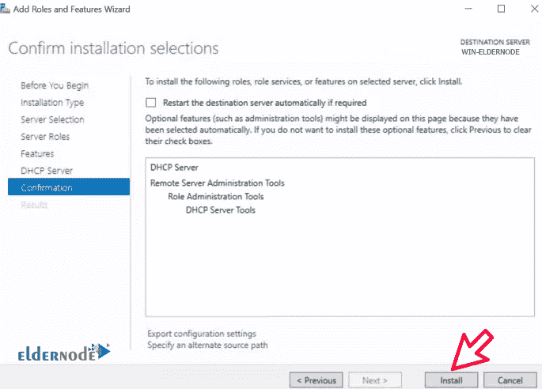

*

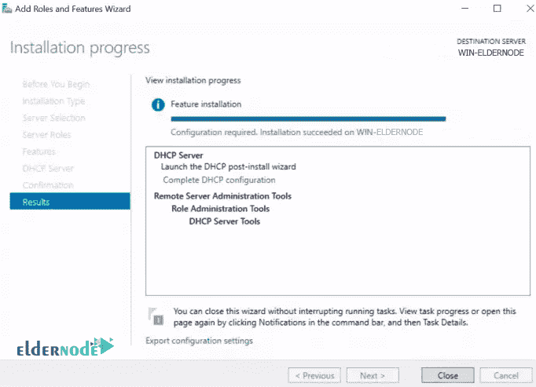

## I) 部署后配置

***甲部:***

打开服务器管理器，你现在应该能够看到 **DHCP** 作为窗口左侧窗格中的一个选项。

您应该会看到一个如下图所示的**黄色标记的**警告，在警告句的末尾写着**配置 DHCP 服务器需要……**，时钟在更多链接上。

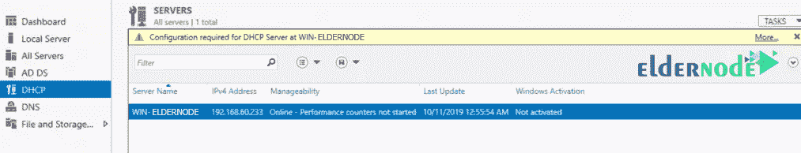

***乙部:***

在部分 A 之后，一个标题为**所有服务器任务细节和通知**的新窗口将会出现。在它下面，你会看到部署后配置行。

点击该行末尾的完成 DHCP 配置，如下所示。

将出现一个安装向导。点击下一个。

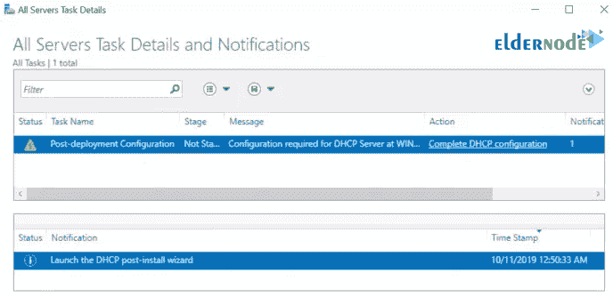

**

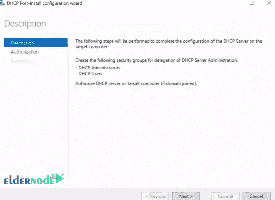

***C 部分:***

在此页面上，您有三个选项。

您可以使用管理员凭证、备用用户凭证以及广告授权进行操作。

如果您的服务器是独立的，并且不在任何 Active Directory 域中，则选择跳过广告授权无线电。如果是，那么您将使用您的广告中记录的凭证。

做出适合您的环境的决定后，单击提交。

点击关闭。

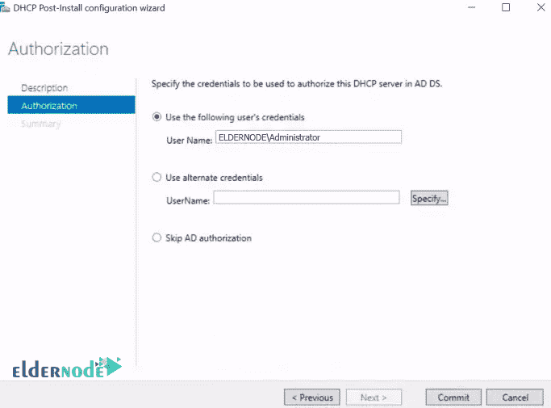

***

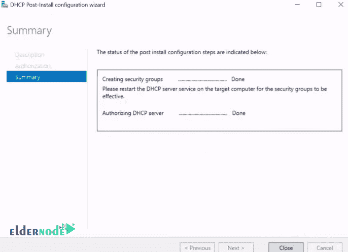

J) 如何配置 DHCP 服务器

## 回到服务器管理器，点击工具，选择 DHCP 。

这将打开 **DHCP 配置**窗口，如下所示:

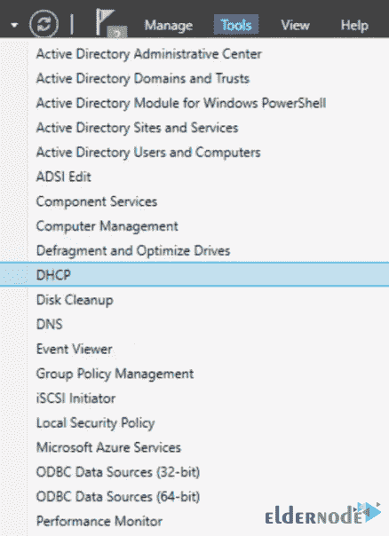

****

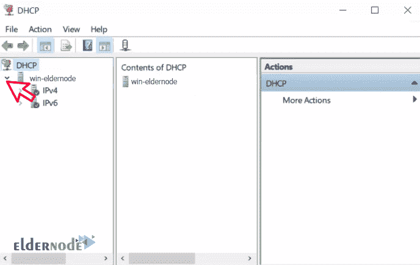

【K】新范围

### **右键单击** IPv4 然后选择新作用域。

将弹出一个新的范围向导窗口，如下所示。点击下一个。

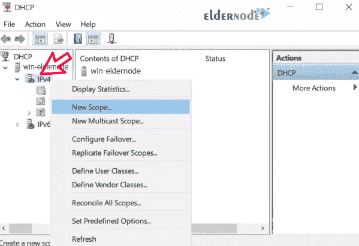

****

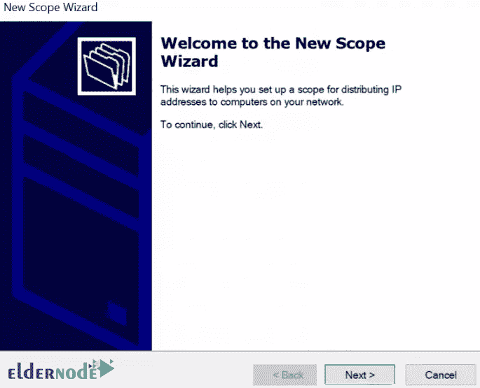

L) 说出你的作用域

### 输入这个新范围的名称和描述，然后点击下一个按钮。

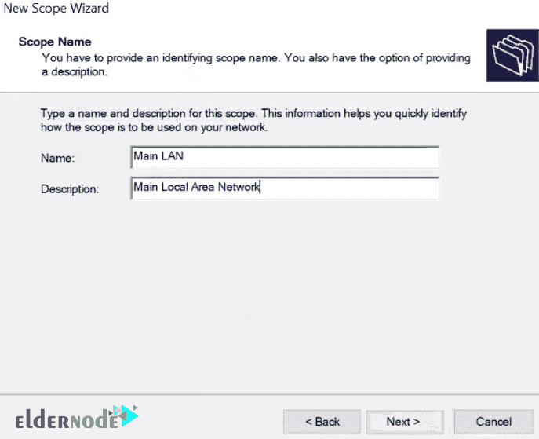

M) 输入想要的 IP 地址范围

### 输入你的开始和结束的 IP，长度和子网掩码然后点击下一个。

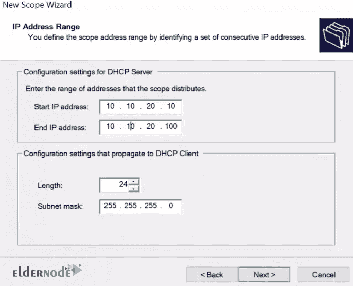

【N】在此设定您想要排除的 IP

### 如果您想在范围内保留一些IP，用于**打印机**和其他设备，您可以在此阶段输入它们。

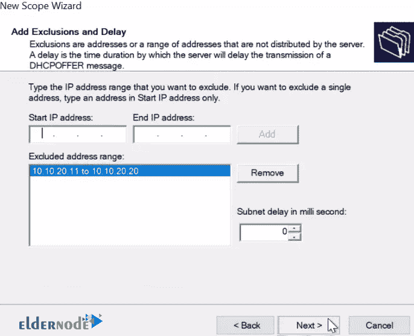

O) 租赁期限

### 租期是指 DHCP 服务器在再次登录时，给特定的计算机或客户端一个 IP 地址，然后改变它或给它另一个 IP 地址。

设置您的并点击下一个。

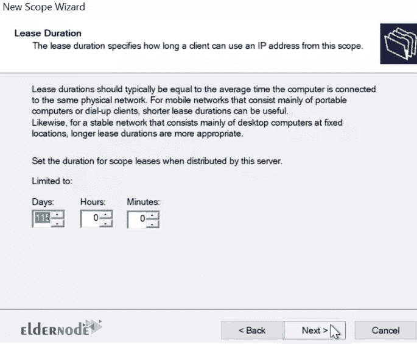

P) DHCP 选项

### 点击下一个。

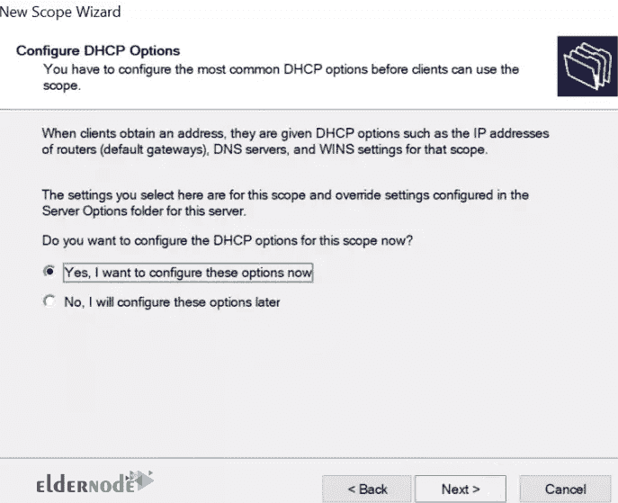

【Q】输入你给的子网的默认网关

请键入在租赁期间将分配给客户端的默认网关。

### 输入并点击在其旁边添加。之后，点击下一个。

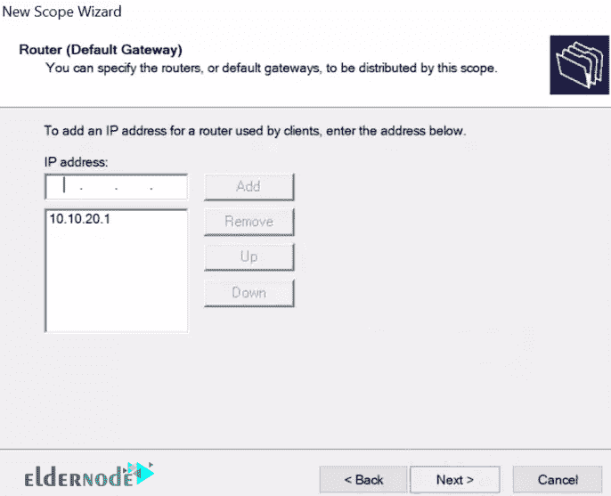

【R)键入 DNS 和域名

DNS 非常重要，因为它将促进 FQDN 到 IP 地址的解析。

### 键入然后点击下一个。

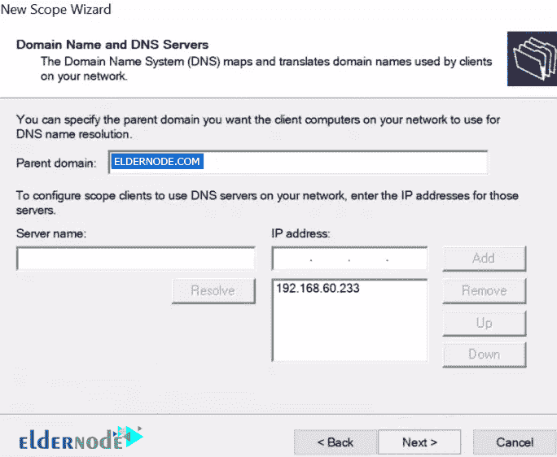

S) WINS 服务器(可选)

如果您想在您的环境中使用 WINS 服务器，请在此步骤中输入详细信息，然后点击下一步继续。

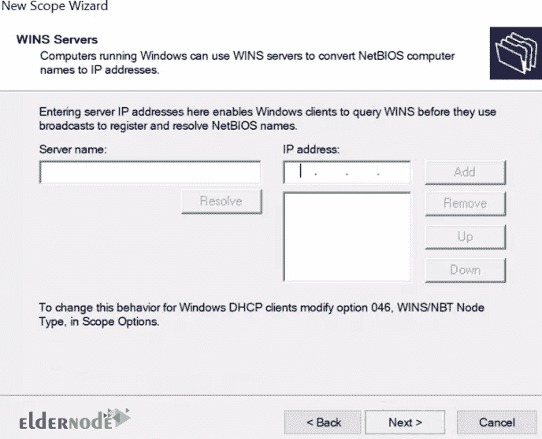

【T】激活范围

只需点击下一个即可激活我们已经配置好的范围。

### **注意:** 如果您希望稍后激活，请选择第二个单选选项。

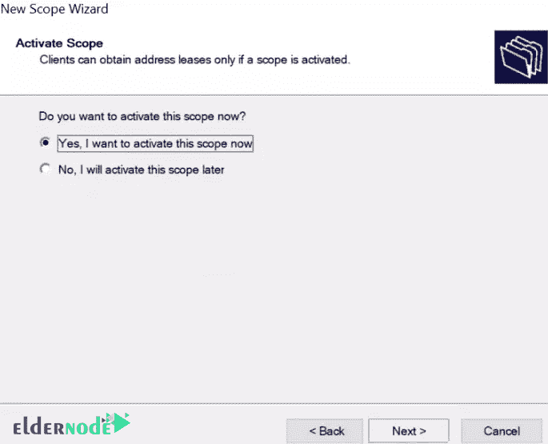

完成范围配置

如果您已经将您的局域网/网络分割成**VLAN**，只需为那些VLAN创建如上所示的其他作用域，然后配置您的路由器以相应地从 DHCP 服务器获取IP。

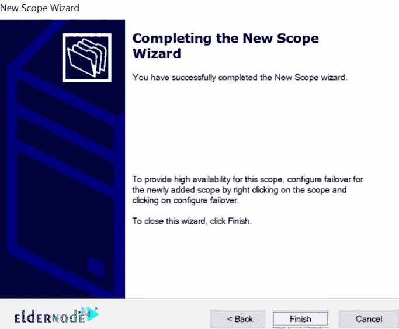

**注意:** 打开您的 DHCP 配置如在 ***步骤** **K*** 中，然后检查您的配置是否如下所示:

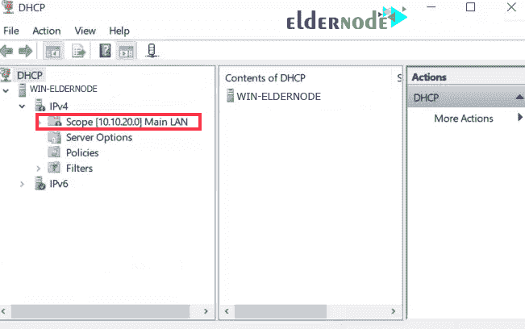

**亦作，见:**

[1。如何在 Windows Server 2019 上安装和配置 NFS 服务器](https://eldernode.com/install-and-configure-nfs-server-on-windows-server/)

[2。如何在 Windows Server 2019 上安装和配置 DNS 服务器](https://eldernode.com/install-and-configure-dns-server-on-windows/)

[3。如何在 Windows Server 2019 上安装 IIS Web 服务器](https://eldernode.com/install-iis-web-server-on-windows-server/)

[4。如何在 IIS Server 2019 中配置默认站点](https://eldernode.com/configure-default-site-in-iis-server/)

[5。如何在 Windows Server 2019 上安装 Active Directory](https://eldernode.com/install-active-directory-on-windows-server/)

**尊敬的用户**，我们希望您能喜欢这个[教程](https://eldernode.com/category/tutorial/)，您可以在评论区提出关于本次培训的问题，或者解决[老年人节点培训](https://eldernode.com/blog/)领域的其他问题，请参考[提问页面](https://eldernode.com/ask)部分，并尽快提出您的问题。腾出时间给其他用户和专家来回答你的问题。

如何在 Windows Server 2019 上安装和配置 DHCP 服务器？

好运。

How to Install and Configure DHCP Server on Windows Server 2019.

Goodluck.