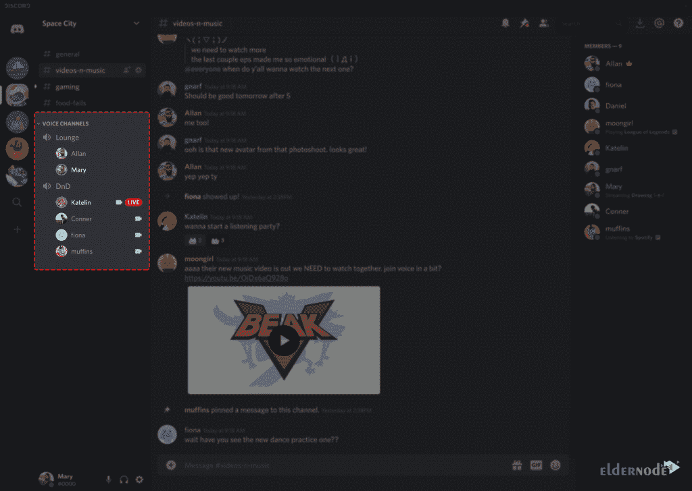

# 如何在 Fedora 33 - Eldernode 博客上安装和配置 Discord

> 原文：<https://blog.eldernode.com/install-and-configure-discord-on-fedora/>


Discord 是一款面向 Windows、IOS、Android、Linux 和 macOS 游戏玩家的网络通讯软件。该软件也可以在网络浏览器中运行。最初，Discord 是为游戏玩家编写的，但使用 Discord 的范围要广得多。不和谐的时候可以和好友群聊，视频通话，聊天，甚至看电影。在本文中，我们将一步一步地教你如何在 Fedora 33 上安装和配置 Discord。需要注意的是，如果你想买一个 **[Linux VPS](https://eldernode.com/linux-vps/)** 服务器，可以在 [Eldernode](https://eldernode.com/) 中看到可用的包。

## **教程在 Fedora 上安装和配置 Discord 33**

Discord 是专门为游戏社区设计的。该程序提供信息、语音和视频通话，允许玩家在游戏中与朋友交流。同时，它非常轻和简单，因此它不会占用大量的计算机处理器。

Discord 是一个流行的群聊应用程序，最初开发的目标是为游戏玩家创建一个聊天的地方。但自 2015 年推出以来，该程序已被大量互联网用户使用。Discord‌可用于 [Windows](https://blog.eldernode.com/tag/windows/) 、 [Linux](https://blog.eldernode.com/tag/linux/) 、iPhone、Android 和 Mac。

在本文中，我们将在介绍和解释 Discord 的特性后，教你如何在 [Fedora](https://blog.eldernode.com/tag/fedora/) 33 上安装和配置 Discord。

### **什么是不和？**

Discord 是近年来流行的社交网络之一。主要用户是游戏玩家，Discord 游戏服务器的数量也在不断增加。在这个社交网络中，你可以很容易地和你的朋友聊天。不和谐的一个积极点是它对高速互联网的需求较低。你也可以用常规带宽让你的朋友听到你的声音。

因此，全球大量的游戏玩家也活跃在这个计划中。Discord 还包括群组视频通话和流媒体功能。这种可能性导致了很多人把它用于教育和上课。在下一节中，我们将介绍不和谐的一些特征，请加入我们。

### **不和谐特征**

Discord 最重要的特性和功能包括:

1_ 100%免费

2_ 安全并防范 DDoS 攻击

3_ 网络和移动版本支持

4_ 最小 CPU 使用率

5_ 拥有功能性机器人

6_ 游戏玩家的高级设置

7_ 能够向您的网站或博客添加在线页面

8_ 调节声音传输质量的能力

9_ 能够进行屏幕共享和视频通话

10_ 低响应时间

11_ 免费聊天服务器

12_ PC 音频和视频共享

13_ 它还拥有[台专用服务器](https://eldernode.com/dedicated-server/)

在本文的其余部分，请加入我们，教您如何在 Fedora 33 上安装和配置 Discord。

## **在软呢帽上安上不和 33**

要在 Fedora 33 上安装 Discord，只需遵循以下步骤。有趣的是，这种不和谐被打包在一个金丝雀软呢帽库中。所以你不必努力安装它。你可以使用 **DNF 软件包管理器**轻松下载。然后安装不和谐。在第一步中，您必须使用以下命令来启用 Canary 存储库:

```
dnf copr enable vishalv/discord-canary
```

然后使用以下命令安装软件包:

```
dnf install discord-canary
```

### **如何在 Fedora 上配置不和 33**

你必须年满 13 岁才能合法使用不和谐音。该计划的主要特点将提供给你免费的，但是，该公司也有一个每月订阅版本。该版本提供了动画头像、自定义波形和高质量屏幕共享等功能，以及上传更大文件的能力。在接下来的部分，我们将教你配置 Discord 的流行设置。请加入我们。

#### **如何整合与其他热门节目的不和**

默认情况下，Discord 有一个可以与其他流行程序集成的部分。只需从 Discord 内部登录你想要合并的程序。现在，您可以将您的不和谐与以下应用程序联系起来:

1.Xbox Live

2.Battle.net

3.脸谱网

4.Reddit

5.Spotify

6.蒸汽

7.推趣

8.推特

9.油管（国外视频网站）

10.网络电话

11.英雄联盟

到目前为止，已支持 11 个应用程序与 Discord 集成。每个程序根据类型有不同的功能。应用程序之间集成的整体性能是与不和谐的服务器同步数据。

要将 Discord 与不同的应用程序集成，可以进入**用户设置** > > **连接**，选择想要的应用程序图标。


#### **如何管理不和谐通知**

如果您是许多服务器的成员，那么随着时间的推移，您收到的通知无疑会大大增加。这让你觉得不舒服。甚至当你进入程序的时候，你会遇到很多可能让你困惑的信息。幸运的是，Discord 为通知部分提供了独特的设置，您可以根据需要进行定制。根据服务器、通道或用户的类型，您可以指定通知。

要更改不一致的通知设置，请转到**用户设置>** > **通知**。如果要禁用**所有服务器**的通知，右击图标，点击**服务器静音**。但是如果您想禁用某个**特定频道**的通知，右击频道名称并点击**静音【频道名称】**。


#### **如何使用书签获取不一致的文本**

Discord 允许您以多种格式编写和提交文本。使用下面的列表，您可以使用不同的模式来编写和发送文本:

**加粗:*** *[正文] **

**斜体:** * [TEXT] *或 _ [TEXT] _

**下划线:**_ _[文本] __

**删除线:** ~~删除线~~

**代码:**`[文本]`

**超链接:**【超链接！] ([URL])

**删除嵌入:** <【网址】>

这些命令的使用没有限制，并且对所有用户都是免费的。通常，使用这种类型的消息传递模型是因为它与另一种不同，并且您打算以相同的方式使用它。

#### **不和谐聊天命令**

在**聊天**部分，你可以使用很多不一致的命令。其中一些命令如下:

**nick/:** 这允许您更改服务器的名称。只需在命令后输入新名称。

**tenor/和 giphy/:** 网页搜索 gif。

**spoiler/:** 向其他人隐藏您的消息，以防止电影和连续剧泄露给其他用户。

**【表情符号】/:** 输入表情符号代码即可搜索表情符号。

### **如何在软呢帽上使用不和 33**

从这一节开始，我们将向你展示如何使用不和谐。请注意，不和谐允许你为你的朋友创建一个客人之家。这个家是你可以倾诉的地方。这些特殊的家和地方被称为**服务器**，具体如下。您可以创建服务器或被邀请到其他服务器并加入。


如前所述，你的服务器由**文本通道**和**语音通道**组成。

**文字频道**是单独的文字聊天空间。这些文字频道让谈话有条理，也给每个人足够的空间来交谈。也可以为不同的主题创建不同的频道。


**语音频道**是你可以使用音频和视频的地方。请注意，您不再需要打电话或打电话。你可以很容易地点击语音频道进入它。另一方面，你在服务器上的朋友可以看到你在那里。您可以登录语音频道进行交谈、向视频问好或共享他们的屏幕。



## 结论

Discord 是一个用于即时通讯和数字分发的 VoIP 平台。该应用程序旨在创建通信社区。用户通过语音通话、视频通话、文本消息、媒体和私人聊天中的文件或作为称为服务器的论坛的一部分进行通信。如果你玩很多在线电脑游戏，你现在需要花时间去熟悉不和谐。在本文中，我们试图向您介绍如何在 Fedora 33 上安装和配置 Discord。然后我们教你如何使用不和谐。