# 如何在 Windows Server 2019 - Eldernode 上安装和配置 DNS 服务器

> 原文：<https://blog.eldernode.com/install-and-configure-dns-server-on-windows/>

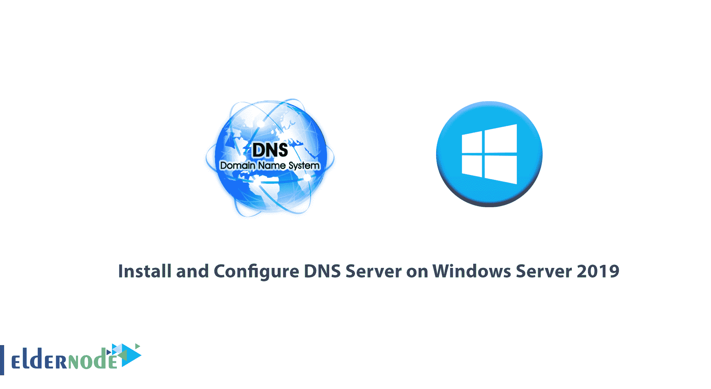

如何在 [Windows Server 2019](http://eldernode.com/tag/windows-server-2019/) 上安装配置 DNS 服务器？ DNS 服务器是从客户端接收域请求并向请求用户客户端显示服务器管理员分配给其 [DNS](https://en.wikipedia.org/wiki/Domain_Name_System) 服务器的 IP 地址内容的服务器。 DNS 服务器的工作方式类似于电话簿，当你从联系人中选择某人的名字并给他们打电话时，你选择了他们的名字，但你的手机会拨打其号码并进行呼叫。

在上一篇文章中，我们教过你[如何在 Windows Server 2016](https://eldernode.com/configure-dns-on-windows-server-2016/) 上配置 DNS。在本文中，我们将教你如何在 Windows Server 2019 中安装和配置 DNS 服务器。

[***购买 Windows VPS 托管在 Eldernode***](https://eldernode.com/windows-vps/)

### 1)如何打开服务器管理器并添加角色和功能

**A-** 第一步，按下 Windows 按钮，从开始菜单中键入服务器管理器并打开。

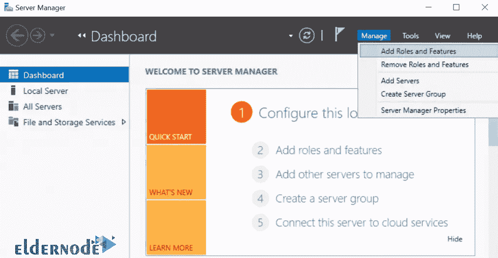

**B-** 点击进入下一页；

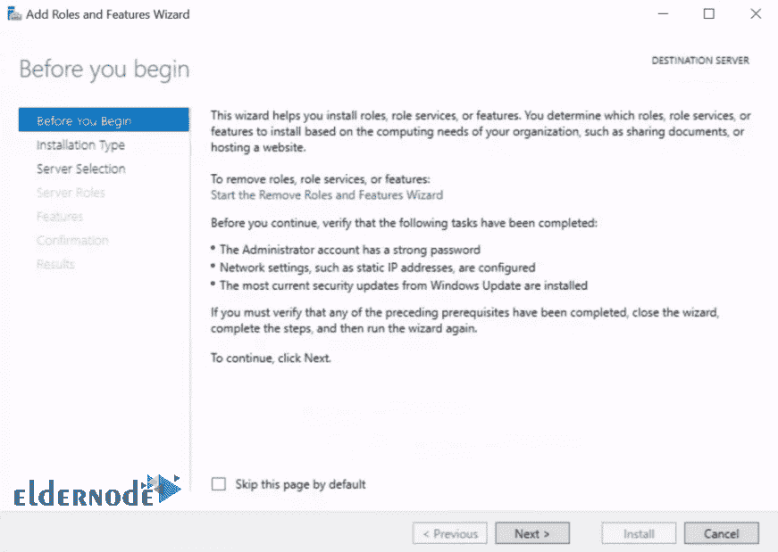

**C-** 选择基于角色或基于功能的安装。

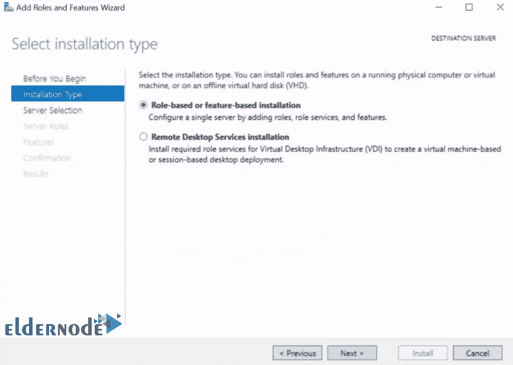

**D-** 选择**服务器**安装 DNS 进入，点击下一步。

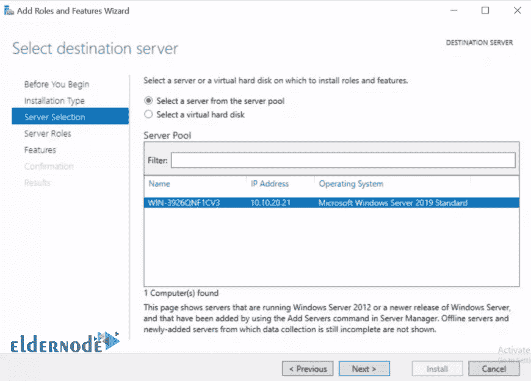

### 如何选择 DNS 服务器并添加功能

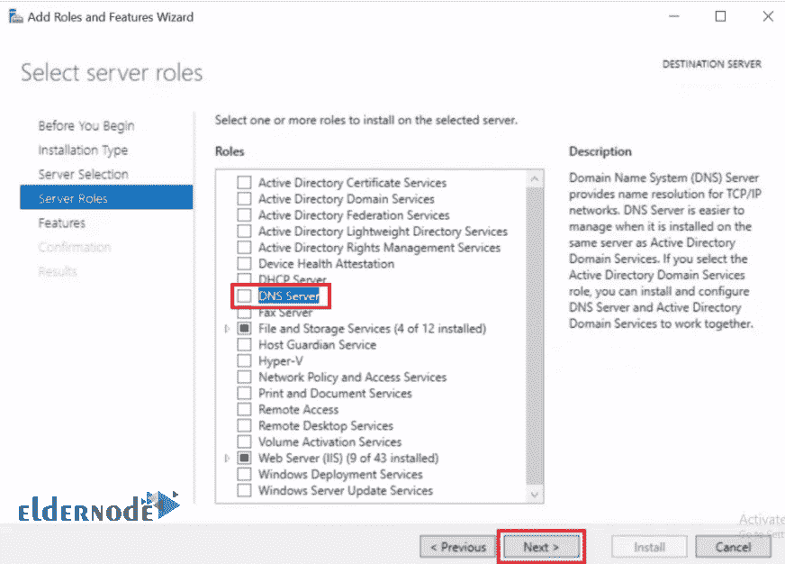

**1-** 点击添加功能。

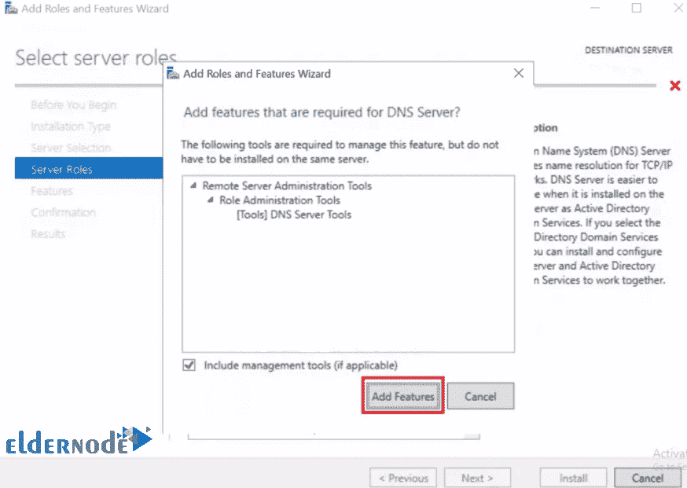

如果您之前没有配置静态 IP ，您将会收到如下所示的消息。

**2-** 点击继续。

**注意:** 如果您的服务器配置了静态 IP，您将不会收到该消息。

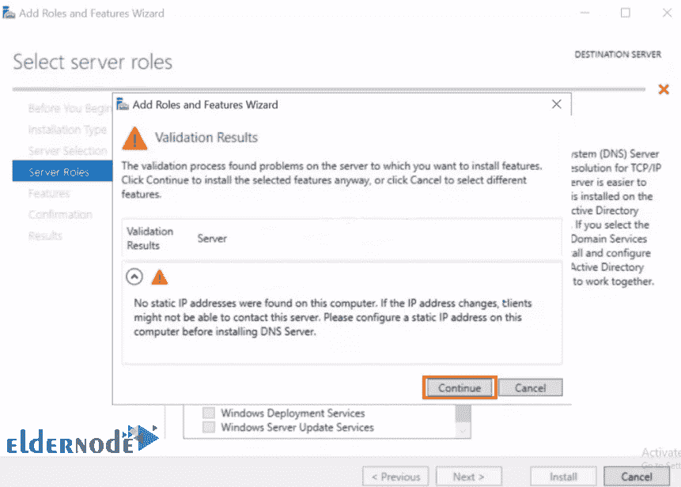

**3-** 在接下来的三个连续屏幕上点击下一个。

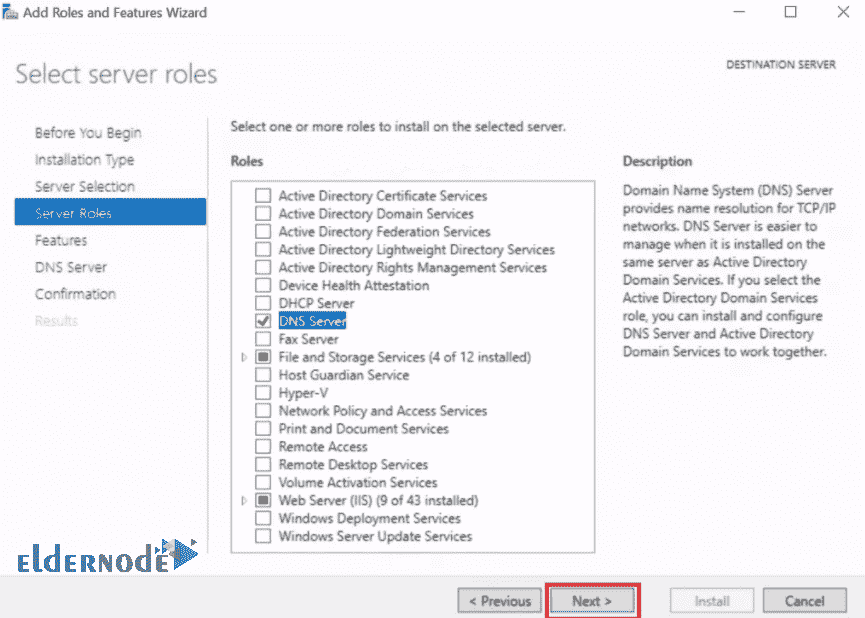

*

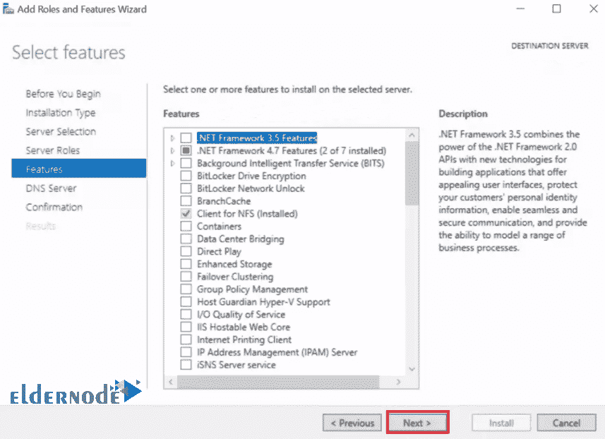

**

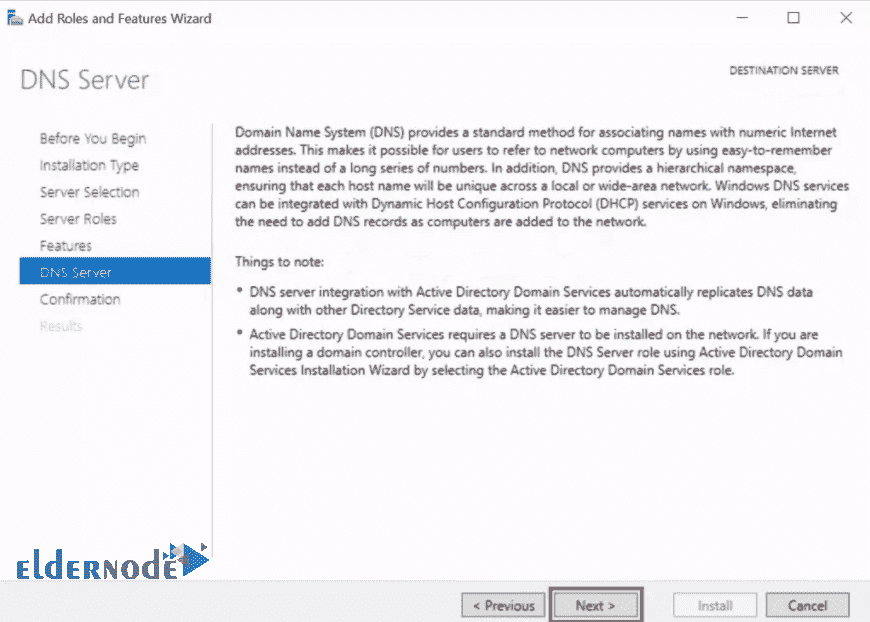

如何确认和安装

### 确认您的选择，然后点击安装。

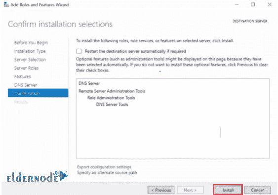

等待**安装**然后点击关闭。

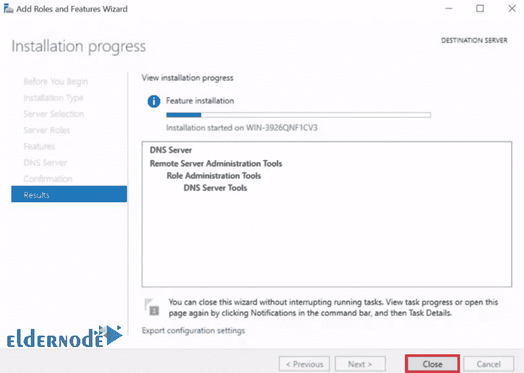

**亦作，见:**

[如何在 Windows Server 2012 R2 版中配置 DNS 转发](https://eldernode.com/dns-forwarding-in-windows-server-2012/)

[Windows、MacOS & Linux](https://eldernode.com/flush-dns-cache-in-windows-macos-linux/) 如何刷新 DNS 缓存

[教程清除本地 DNS 缓存](https://eldernode.com/clear-local-dns-cache/)

**尊敬的用户**，我们希望您能喜欢这个[教程](https://eldernode.com/category/tutorial/)，您可以在评论区提出关于本次培训的问题，或者解决[老年人节点培训](https://eldernode.com/blog/)领域的其他问题，请参考[提问页面](https://eldernode.com/ask)部分，并尽快提出您的问题。腾出时间给其他用户和专家来回答你的问题。

好运。

Goodluck.