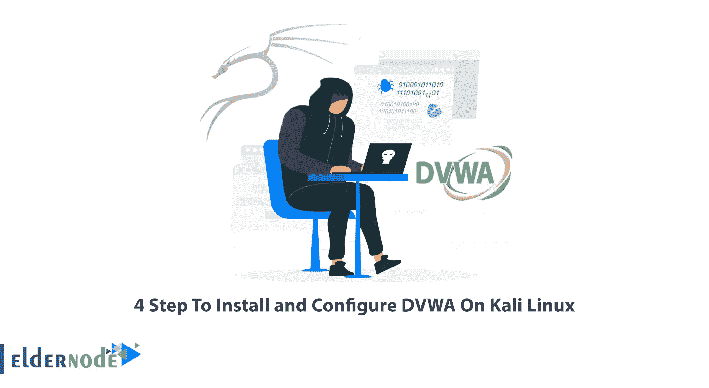
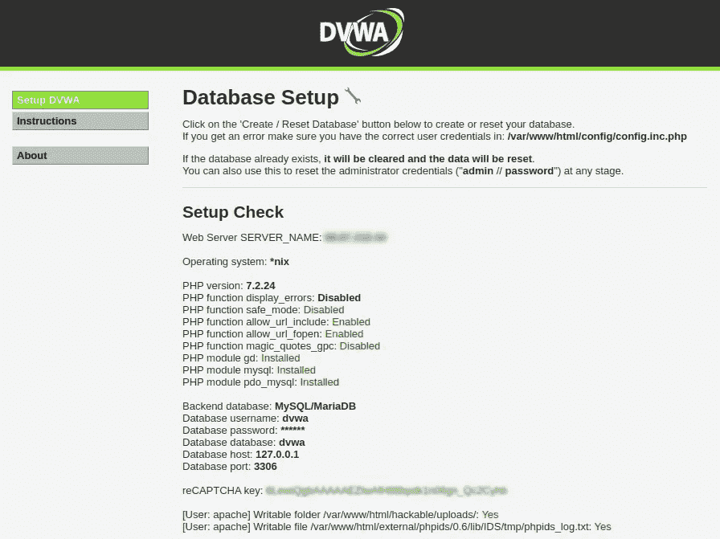
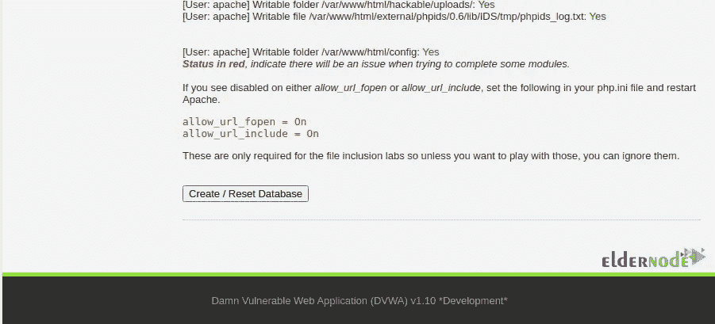
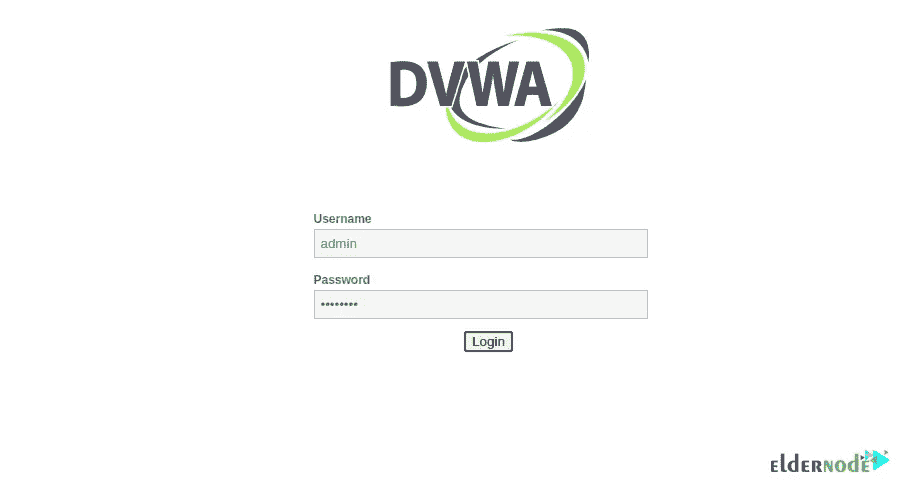
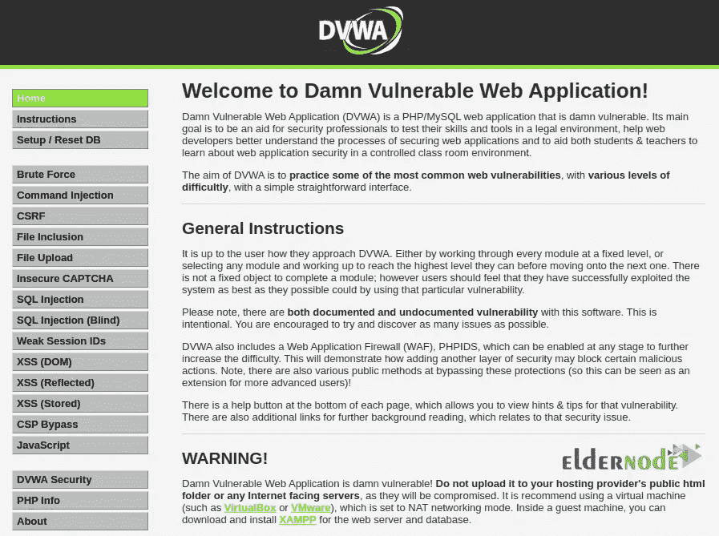

# 在 Kali Linux 上安装和配置 DVWA 的 4 个步骤

> 原文：<https://blog.eldernode.com/install-and-configure-dvwa-on-kali-linux/>



DVWA 包包含一个极易受到攻击的 PHP/MySQL web 应用程序。DVWA 旨在练习一些最常见的网络漏洞，难度各不相同。在本文中，我们试图教你在 Kali Linux 上安装和配置 DVWA 的 4 个步骤。需要注意的是，如果你想[购买 Linux VPS](https://eldernode.com/linux-vps/) ，可以访问 [Eldernode](https://eldernode.com/) 网站上提供的套装。

在这篇文章的剩余部分，跟随我们教你如何用 4 个步骤在 Kali Linux 上安装 DVWA。

### **1)如何在 Kali Linux**T3 上下载 DVWA

通过在第一步中运行以下命令，您可以在/var/www/html 文件夹中克隆 DVWA GitHub:

```
cd /var/www/html
```

然后，您应该使用以下命令克隆 DVWA GitHub 存储库:

```
sudo git clone https://github.com/digininja/DVWA
```

### **2)如何在 Kali Linux 上配置 DVWA**

要配置 DVWA，首先需要使用以下命令设置读取、写入和执行权限:

```
chmod -R 777 dvwa/
```

在下一步中，您需要更改目录来设置用户和密码。注意，这样做将指向 config 目录。最好知道访问数据库的用户和密码的设置已经完成:

```
cd dvwa/config
```

通过运行 ls 命令，您将看到默认 DVWA 设置所在的 config.inc.php.dist 文件。

```
ls
```

在这里，创建一个名为 config.inc.php 的副本就足够了:

```
sudo cp config.inc.php.dist config.inc.php
```

使用您想要的文本编辑器，像下面这样打开配置文件:

```
sudo nano config.inc.php
```

需要注意的是，我们将设置 **db_user** 为用户， **db_password** 为密码。应用更改后，按 **ctrl+o** 保存文件并退出。

```
$_DVWA[ 'db_server' ] = '127.0.0.1';
```

```
$_DVWA[ 'db_database' ] = 'DVWA';
```

```
$_DVWA[ 'db_user' ] = 'user';
```

```
$_DVWA[ 'db_password' ] = 'pass';
```

```
$_DVWA[ 'db_port'] = '3306';
```

### **3)如何在 Kali Linux 上安装 MySQL 和 PHP**

在本节中，我们将分别安装和配置 MySQL、PHP 和 Apache。需要注意的是，默认情况下，MySQL 安装在 [Kali Linux](https://blog.eldernode.com/install-and-configure-kali-linux-on-vps/) 上。但是您可以使用以下命令安装它:

```
sudo apt install default-mysql-server
```

现在，您需要通过运行以下命令来启动 MySQL:

```
sudo service mysql start
```

通过运行以下命令检查 MySQL 安装状态:

```
systemctl mysql status
```

现在，您可以通过运行以下命令登录到 [MySQL](https://blog.eldernode.com/how-to-install-mysql-on-centos-8/) 数据库:

```
sudo mysql -u root -p
```

在下一步中，你会看到一个输入密码的信息，你只需按下**回车**即可。

正如您之前看到的，我们在 DVWA 应用程序的配置文件中创建了一个新用户，并提供了用户名和密码。请注意，我们使用的服务器是 Localhost (127.0.0.1)。您可以使用以下命令再次执行这些步骤:

```
create user 'user'@'127.0.0.1' identified by 'pass';
```

创建新用户后，您现在可以使用以下命令授予新用户对 dvwa 数据库的权限:

```
grant all privileges on dvwa.* to 'user'@'127.0.0.1' identified by 'pass';
```

最后，运行下面的命令来**退出 Mysql** :

```
exit
```

**PHP** 和 [Mysql](https://blog.eldernode.com/install-mysql-on-linux-ubuntu-20-04/) 一样在 Kali Linux 中也有，但是遇到问题可以通过运行以下命令来安装:

```
sudo apt update
```

```
sudo apt -y install lsb-release apt-transport-https ca-certificates
```

```
sudo wget -O /etc/apt/trusted.gpg.d/php.gpg https://packages.sury.org/php/apt.gpg
```

```
echo "deb https://packages.sury.org/php/ buster main" | sudo tee /etc/apt/sources.list.d/php.list
```

```
sudo apt install php7.4 -y
```

您还可以通过运行以下命令来安装额外的 **PHP 扩展**:

```
sudo apt install php7.4-{cli,json,imap,bcmath,bz2,intl,gd,mbstring,mysql,zip}
```

在本节中，要配置 **Apache** 服务器，您必须首先指向所需的目录，如以下命令所示:

```
cd /etc/php/7.4/apache2
```

使用您喜欢的文本编辑器运行以下命令，并打开配置文件:

```
sudo nano php.ini
```

在配置文件中找到以下命令，并按如下方式设置它们。应用更改后，**保存**配置文件并退出。

```
allow_url_fopen = on
```

```
allow_url_include = on
```

最后，通过运行以下命令启动 Apache，然后检查其安装状态:

```
sudo service apache2 start
```

```
systemctl status apache2
```

### **4)如何在 Kali Linux 上访问 DVWA**

仔细遵循本教程中提到的所有步骤后，您现在可以在浏览器中输入以下地址来访问 DVWA:

```
http://127.0.0.1/dvwa/
```

在下图中，你可以看到 DVWA 设置页面。点击**创建/重置数据库**:





在 DVWA 登录页面上输入以下信息

**用户名:**管理员

**密码:**密码



最后，登录后，您将看到如下所示的 DVWA 主页:



## 结论

在本文中，我们试图教您如何在 Kali Linux 上安装和配置 DVWA。我们建议您不要将 DVWA 上传到您的主机提供商的公共 html 文件夹。如果你有任何问题，你可以在评论区和我们分享。