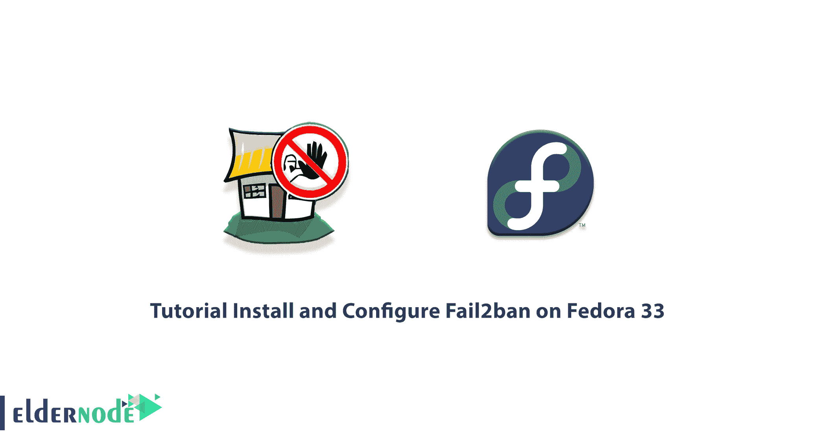

# Fedora 33 - Eldernode 博客上的教程安装和配置 Fail2ban

> 原文：<https://blog.eldernode.com/install-and-configure-fail2ban-on-fedora/>



Fail2ban 是防止暴力攻击的软件。这个软件是用 Python 编写的，可以在本地安装了用户界面或防火墙(如 Iptables 等)的 POSIX 系统上运行。).Fail2ban 会扫描日志文件，寻找意图渗透系统、破坏服务器安全的 IP，找到后会封锁该 IP。服务器管理员为服务器上的每个活动设置时间。例如，每个人最多可以用错误的密码向服务器发送 3 次登录请求。Fail2ban 会阻止超过这个时间限制的人，这样可以防止创建多个涉及服务器处理器的日志。在这篇文章中，我们将教你关于**教程在 Fedora 33** 上安装和配置 Fail2ban。如果你想买一台 **[Linux VPS](https://eldernode.com/linux-vps/)** 服务器，你可以访问 [Eldernode](https://eldernode.com/) 的软件包。

## **如何在 Fedora 33** 上安装和配置 fail 2 ban

任何可以从互联网上访问的服务都有可能受到黑客的攻击。如果您使用的服务有身份验证步骤，机器人或黑客会通过不同的方式输入不同的身份信息来尝试通过这一步骤。

当我们谈到基于 Strix 的 VoIP 电话系统时，星号、ssh、Cyrus、apache、postfix 服务有可能通过暴力攻击或攻击字典渗透到这些系统中。

fail2ban 工具正是为了应对这种攻击而设计的，实际上是一种入侵防御工具。fail2ban 的程序是这样的，如果在某个时间进入服务的请求数量超过指定的限制，该模块将把请求 IP 视为恶意 IP，并将它列入黑名单。这样，通过该 IP 的所有访问都将关闭现有服务。

在本文的剩余部分，我们将教你如何在 Fedora 33 上安装和配置 fail2ban。和我们在一起。

### 什么是 Fail2ban，它有什么作用？

Fail2Ban 是一个日志文件分析器，可以读取和分析您的系统日志文件。同时，根据您为 Fail2Ban 指定的事件和红线，适当地对待攻击者。这个工具是用强大的 Python 语言开发的，所以速度很快。这个工具的缺点是，如果你为它定义了大量的规则，那么由于同时分析几个命令，它可能会使用比通常多一点的服务器硬件资源。所以注意不要给 Fail2Ban 不必要的规则。

Fail2ban 的主要工作是更新服务器的防火墙规则。该工具的工作方式显示出对 web 服务器日志文件的敏感性。例如，如果用户多次输入错误的密码，或试图利用漏洞，或在您的应用程序中发现一个漏洞并导致错误，信息将存储在您的 web 服务器日志中。当然，有些情况需要编码来记录。该工具通过查看日志文件来获取关于每个用户如何工作的信息。现在，如果用户根据其规则怀疑，更新防火墙信息会完全阻止该用户。

请记住，如果用户是恶意的，在登录屏幕被锁定后，它可以攻击您系统的其他部分。但如果此刻他被阻止通过防火墙，他将完全与服务器断开连接。

Fail2ban 的工作方式是在日志文件中定义的设置中查找它的模式。如果发现该模式，它会使用防火墙阻止相应的 IP 地址。在指定的时间过后，移除此 IP 的封锁。

## **在 Fedora 上安装 fail 2 ban 33 | Fedora 32**

在本节中，我们将解释如何在 [Fedora](https://blog.eldernode.com/install-fedora-on-virtualbox/) 33 上安装 Fail2ban。要安装 Fail2ban，只需遵循以下步骤。在第一步中，有必要使用以下命令添加 **EPEL 存储库**:

```
sudo dnf install epel-release -y
```

成功添加 Epel 存储库之后，您现在可以通过运行以下命令轻松地**安装 fail2ban** :

```
sudo dnf install fail2ban -y
```

您现在可以通过运行以下命令来**启动**和**启用** Fail2ban:

```
sudo systemctl enable fail2ban
```

```
sudo systemctl start fail2ban
```

### **如何在 Fedora 上配置 fail 2 ban 33**

在本节中，我们将了解如何配置 Fail2ban。注意，Fail2ban 配置文件位于 **/etc/fail2ban** 中。使用以下命令在您的系统上安装**纳米编辑器**:

```
sudo dnf install nano -y
```

如果您想要创建一个新文件来监视 SSH 登录尝试，您必须使用以下命令:

```
sudo nano /etc/fail2ban/jail.local
```

现在，您需要将以下命令添加到您创建的新文件中:

```
[sshd]  enabled = true  port = 22  filter = sshd  logpath = /var/log/auth.log  maxretry = 3
```

完成上述步骤后，您现在可以**保存**配置文件并退出。然后，要应用更改，您必须通过执行以下命令**重启**系统一次:

```
sudo systemctl restart fail2ban
```

## **如何在 Fedora 上使用 fail 2 ban 33**

在你成功安装并配置了 fail2ban 之后，现在我们想教你如何使用这个软件。在这里，您应该尝试使用另一个使用 SSH 的设备登录到您的网络。然后你会输入 3 次错误的密码。在这种情况下，应该阻止该设备的 IP。然后，您将再次尝试保护 Fedora 设备上的外壳。但是你会看到我们马上就被剥夺了这项工作。

请注意，成功测试系统后，您可以使用以下命令取消测试 IP 地址:

```
sudo fail2ban-client set sshd unbanip IP
```

关于如何使用 Fail2ban 的更多信息，可以参考文章[如何使用 Fail2ban 保护 Linux 服务器](https://blog.eldernode.com/fail2ban-secure-linux-server/)。

## 结论

在本文中，我们试图让您全面了解 Fail2Ban 软件。然后我们一步步教你如何在 Fedora 33 上安装和配置 Fail2ban。需要注意的是，如果愿意可以参考文章[如何在 CentOS 8](https://blog.eldernode.com/install-fail2ban-centos-8/) 上安装 Fail2Ban 保护 SSH。