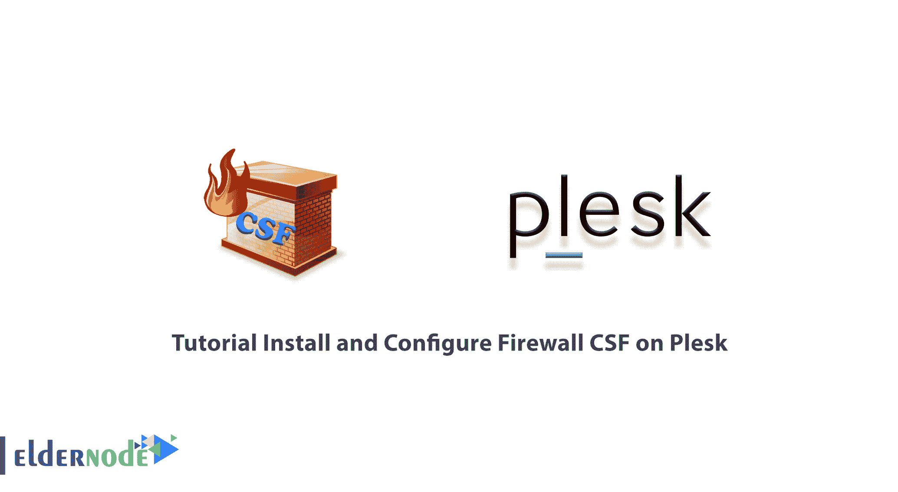

# Plesk - Eldernode 博客上的教程安装和配置防火墙 CSF

> 原文：<https://blog.eldernode.com/install-and-configure-firewall-csf-on-plesk/>



CSF 代表 ConfigServer 安全和防火墙。这个非常强大的免费 CSF 软件防火墙已经发布，并通过 Web 团队的方式提供给公众。这个防火墙是针对基于 Linux 的发行版的。CSF 接口被集成到流行的 Linux 控制面板中，如 Cpanel、Directadmin 和 Plesk。在本文中，我们将首先向您全面介绍 CSF 防火墙。然后我们会教你关于**教程在 Plesk** 上安装和配置防火墙 CSF。如果你想买一个 [VPS 托管](https://eldernode.com/vps-hosting/)服务器，你可以在 [Eldernode](https://eldernode.com/) 看到可用的包。

## **如何在 Plesk** 上安装配置防火墙 CSF

防火墙对于确保 Plesk 服务器的安全至关重要。CSF 是一款免费的防火墙，可以安装在您的 Plesk 服务器上，作为 Plesk 防火墙的替代产品。CSF 是服务器托管的综合安全解决方案，可以轻松集成到 Plesk UI 中。这就是为什么我们想教你如何在 [Plesk](https://blog.eldernode.com/tag/plesk/) 上安装和配置防火墙 CSF。请继续关注本文的其余部分。

### **防火墙 CSF 介绍**

CSF 是 [Linux](https://blog.eldernode.com/tag/linux/) 操作系统中最流行和最强大的 IPtables 管理防火墙之一，由配置服务器免费开源提供。CSF 负责保护服务器，顾名思义，是防止各种攻击的防火墙，其中最重要的是 syn flood、DDoS 和[蛮力](https://blog.eldernode.com/block-ip-of-brute-force-by-csf/)。

这种防火墙为服务器安全提供了许多功能。它还会定期检查失败登录尝试的报告，并能够检测大多数未经授权访问您的服务器的尝试。因此您可以在 CSF 配置文件中设置您想要的安全措施。

此功能支持以下应用程序:

1.信差 IMAP，多佛，你的 IMAP

2.OpenSSH

3.纯 ftpd、vsftpd、Proftpd

4.受密码保护的网页(Htpasswd)

5.Mod _ 安全故障(v1 和 v2)

6.苏霍辛失败

7.进出口 SMTP 授权

此外，您可以创建自己的日志文件。

### **在 Plesk** 上安装防火墙 CFS 的前提条件

在 Plesk 上开始安装和配置防火墙 CSF 之前，您应该准备好 CSF 依赖项。因为 CSF 是基于 Perl 的，所以您需要在服务器上安装它才能开始。您必须有 Wget 来下载 CSF 安装程序以及 vim 或您选择的编辑器，如 [Nano](https://blog.eldernode.com/how-to-install-and-use-nano-text-editor/) 来修改 CSF 配置文件。

因此，您必须使用以下命令安装软件包:

```
yum install wget vim perl-libwww-perl.noarch perl-Time-HiRes
```

## **在 Plesk 上安装防火墙 CSF**

现在您已经有了 CSF 预安装的依赖项，是时候安装它了。第一步是转到 **/usr/src/** 文件夹，使用以下命令加载 CSF:

```
cd /usr/src/
```

```
wget https://download.configserver.com/csf.tgz
```

然后，您必须使用以下命令提取**tar.gz**文件，并转到 CSF 列表。然后在下一步中，安装 tar.gz 文件:

```
tar -xzf csf.tgz
```

```
cd csf
```

```
sh install.sh
```

成功安装 CSF 后，您现在应该检查 CSF 是否按需要在此服务器上工作。因此，您必须使用以下命令转到 **/usr/local/csf/bin/** 目录:

```
cd /usr/local/csf/bin/
```

现在，您需要通过运行以下命令来运行" **csftest.pl** ":

```
perl csftest.pl
```

最后，如果您看到以下答案，您可以确定 CSF 在您的服务器上正常工作:

```
RESULT: csf should function on this server
```

### **如何在 Plesk** 上配置防火墙 CSF

需要注意的重要一点是，在进入 CSF 配置流程之前，您应该知道 [CentOS](https://blog.eldernode.com/tag/centos/) 7 默认防火墙程序“Firewalld”应该被停止并从启动中删除。因此，您必须使用以下命令来停止它:

```
systemctl stop firewalld
```

您也可以使用以下命令禁用防火墙并将其从启动中删除:

```
systemctl disable firewalld
```

您现在可以开始配置 CSF 了。第一步是转到 CSF 配置目录 **/etc/csf/** ，使用想要的编辑器修改“ **csf.conf** 文件。为此，请使用以下命令:

```
cd /etc/csf/
```

```
vim csf.conf
```

然后，您需要将第 11 行"**测试**更改为" 0 "，如以下命令所示，以配置 CSF 防火墙:

```
TESTING = “0”
```

注意，默认情况下，CSF 为标准的 **SSH 22 端口**提供输入和输出流量，因此如果您想要使用一个替代的 SSH 端口，您需要将您想要的端口添加到第 139 行“ **TCP_IN** ”。然后，您需要像下面这样启动 CSF 和 LFD:

```
systemctl start csf
```

```
systemctl start lfd
```

在下一步中，您可以设置 **CSF** 和 **LFD** 服务在引导时启动:

```
systemctl enable csf
```

```
systemctl enable lfd
```

最后，您可以使用以下命令默认查看 CSF 列表:

```
csf -l
```

如果您想进行更高级的配置，请遵循本节内容。返回 csf 配置列表，使用以下命令修改 **csf.conf** 配置文件:

```
cd /etc/csf/
```

```
vim csf.conf
```

如果你想确保 **CSF.allow** 中的某个特定 IP 永远不会被 LFD 屏蔽，找到命令“ **IGNORE_ALLOW** ，将其值改为“ **1** ”:

```
IGNORE_ALLOW = "1"
```

您可以使用以下命令**启用 ICMP** 输入和输出:

```
ICMP_IN = "1"
```

```
ICMP_OUT = "1"
```

CSF 允许您拒绝或允许通过 CIDR(国家代码)进入某些国家。借助以下命令，您可以阻止或允许访问国家/地区:

```
CC_DENY = "CN,UK,US"
```

```
CC_ALLOW = "ID,MY,DE"
```

## 结论

使 CSF 防火墙流行的特性之一是对服务器内容的更好的管理，例如端口管理、连接管理、进程管理等等。通过安装这种防火墙，您可以完全关闭 FirewallD 或 Iptables 服务。在本文中，我们试图教您如何在 Plesk 上安装和配置防火墙 CSF。