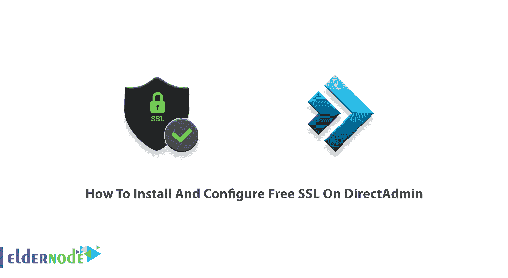
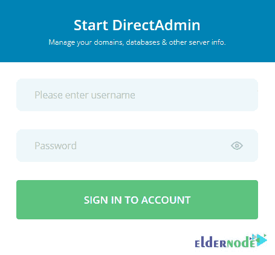
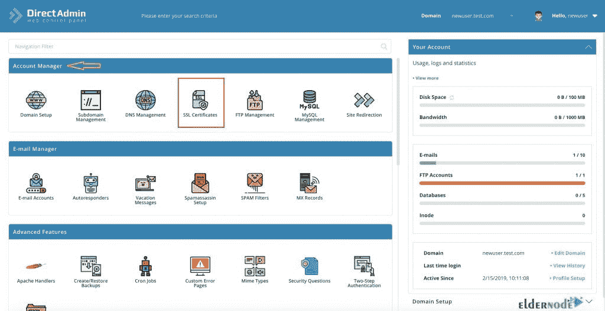
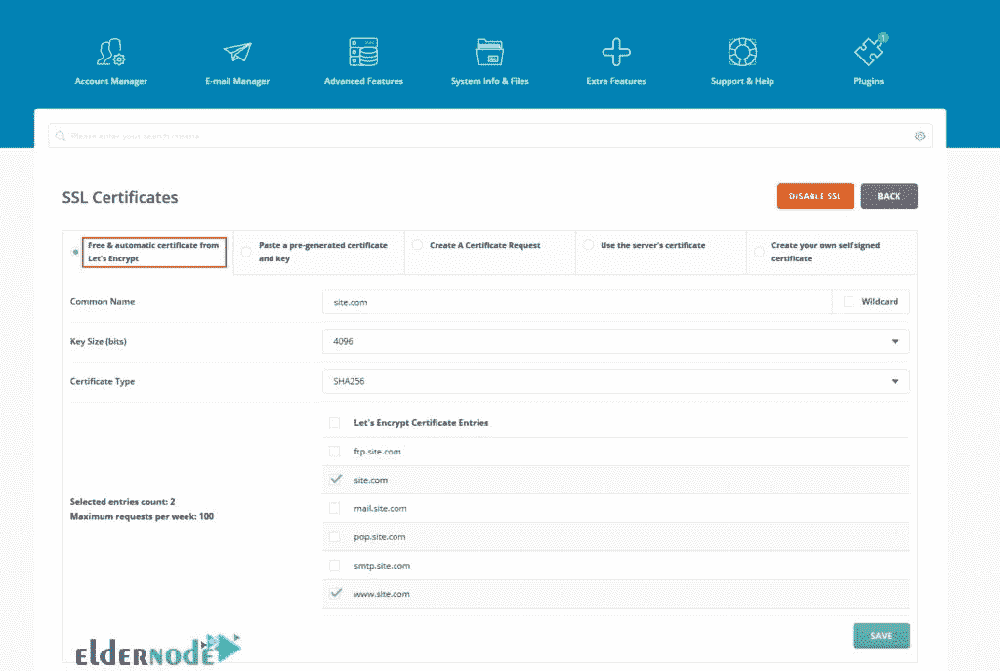
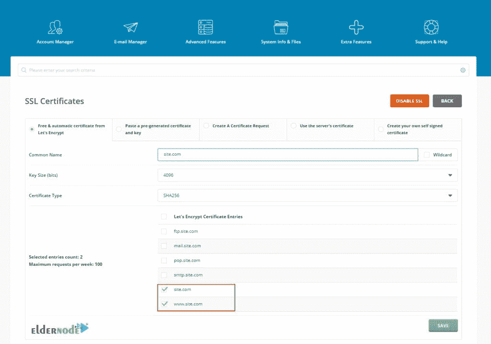
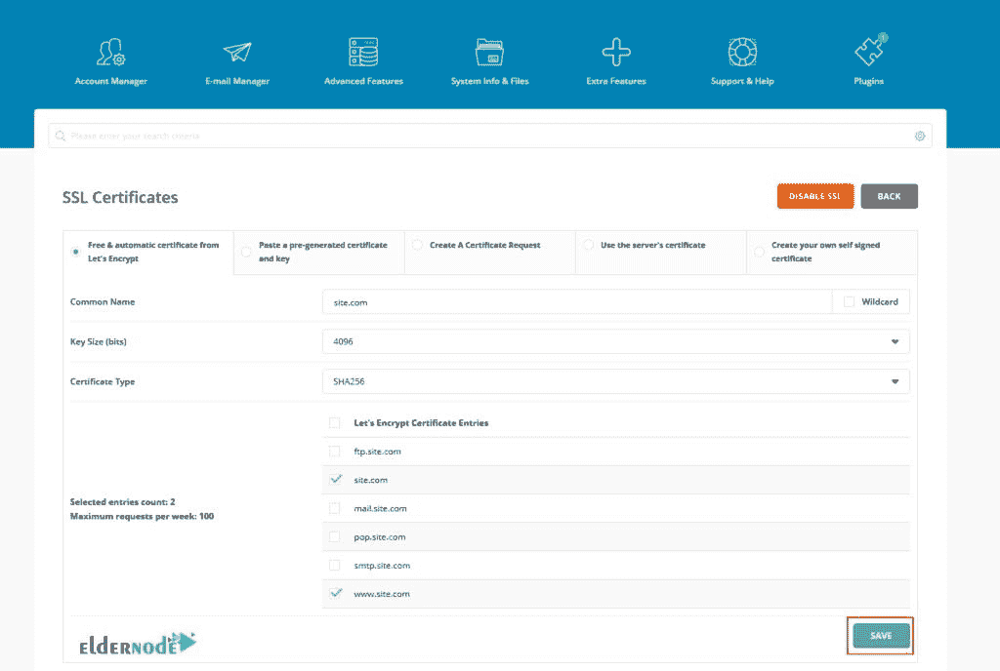
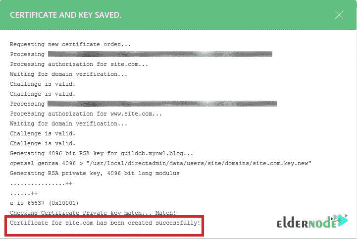

# 如何在 DirectAdmin - Eldernode 博客上安装和配置免费 SSL

> 原文：<https://blog.eldernode.com/install-and-configure-free-ssl-on-directadmin/>

DirectAdmin 是发展最快的图形虚拟主机控制面板。使用 DirectAdmin，您可以管理管理员、经销商或普通用户级别的网站。如果您希望您的信息对除了您发送信息的服务器之外的任何人都不可读，您必须使用 SSL 证书。网站 URL 的 HTTP 和 HTTPS 的区别在于 SSL。HTTPS 的“s”代表安全加密，只有 SSL 证书才能保证安全。让我们为任何网站提供免费的 SSL 证书。DirectAdmin 完全支持加密插件。在本文中，您将学习如何在 DirectAdmin 上安装和配置免费的 SSL。要购买您自己的 [DirectAdmin VPS](https://eldernode.com/directadmin-vps-server/) ，请访问 [Eldernode](https://eldernode.com/) 并订购您确切需要的产品。

## **教程在 DirectAdmin** 上安装和配置免费 SSL

[DirectAdmin](https://blog.eldernode.com/tag/directadmin/) 运行在 Linux 系统和 Redhat、CentOS、FreeBSD 和 Debian 版本上。作为网站所有者，你可以为你的访问者提供完全免费的加密 HTTPS 连接，因为“让我们加密”推出了免费的 SSL 证书。在下一节中，我们将解释加密和 SSL 证书。然后我们会一步一步教你如何在 DirectAdmin 上安装和配置免费 SSL。请加入我们。

### **什么是咱们加密和 SSL 证书？**

Let's Encrypt 是一个免费的、自动化的、开放的认证机构，由 T2 互联网 T4 安全研究小组运营。该证书颁发机构通过免费的 SSL 证书提供在线安全。来自 Let's Encrypt 的**S**secure**S**ockets**L**ayer 证书有效期仅为 90 天，而付费 SSL 证书的最低有效期为 2 年。

为了保护/加密您的站点和您的客户之间的敏感通信，您可以使用 **SSL 认证**作为您安装在服务器上的带有加密数据的文本文件。此外，有两种类型的 SSL 证书:

**1。商业(付费)SSL 证书**

**2。免费 SSL 证书**

在本指南的以下内容中，您将了解如何在 DirectAdmin 上安装和配置免费 SSL。

### **在 DirectAdmin 上安装免费 SSL 的先决条件**

为了让本教程更好地工作，请考虑以下先决条件:

_ 有权访问您的 DirectAdmin 帐户。

SSL 功能必须在 DirectAdmin 帐户中处于活动状态。

## **在 DirectAdmin** 上安装并配置免费 SSL

DirectAdmin 支持让我们加密。使用 DirectAdmin 特性，无需购买昂贵的 SSL 证书就可以保护您的域。

您可以在 DirectAdmin 上安装来自 Let's Encrypt 的免费 SSL 证书。让我们浏览一下本指南的步骤，在 DirectAdmin **上安装和配置免费的 SSL。**

首先，在 DirectAdmin 上登录您的帐户:

在那里，当选项加载时，你可以在**账户管理器**下看到一个名为 **SSL 证书**的选项。单击它将带您进入 SSL 界面:

现在，从“让我们加密”选项卡中点击**免费的&自动证书 LetsEncrypt** :

如您所见，条目“mydomain.com”和“www.mydomain.com”被默认选中。所以，选择那些必要的。

然后，它将向您展示一系列选项，例如选择一个通配符 SSL，它可以方便地用于各种用例，并保护您所有的子域和别名。使用通配符 SSL 证书可以让您节省大量工作，因为它将保护您的整个网站以及所有相关的子域。如果安装通配符 SSL，则必须为您创建的每个子域安装证书。

如果不想安装通配符 SSL，可以在创建子域时手动安装 SSL。但是，如果你不需要或不了解他们的功能，就不要更换他们。

点击**保存**提交更改并生成加密 SSL 证书。SSL 在服务器上安装大约需要 30 分钟(取决于所选条目的数量):

一旦您可以查看类似于下图的表格，就意味着所有过程都已完成:

就是这样！如果一切正常，你的网站会显示绿色挂锁，chrome 会显示你的网站是安全的。绿色 SSL 挂锁只会在您通过 HTTPS 协议访问您的网站时出现。但是您可以通过选中复选框来强制您的站点使用 SSL。

## 结论

在本文中，您了解了如何在 DirectAdmin 上安装和配置免费的 SSL。如果您已经正确地通过了所有必需的步骤，现在您应该能够用一个让我们加密 SSL 证书来打开您的站点了。