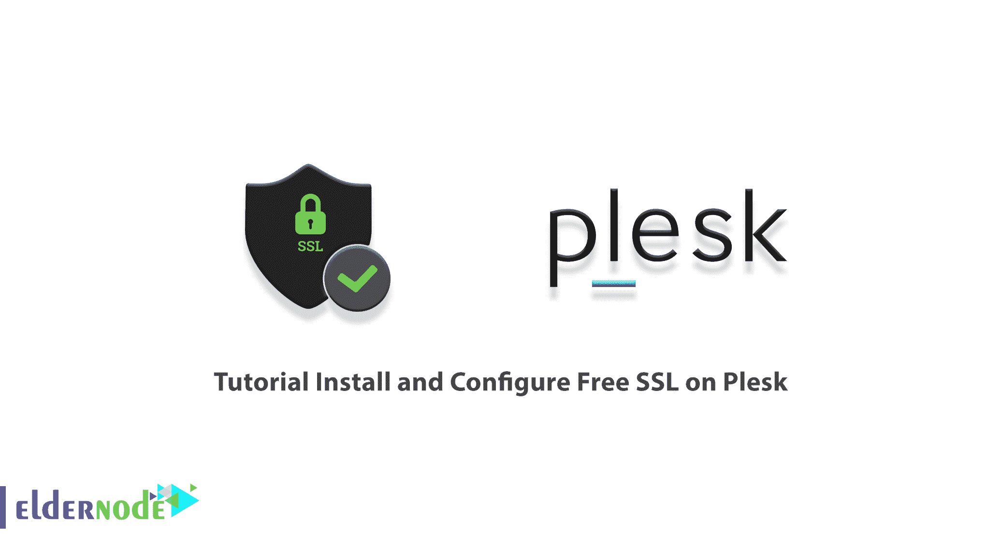
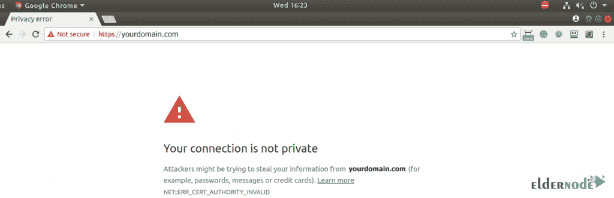
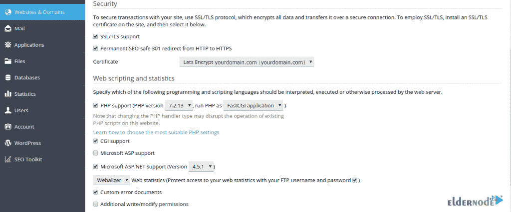
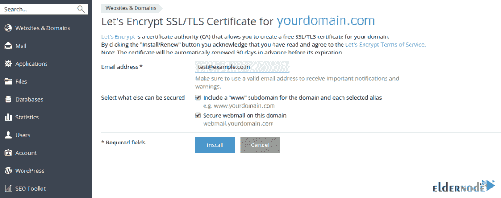
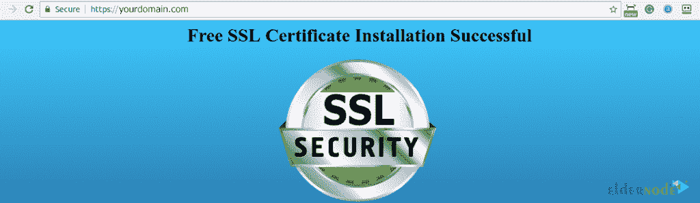

# 教程在 Plesk - Eldernode 博客上安装和配置免费 SSL

> 原文：<https://blog.eldernode.com/install-and-configure-free-ssl-on-plesk/>

随着网站的出现和网络活动的扩展，互联网用户希望使用为他们提供良好安全性的网站。网站所有者可以做的事情之一是激活 SSL 来保护他们的网站和客户。SSL 实际上是一种安全证书，它对网站上输入的数据进行加密，以保护人们的安全。但是这里的问题是如何启用 SSL？在本文中，我们想一步一步地向您介绍如何在 Plesk 上安装和配置免费 SSL。如果你想购买一台 **[VPS 托管](https://eldernode.com/vps-hosting/)** 服务器，你可以访问 [Eldernode](https://eldernode.com/) 中提供的软件包。

## **教程在 Plesk 上安装和配置免费 SSL**

在客户端和服务器之间建立安全连接的一种方法是使用 SSL 加密。SSL 证书代表套接字安全层，它是用于安全传输数据的安全连接层。由于这个原因，许多用户更喜欢使用能够提供良好信息[安全性](https://blog.eldernode.com/tag/security/)的网站。

重要和敏感的信息，如用户个人信息、信用卡信息和大量数据，如果泄露，可能会对客户和网站所有者造成不可挽回的损失，这些信息都以加密的形式进行交换。

要确定网站上是否启用了 SSL，您需要查看网站 URL。如果网站链接以 HTTPS 开始，您可以看到该网站的 SSL 激活过程已经完成。

在这篇文章的续篇中，加入我们来教你如何在 [Plesk](https://blog.eldernode.com/tag/plesk/) 上设置免费的 SSL。

### **什么是免费 SSL，它有什么作用？**

Let's Encrypt 是一个免费的安全证书，由一个互联网安全研究小组(ISRG)于 2014 年首次发布，并受到高度好评。这项服务允许您在任何网站上安装免费的数字证书。让我们加密加密您的网站和浏览器之间的信息传输，并增加您的网站上的信息交换的安全性。

另外，如果你把网站的内部链接全部改成 HTTPS，在所有浏览器的地址栏里，你的网站地址上会显示一个绿色的条，让用户和访客放心。

由于安全性在网站中的重要性，免费使用 SSL 安全证书在网站领域创造了大量粉丝。本证书每 3 个月颁发一次，需要每 3 个月重新颁发一次。既然存在安全问题，那么在这种情况下，就要注意这个证书在安全性上和其他证书没有区别，它的签发公司是 Let's Encrypt。

## **如何在 Plesk** 上安装和配置免费 SSL

第一步是检查你的网站网址。如果您的网站 URL 显示“HTTP”，这意味着您的网站没有 SSL 证书。此外，如果你的网址显示“HTTPS”，这意味着你的网站是安全的。

现在是时候使用 let 加密服务来保护您的网站了。这一步是**登录 Plesk** ，点击**网站&域名**的侧边栏。查看完这些选项后，您的窗口将显示如下:

在安全性部分，您有两个选项可以启用，这两个选项可用于网站的安全性。

**1。对 SSL/TLS 的支持:**

SSL/TLS 通过加密客户端和服务器之间的连接来保护敏感数据。这非常重要，它建议您使用 SSL/TLS 证书来保护您的网站或电子邮件。

**2。永久 SEO-safe 301 从 HTTP 重定向到 HTTPS:**

如果您的网站不安全，由 HTTPS，一种方法是可用于该领域。你可以用 301 重定向来重定向你的域名。301 重定向是一种永久性重定向，将排名权力传递给被重定向的页面。这是在网站上实现重定向的最佳方式。

现在，你需要去**网站&域名**点击**让加密**进行更多设置。然后在指定字段输入您的**电子邮件**。Lets Encrypt authority 允许您使用 SSL/TLS 为您的域创建免费证书。通过单击**安装或续订**按钮，您确认已经阅读并同意让我们加密条款和服务。

***注意:*** 要同时启用 www 和暂留域的 SSL，请选择第一个选项(包括“www”…)。此外，为电子邮件面板访问地址选择第二个选项(Secure webmail…)以使用 SSL。

一旦你成功地完成了所有的虚拟主机和加密设置，你现在应该去另一个标签，并输入帐户名。然后你会看到这种类型的安全网址“HTTPS”。

## 结论

自从谷歌宣布 HTTPS 对其搜索引擎优化和结果(SERPS)的影响，网站管理员开始购买这种类型的加密协议。谷歌的目标是保护网络环境，从而鼓励网站管理员从 HTTP 迁移到 HTTPS。在本文中，我们试图一步一步地教您如何在 Plesk 上安装和配置免费 SSL。