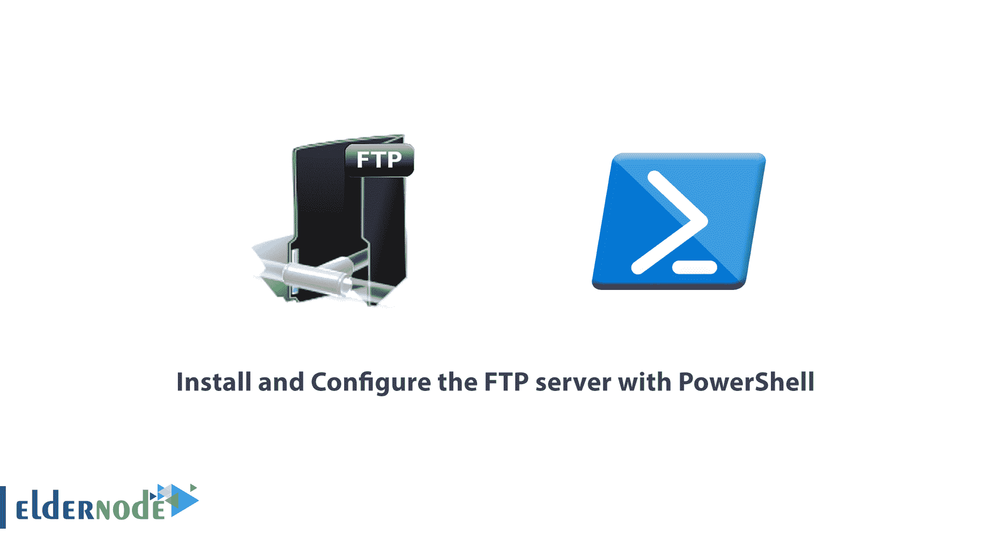

# 如何用 PowerShell 安装和配置 FTP 服务器- ElderNode Blog

> 原文：<https://blog.eldernode.com/install-and-configure-ftp-server/>



如何用 [PowerShell](http://eldernode.com/tag/powershell-commands/) 安装配置 [FTP](https://en.wikipedia.org/wiki/File_Transfer_Protocol) 服务器？我们已经在之前的教程中用图形方式考察了[如何在 Windows Server 2019](https://eldernode.com/install-ftp-server-on-windows-server/) 中安装 FTP 服务器，而在本文中的，我们将教你如何用 PowerShell 来做到这一点。

我们将向您展示如何配置**站点名称**、**端口**和**根文件夹**。然后我们将解释如何创建 FTP 用户，如何认证用户，以及如何配置 SSL 策略和 NTFS 权限。

[***elder node 中可用的 VPS 服务器***](https://eldernode.com/vps/)

### 如何安装 FTP 功能

在开始配置您的 FTP 服务器之前，您首先需要安装所需的 Windows 功能:

**1)** FTP

**2)** Web 服务器(IIS)

**3)** 管理工具用 PowerShell 进行管理

```
# Install the Windows feature for FTP  Install-WindowsFeature Web-FTP-Server -IncludeAllSubFeature  Install-WindowsFeature Web-Server -IncludeAllSubFeature IncludeManagementTools
```


安装完成后，导入 WebAdministration 模块。

这将映射一个互联网信息服务 ( **IIS** )驱动器( IIS:\ )，通过它我们将配置我们的 **FTP 站点**，稍后在本文中。

```
# Import the module  Import-Module WebAdministration
```

### 如何配置站点名称、端口和根文件夹

您可以使用 New-WebFtpSite cmdlet 创建一个新的 **FTP 站点，方法是为您的 FTP 站点提供一个 FTP 站点名称、根文件夹和端口号。**

**注意:** 我们选择的是端口 21 ，这是默认的 FTP 端口，但是您也可以为您的 FTP 站点指定任何自定义端口。

```
# Create the FTP site  $FTPSiteName = 'Default FTP Site'  $FTPRootDir = 'D:\FTPRoot'  $FTPPort = 21  New-WebFtpSite -Name $FTPSiteName -Port $FTPPort -PhysicalPath $FTPRootDir
```


运行完 cmdlet 后，你会在 [IIS 管理器](https://eldernode.com/configure-default-site-in-iis-server/)中看到 **FTP 站点**和绑定。


### 如何创建 FTP 用户

创建一个新的 **FTP 站点**后，您可以创建一个 Windows 用户或组，通过它您可以控制对 **FTP 服务器**的访问。

**首先**，创建 Windows 本地组:

```
# Create the local Windows group  $FTPUserGroupName = "FTP Users"  $ADSI = [ADSI]"WinNT://$env:ComputerName"  $FTPUserGroup = $ADSI.Create("Group", "$FTPUserGroupName")  $FTPUserGroup.SetInfo()  $FTPUserGroup.Description = "Members of this group can connect through FTP"  $FTPUserGroup.SetInfo()
```

然后我们将**创建**一个新的本地 FTP 用户，使用**用户名**和**密码**:

```
# Create an FTP user  $FTPUserName = "FTPUser"  $FTPPassword = '[[email protected]](/cdn-cgi/l/email-protection)'  $CreateUserFTPUser = $ADSI.Create("User", "$FTPUserName")  $CreateUserFTPUser.SetInfo()  $CreateUserFTPUser.SetPassword("$FTPPassword")  $CreateUserFTPUser.SetInfo()
```

**将 FTP 用户的**添加到 Windows 组:

```
# Add an FTP user to the group FTP Users  $UserAccount = New-Object System.Security.Principal.NTAccount("$FTPUserName")  $SID = $UserAccount.Translate([System.Security.Principal.SecurityIdentifier])  $Group = [ADSI]"WinNT://$env:ComputerName/$FTPUserGroupName,Group"  $User = [ADSI]"WinNT://$SID"  $Group.Add($User.Path)
```


### 如何认证 FTP 用户访问 FTP 服务器数据

现在**在 **FTP 站点**上启用**基本认证，并授权包含 FTP 用户的 Windows 组访问 FTP 站点。

```
# Enable basic authentication on the FTP site  $FTPSitePath = "IIS:\Sites\$FTPSiteName"  $BasicAuth = 'ftpServer.security.authentication.basicAuthentication.enabled'  Set-ItemProperty -Path $FTPSitePath -Name $BasicAuth -Value $True  # Add an authorization read rule for FTP Users.  $Param = @{  Filter = "/system.ftpServer/security/authorization"  Value = @{  accessType = "Allow"  roles = "$FTPUserGroupName"  permissions = 1  }  PSPath = 'IIS:\'  Location = $FTPSiteName  }  Add-WebConfiguration @param
```


你也可以在 IIS 管理器 > > FTP 站点>>FTP 授权规则下**查看**这些设置。


### FTP 根文件夹的 SSL 策略和 NTFS 权限

将 SSL 策略从要求 SSL 更改为允许 SSL 连接。

```
$SSLPolicy = @(  'ftpServer.security.ssl.controlChannelPolicy',  'ftpServer.security.ssl.dataChannelPolicy'  )  Set-ItemProperty -Path $FTPSitePath -Name $SSLPolicy[0] -Value $false  Set-ItemProperty -Path $FTPSitePath -Name $SSLPolicy[1] -Value $false
```


下面的命令在 FTPRoot 文件夹上设置 **NTFS 权限**，允许 FTP 用户组访问文件:

```
$UserAccount = New-Object System.Security.Principal.NTAccount("$FTPUserGroupName")  $AccessRule = [System.Security.AccessControl.FileSystemAccessRule]::new($UserAccount,  'ReadAndExecute',  'ContainerInherit,ObjectInherit',  'None',  'Allow'  )  $ACL = Get-Acl -Path $FTPRootDir  $ACL.SetAccessRule($AccessRule)  $ACL | Set-Acl -Path $FTPRootDir
```


你可以从安全标签下的 FTP 根文件夹属性中**验证**这一点。


```
# Restart the FTP site for all changes to take effect  Restart-WebItem "IIS:\Sites\$FTPSiteName" -Verbose
```

您可以测试 **FTP 服务器**，它应该允许您访问 **FTP 根文件夹**下的文件、内容和目录。


**亦作，见:**

[教程在 Windows Server 2019 上添加 FTP 站点](https://eldernode.com/add-ftp-site-on-windows-server/)

[如何在 XAMPP 创建 FTP](https://eldernode.com/create-ftp-in-xampp/)

[如何在 windows server 2019 上安装 FTP 服务器](https://eldernode.com/install-ftp-server-on-windows-server/)

**尊敬的用户**，我们希望您能喜欢这个[教程](https://eldernode.com/category/tutorial/)，您可以在评论区提出关于本次培训的问题，或者解决[老年人节点培训](https://eldernode.com/blog/)领域的其他问题，请参考[提问页面](https://eldernode.com/ask)部分，并尽快提出您的问题。腾出时间给其他用户和专家来回答你的问题。

如何用 PowerShell 安装和配置 FTP 服务器

好运。