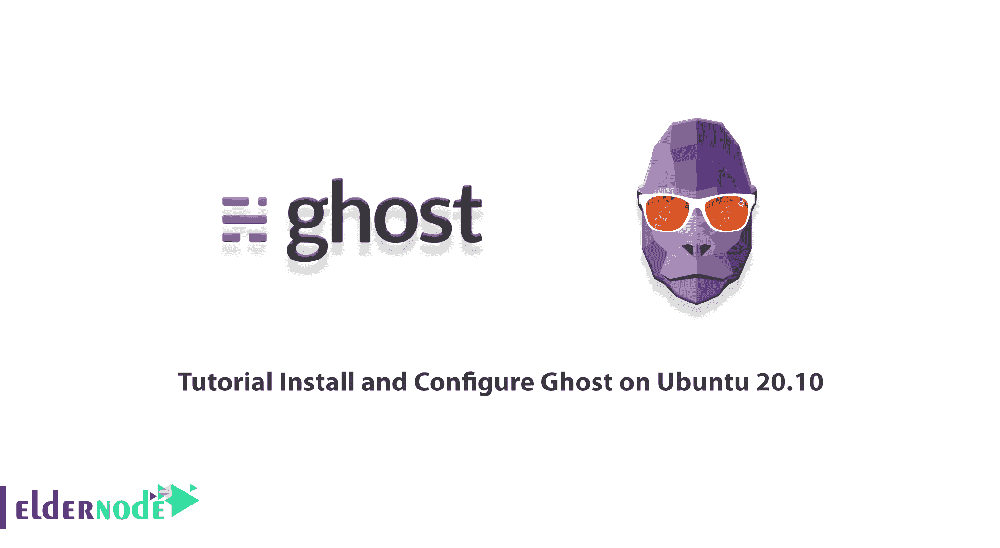
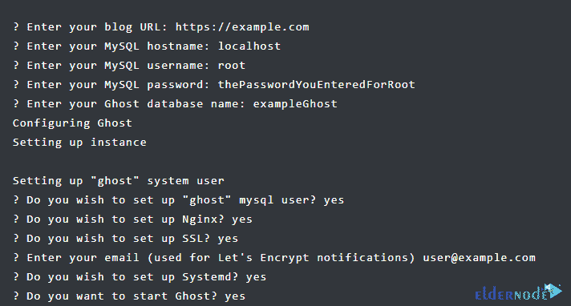

# 教程在 Ubuntu 20.10 上安装和配置 Ghost-elder node 博客

> 原文：<https://blog.eldernode.com/install-and-configure-ghost-on-ubuntu/>



Ghost 是一个免费的开源博客平台。这个工具是用 JavaScript 编写的，在 MIT 许可下分发。Ghost 旨在简化特定博客的在线发布过程以及在线发布。Ghost 平台的概念最早于 2012 年 11 月由项目创始人约翰·奥诺兰在博客中发表。Ghost 是用 Node.js、服务器端 JavaScript 执行引擎和 Ember.js 管理客户端编写的。在这篇文章中，我们试着教你关于**教程在 Ubuntu 20.10 上安装和配置 Ghost**。如果你想购买一台 [Ubuntu VPS](https://eldernode.com/ubuntu-vps/) 服务器，你可以访问 [Eldernode](https://eldernode.com/) 中提供的软件包。

## **如何在 Ubuntu 20.10 上安装配置 Ghost**

下一节，我们将列出在 [Ubuntu](https://blog.eldernode.com/tag/ubuntu/) 20.10 上安装 Ghost 的先决条件。然后我们会一步步教你如何安装、配置和使用 Ghost。请加入我们。

### **在 Ubuntu 20.10 上安装 Ghost 的先决条件**

想要在 Ubuntu 20.10 上安装 Ghost 之前，需要安装和准备一些必备的东西。这些先决条件是:

用于 SSL 的 _ NGINX

_ node . js 的支持版本

_ MySQL 5.7 或 8.0

_ Systemd

_ 至少 1GB 内存的服务器

_ 已注册的域名

***注意:*** 在开始之前，您应该从您的域设置一个工作 DNS A-Record，指向服务器的 IP 地址。这必须提前完成，以便可以在设置过程中配置 SSL。

以下是安装 **Ghost-CLI** 的所有先决条件。你必须首先创建一个**新用户**。为此，您必须以 root 用户身份登录到您的服务器:

```
ssh [[email protected]](/cdn-cgi/l/email-protection)your_server_ip
```

```
adduser <user>
```

现在，您需要使用以下命令将用户添加到超级用户组，以打开管理员权限:

```
usermod -aG sudo <user>
```

现在，您可以使用以下命令作为新用户登录:

```
su - <user>
```

最后，使用以下命令更新“包列表”和“已安装的包”:

```
sudo apt-get update
```

```
sudo apt-get upgrade
```

### **在 Ubuntu 20.10 上安装 Nginx**

在这一节，我们将教你如何在 Ubuntu 20.10 上安装 Nginx。因为 Ghost 使用 NGINX 服务器，所以 SSL 配置需要 NGINX 1.9.5 或更高版本。因此，您可以使用以下命令来完成此操作:

```
sudo apt-get install nginx
```

需要注意的是，如果启用了 ufw，防火墙将允许 HTTP 和 HTTPS 连接。您可以使用以下命令打开防火墙:

```
sudo ufw allow 'Nginx Full'
```

### **在 Ubuntu 20.10 上安装 MySQL**

成功安装 Nginx 后，现在是安装 MySQL 的时候了。使用以下命令，您可以安装 MySQL 来创建数据库:

```
sudo apt-get install mysql-server
```

需要密码来确保 MySQL 与 **Ghost-CLI** 的兼容性。因此，您必须使用以下命令来设置密码:

```
sudo mysql
```

现在，您应该用您的密码替换'**密码**:

```
ALTER USER 'root'@'localhost' IDENTIFIED WITH mysql_native_password BY 'password';
```

然后用下面的命令退出 MySQL:

```
quit
```

现在，您可以使用以下命令再次登录您的 Ubuntu 用户:

```
su - <user>
```

### **在 Ubuntu 20.10 上安装 node . js**

在这一节，我们将教你如何[在 Ubuntu](https://blog.eldernode.com/install-and-config-node-js-on-ubuntu-20-04/) 20.10 上安装 Node.js。请注意，您必须在系统级别安装受支持的 Node 版本，如下所述。第一步是为节点添加节点源 APT 存储库:

```
curl -sL https://deb.nodesource.com/setup_14.x | sudo -E bash
```

然后，您需要使用以下命令安装 Node.js:

```
sudo apt-get install -y nodejs
```

下一节，加入我们，一步一步教你如何在 Ubuntu 20.10 上安装 Ghost。

## **如何在 Ubuntu 20.10 上安装 Ghost**

在开始安装之前，我们必须指出，您需要在第一步中使用 Ghost-CLI 工具安装 npm 模块，以便于 Ghost 的使用和配置。请注意，npm 模块可以与 npm 或 thread 一起安装:

```
sudo npm install [[email protected]](/cdn-cgi/l/email-protection) -g
```

成功安装 Ghost-CLI 后，您现在可以安装 Ghost。因为 Ghost 需要安装在它自己的目录中，所以您首先需要创建一个目录。您可以使用以下命令创建一个目录。应该注意的是，在下面的命令中，您应该将" **sitename** "更改为您喜欢的任何名称:

```
sudo mkdir -p /var/www/sitename
```

下一步是设置目录所有者，您可以在下面的命令中将 **<用户>** 替换为您的用户名:

```
sudo chown <user>:<user> /var/www/sitename
```

您可以使用以下命令来设置正确的权限:

```
sudo chmod 775 /var/www/sitename
```

最后，您可以使用以下命令登录:

```
cd /var/www/sitename
```

成功完成上述步骤后，您现在应该通过执行以下命令在最后一步**安装 Ghost** :

```
ghost install
```

在安装过程中，您必须回答如下所示的问题:



### **如何在 Ubuntu 20.10 上配置和使用 Ghost**

成功安装 Ghost 后，就该配置和运行它了。您可以使用以下命令查看正在运行的 Ghost 进程:

```
ghost ls
```

***注意:*** 将来 Ghost 有新版本发布时，可以从 **/var/www/ghost** 目录运行 ghost update 更新到最新版本。

现在，为了完成设置过程，您应该通过在您博客的 URL 或 IP 末尾添加 **/ghost** 来导航到 Ghost 配置页面。这个例子使用了 https://example.com/ghost 的**。**

**您必须首先在欢迎页面上**创建您的帐户**:**

****

**然后，如下图所示，您需要输入您的电子邮件，创建用户、密码和博客标题:**

****

**在下一步中，您可以邀请更多成员加入您的团队。需要注意的是，如果您想跳过这一步，请点击“**我稍后再做，带我去我的博客！**”。**

****

**最后，你可以去 **Ghost Admin** 创建第一篇文章，改变你的站点主题，或者配置附加设置:**

****

*****注意:*** 如果您在安装或更新 Ghost 时遇到任何问题，您可以对系统进行故障排除:**

```
`ghost doctor`
```

**您也可以使用以下命令获得有关 Ghost 的帮助:**

```
`ghost --help`
```

## **结论**

**在本文中，我们首先试图让您完全熟悉 Ghost 及其功能。然后我们试着教你如何在 Ubuntu 20.10 上安装和配置 Ghost。**