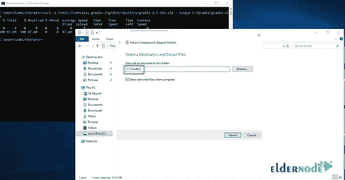

# 如何在 Windows - Eldernode 上安装和配置 Gradle

> 原文：<https://blog.eldernode.com/install-and-configure-gradle-on-windows/>


如何在 Windows 上安装和配置 Gradle？gradle 是一个构建自动化系统。今天的应用程序，例如 Android 应用程序，在结构上不像 15 年前那么简单。

过去，程序代码由程序员编写，编译后执行。但是今天，程序员需要在运行程序之前执行各种操作，以创建程序可执行文件，如 apk 或 exe 文件。注意，程序员必须在每次修改程序后重复这一操作才能重新运行。

这种操作称为施工操作。制造过程的耗时、复杂和多样，这使得程序员们建造了自动化制造系统，如 [gradle](https://gradle.org/install/) 。

因为构建自动化是软件项目一致交付的一个组成部分，Gradle 与多个 IDE 无缝集成，包括 Android Studio。本教程涵盖了在 Windows 上手动安装 Gradle。

**你可以从 eldernode 选择你最完美的 [Windows VPS 服务器](https://eldernode.com/windows-vps/)包。**

## 下载最新版本

**1。**T5 从**开始菜单**中打开命令提示符。然后创建一个目录让 Gradle 登陆: 

```
C:\Users\Administrator>mkdir C:\Gradle
```

**2。** 运行下面的命令，将 Gradle 插入你刚刚创建的文件夹:

```
C:\Users\Administrator>curl -L https://services.gradle.org/distributions/gradle-6.5-bin.zip --output C:\Gradle\gradle.zip    % Total % Received % Xferd Average Speed Time Time Time Current  Dload Upload Total Spent Left Speed  0 0 0 0 0 0 0 0 --:--:-- --:--:-- --:--:-- 0  100 97.6M 100 97.6M 0 0 97.6M 0 0:00:01 0:00:01 --:--:-- 115M
```

**3。T3 现在，打开文件浏览器的一个实例，导航到 C:\Gradle 目录。**


**4。** 接下来，通过右击文件并选择**提取全部…** 来提取文件 **gradle.zip** 。

**注意:** 在点击解压按钮之前，调整路径将文件直接解压到 Gradle 目录。

**5。** 提取应该看起来像下面的图片。一旦完成，点击提取按钮:



**6。号**成功安装号。是时候为它设置环境变量了。为此，**右键单击这台电脑上的**，并单击属性。 


**7。T5 选择高级系统设置从左栏:**


**8。在打开的窗口中，点击环境变量。**


**9。** 在**系统变量**表头下找到路径并选中，点击编辑按钮:


**10。T5 然后在打开的窗口中，点击新建，输入 C:\Gradle\gradle-6.5\bin 。**

**11。T5 点击 OK 保存**新变量**。**


验证梯度安装

## 要验证 Gradle 是否已安装并且可用，请打开一个新的，并运行以下命令:

格拉德现在是 **装了** ！

```
C:\Users\Administrator>gradle -v    Welcome to Gradle 6.5!  Here are the highlights of this release:  - Experimental file-system watching  - Improved version ordering  - New samples  For more details see https://docs.gradle.org/6.5/release-notes.html    ------------------------------------------------------------  Gradle 6.5  ------------------------------------------------------------    Build time: 2020-06-02 20:46:21 UTC  Revision: a27f41e4ae5e8a41ab9b19f8dd6d86d7b384dad4  Kotlin: 1.3.72  Groovy: 2.5.11  Ant: Apache Ant(TM) version 1.10.7 compiled on September 1 2019  JVM: 14.0.1 (Oracle Corporation 14.0.1+7)  OS: Windows Server 2019 10.0 amd64
```

**尊敬的用户**，我们希望您能喜欢这个[教程](https://eldernode.com/category/tutorial/)，您可以在评论区提出关于本次培训的问题，或者解决[老年人节点培训](https://eldernode.com/blog/)领域的其他问题，请参考[提问页面](https://eldernode.com/ask)部分，并尽快提出您的问题。腾出时间给其他用户和专家来回答你的问题。

好运。

Goodluck.